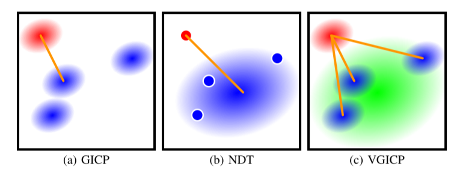
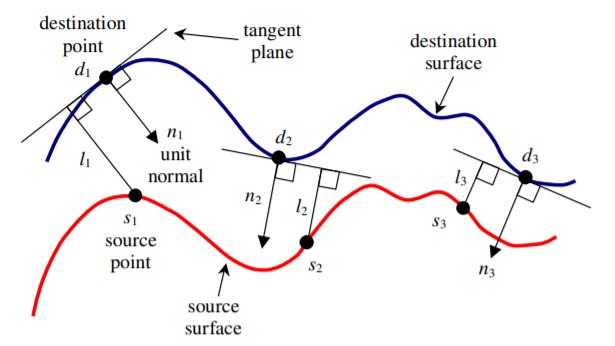
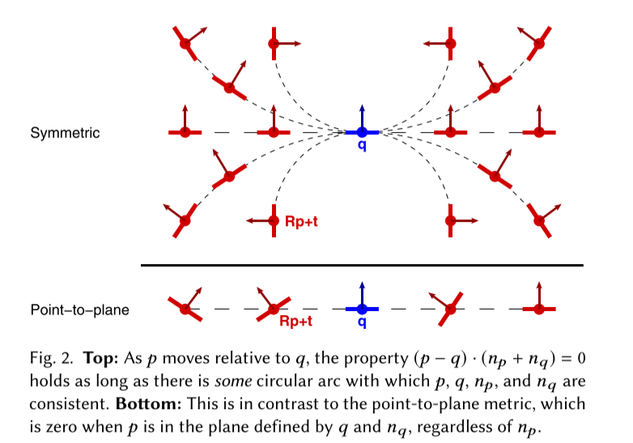
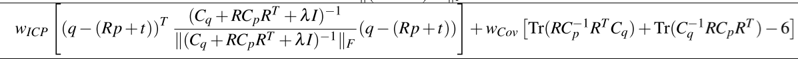

# Hard-Assignment

## Linear-Assign

### Standard  ICP

- **Method for registration of 3-D shapes** **(Standard ICP)** :heavy_check_mark:

  > Besl, P. J., & McKay, N. D. (1992, April). Method for registration of 3-D shapes. In *Sensor fusion IV: control paradigms and data structures* (Vol. 1611, pp. 586-606). International Society for Optics and Photonics.
  >
  > **Citations:** 22173
  >
  > [[url]](https://www.cvl.iis.u-tokyo.ac.jp/class2004/wedenesday/report/besl.pdf)  [[pdf]](./papers/A Method for Registration of 3-D Shapes.pdf)
  >
  > [[tutorial]](http://www.sci.utah.edu/~shireen/pdfs/tutorials/Elhabian_ICP09.pdf) [[ICP Related Material]](http://ais.informatik.uni-freiburg.de/teaching/ss12/robotics/slides/17-icp.pdf)
  >
  > [[notes]](./notes/A Method for Registration of 3-D Shapes.md)

  ​	The original paper of ICP.	

  > It alternates between the closest point query in the target set and minimization of the distance between corresponding points and is guaranteed to converge to a locally optimal alignment

- **Iterative Point Matching for Registration of Free-Form Curves and Surfaces** :heavy_check_mark: 

  > Zhang, Z. (1994). Iterative point matching for registration of free-form curves and surfaces. *International journal of computer vision*, *13*(2), 119-152.
  >
  > **Citations:** 3098
  >
  > [[url]](http://citeseerx.ist.psu.edu/viewdoc/download?doi=10.1.1.175.770&rep=rep1&type=pdf)  [[pdf]](./papers/Iterative Point Matching for Registration of Free-Form Curves and Surfaces.pdf)
  >
  > [[notes]](./notes/Iterative Point Matching for Registration of Free-Form Curves and Surfaces.md)

  - The same work as ICP, but proposed independently.

## Facilitation

### Sampling

- **A Stochastic Iterative Closest Point Algorithm (stochastICP)** :heavy_check_mark:

  > Penney, Graeme P., et al. "A stochastic iterative closest point algorithm (stochastICP)." *International Conference on Medical Image Computing and Computer-Assisted Intervention*. Springer, Berlin, Heidelberg, 2001.
  >
  > **Citations:** 72
  >
  > [[pdf]](./papers/Penney2001_Chapter_AStochasticIterativeClosestPoi.pdf)

  - Summary

    - The method changes point set coordinate stochastically every iteration:
      $$
      p_j' = p_j + v_j
      $$
      The perturbation is generated by Gaussian Noise.

    - The stop criteria is the transformation parameter error between two iterations is small.

### Matching

- **Registration and integration of textured 3D data** :heavy_check_mark:

  > Johnson, Andrew Edie, and Sing Bing Kang. "Registration and integration of textured 3D data." *Image and vision computing* 17.2 (1999): 135-147.
  >
  > **Citations:** 519
  >
  > [[pdf]](./papers/Registration_and_integration_of_textured_3D_data.pdf)

  - Summary

    - The proposed mthod combines the color information into the distance metric based on ICP algorithm. The color parameters are represented by *YIQ* color model. Because it can separate the intensity(which may be affected by the light.) and the intrinsic color.

    - The distance can be computed by
      $$
      p = (x_1,x_2,x_3,\alpha_1c_1, \alpha_2c_2, \alpha_3c_3)
      $$
      Where $\alpha$ is the coefficient, and the $c$ is the measure of color.

- **Color point cloud registration with 4d ICP algorithm** :heavy_check_mark:

  > Men, Hao, Biruk Gebre, and Kishore Pochiraju. "Color point cloud registration with 4D ICP algorithm." *2011 IEEE International Conference on Robotics and Automation*. IEEE, 2011.
  >
  > **Citations:** 117
  >
  > [[pdf]](./papers/Color_point_cloud_registration_with_4D_ICP_algorithm.pdf)

  - Summary
    - Similar to Color-GICP, it uses color information to as the matching method. The color is represented as *Hue* value. The point is represented as $p = (x, y, z, h)$. The core idea is that the *h*  value represents the color but not sensitive to brightness and viewpoint.
  - Comments
    - ICP's drawback:
      - Too sensitve to noise and initialization;
      - Time consuming on finding the correspondence(Need to find correspondence each iteration).

- **Color supported generalized-icp** :heavy_check_mark:

  > Korn, Michael, Martin Holzkothen, and Josef Pauli. "Color supported generalized-ICP." *2014 International Conference on Computer Vision Theory and Applications (VISAPP)*. Vol. 3. IEEE, 2014.
  >
  > **Citations:** 62
  >
  > [[pdf]](./papers/Color_supported_generalized-ICP.pdf)

  - Summary

    - Integrating color information into GICP. The pointwise color is represented by *L\*a\*b\* color space*. The point is represented as:
      $$
      p_{\alpha,i} = (x_i, y_i, z_i, \alpha L_i, \alpha a_i, \alpha b_i)^{T}
      $$
      The distance of two point is represented as :
      $$
      d_i = || p_{\alpha,i} - q_{\alpha,i}||_{2}
      $$

    The method is used in finding correspondences.

  - Pros and cons

    - Compared to GICP, the proposed method is more accurate.
    - The running time arises.

  - Comments

    - GICP reduces the distances of corresponding points in the direction of the surface normals. 

- **Three-dimensional registration using range and intensity information**

  > Godin, Guy, Marc Rioux, and Rejean Baribeau. "Three-dimensional registration using range and intensity information." *Videometrics III*. Vol. 2350. International Society for Optics and Photonics, 1994.
  >
  > **Citations:** 

- **Registration of 3-D Partial Surface Models Using Luminance and Depth Information**

  > Weik, Sebastian. "Registration of 3-D partial surface models using luminance and depth information." *Proceedings. International Conference on Recent Advances in 3-D Digital Imaging and Modeling (Cat. No. 97TB100134)*. IEEE, 1997.
  >
  > **Citations:** 182

- **Extension of the ICP Algorithm to Nonrigid Intensity-Based Registration of 3D Volumes**

  > Feldmar, Jacques, et al. "Extension of the ICP algorithm to nonrigid intensity-based registration of 3D volumes." *Computer Vision and Image Understanding* 66.2 (1997): 193-206.
  >
  > **Citations:** 159
  >
  > [[pdf]](./papers/1-s2.0-S1077314297906068-main.pdf)

- **Improved Data Association for ICP-based Scan Matching in Noisy and Dynamic Environments**

- **Geometrically Stable Sampling for the ICP Algorithm**

  > Gelfand, Natasha, et al. "Geometrically stable sampling for the ICP algorithm." *Fourth International Conference on 3-D Digital Imaging and Modeling, 2003. 3DIM 2003. Proceedings.*. IEEE, 2003.
  >
  > **Citations:** 443

- **Iterative Global Similarity Points: A Robust Coarse-to-Fine Integration Solution for Pairwise 3D Point Cloud Registration** :heavy_check_mark:

  > Pan, Yue, et al. "Iterative global similarity points: A robust coarse-to-fine integration solution for pairwise 3d point cloud registration." *2018 International Conference on 3D Vision (3DV)*. IEEE, 2018.
  >
  > **Citations:** 21
  >
  > [[pdf]](./papers/Iterative_Global_Similarity_Points_A_Robust_Coarse-to-Fine_Integration_Solution_for_Pairwise_3D_Point_Cloud_Registration.pdf)

  - Summary
    - The proposed method follows the iteration process of ICP method.
      - The difference: In ICP, the correspondence is provided by finding the nearest points correspondence. But in this paper, the correspondence is estimated by finding the *feature correspondence*.  The features are provided by *Binary Shape Context (BSC)*. 
      - The process of features correspondence can be summarized by: 1) Keypoints detecting; 2) computing the descriptors. 3) Computing the correspondence by miniminzing a energy function.
      - After getting the correspondence, SVD is used to compute the transformation.
  - Pros and cons
    - From the experiments, the features seem to hadle **partial overlap** well.
    - The method need involve feature correspondence computation, it is really **time consuming**.

- **A Robust Loss for Point Cloud Registration** :heavy_check_mark:

  > Deng, Zhi, et al. "A robust loss for point cloud registration." *Proceedings of the IEEE/CVF International Conference on Computer Vision*. 2021.
  >
  > [[url]](https://openaccess.thecvf.com/content/ICCV2021/papers/Deng_A_Robust_Loss_for_Point_Cloud_Registration_ICCV_2021_paper.pdf)  [[pdf]](./papers/A Robust Loss for Point Cloud Registration.pdf)

  - First, the proposed metric is based on intersections of uniformly random straight lines set in space, which can obtain richer information and more likely to achieve the global minimum.

  - Second, our proposed metric can turn various supervised learning frameworks into unsupervised and has the
    ability to train on massive real unlabeled suitable data sets.

    :star:优缺点要看和谁进行比较；

  - More accurate and faster than ICP, FGR.

### Outlier Rejection

- **The Trimmed Iterative Closest Point Algorithm** **(Tr-ICP)** :heavy_check_mark:

  > Chetverikov, D., Svirko, D., Stepanov, D., & Krsek, P. (2002, August). The trimmed iterative closest point algorithm. In *Object recognition supported by user interaction for service robots* (Vol. 3, pp. 545-548). IEEE.
  >
  > **Citations:** 598
  >
  > [[url]](https://ieeexplore.ieee.org/stamp/stamp.jsp?tp=&arnumber=1047997&tag=1)  [[pdf]](./papers/The Trimmed Iterative Closest Point Algorithm.pdf)

  Tr-ICP: '*Tr*' means the '*Trimmed*', use the '*[Least Trimmed Square](https://en.wikipedia.org/wiki/Least_trimmed_squares)*' method in the process to improve robustness.
  Pros: can converge when the **overlapping** rate is under 50%;
  cons: still need a good initial pose;

- **Robust Euclidean alignment of 3D point sets the trimmed iterative closest point algorithm** :heavy_check_mark:

  > Chetverikov, D., Stepanov, D., & Krsek, P. (2005). Robust Euclidean alignment of 3D point sets: the trimmed iterative closest point algorithm. *Image and vision computing*, *23*(3), 299-309.
  >
  > **Citations:** 461
  >
  > [[url]](https://reader.elsevier.com/reader/sd/pii/S0262885604001179?token=B6A29AD77A8BDB565DE4A2ACBB8EFE4B12056ED98E9FFC14E5AD96E10C8F7E04DB2E587E5F8487939EEAC731DC1B24E1&originRegion=eu-west-1&originCreation=20220107203632)  [[pdf]](./papers/Robust Euclidean alignment of 3D point sets the trimmediterative closest point algorithm.pdf)

  - Similar to Tr-ICP, they are the same authors, but I did not get the difference between them.

### Weitghting

- **Multi-Channel Generalized-ICP: A robust framework for multi-channel scan registration** :heavy_check_mark:

  > Servos, James, and Steven L. Waslander. "Multi-Channel Generalized-ICP: A robust framework for multi-channel scan registration." *Robotics and Autonomous systems* 87 (2017): 247-257.
  >
  > **Citation:** 29

  - Summary
    - The method inherit the framework of GICP, the difference is the covariance estimation. The proposed method estimate the covariance by incorporating the features.
    - By point matching, the proposed method also using multi-channels information to find nearest points.
  - Comments
    - 但需要指出的 是，在室外及非结构化场景中 ＧＩＣＰ并不比标准 ＩＣＰ表现出色。——GICP的文献内部？（**要开始有意识地记录缺点！**)
    - The paper has a good explanation of GICP.

- **Learning anisotropic ICP (LA-ICP) for robust and efficient 3D registration** :heavy_check_mark: :x:

  > Lee, Bhoram, and Daniel D. Lee. "Learning anisotropic ICP (LA-ICP) for robust and efficient 3D registration." *2016 IEEE international conference on robotics and automation (ICRA)*. IEEE, 2016.
  >
  > **Citations:** 11
  >
  > [[pdf]](./papers/Learning_anisotropic_ICP_LA-ICP_for_robust_and_efficient_3D_registration.pdf)

  - Summary

    - I do not understand this paper. The proposed method is based on *G-ICP*. It aims to estimate the covariance in the equation;
    - The ideas of the author show as follows:
      - The generalized ICP equation with covariance; And include the point2plane, GICP into this framework;
      - **The problem to solve** is how to get the covariance?  
    - The method proposes an *online learning* method to estimate covariance. In my view, the proposed metzhod first iteratively estimates the covariance and transformation.
  
- **Fast and Robust Iterative Closest Point** :heavy_check_mark:

  > Zhang, J., Yao, Y., & Deng, B. (2021). Fast and Robust Iterative Closest Point. *IEEE Transactions on Pattern Analysis and Machine Intelligence*.
  >
  > [[url]](https://ieeexplore.ieee.org/stamp/stamp.jsp?tp=&arnumber=9336308)  [[pdf]](./papers/Fast_and_Robust_Iterative_Closest_Point.pdf)

  1. Fast: Use Anderson acceleration to make the iteration process quickly;

  2. Robust: Use Welsch’s function to formulate an objective function.

     Extend them to the p2p and p2plane algos, but not globally and need a good initialization.
  
- **Sparse point cloud registration and aggregation with mesh‐based generalized iterative closest point** :heavy_check_mark:

  > Young, Matthew, et al. "Sparse point cloud registration and aggregation with mesh‐based generalized iterative closest point." *Journal of Field Robotics* 38.8 (2021): 1078-1091.
  >
  > **Citations:** 0
  >
  > [[pdf]](./papers/Sparse_point_cloud_registration_and_aggregation_with_mesh_based_generalized.pdf)

  - Summary

    - Mainly about the experiments. The proposed variant of G-ICP aims to compute covariance under **sparse** point cloud. It first completes the point cloud with meshes and then computes the normal of the point using neighbour meshes.

  - Comments:

    - In many cases, the density is not high enough to compute the normal and covariance. So it is difficult for some methods to use. 

      > In addition, color information has similar properties because color is relatively sensitive to the light and viewpoint.

    - Since the raw point cloud is sparse, solely points can not represent topography, so methods like LOAM tries to extract plane and line features for registering.  But theses methods also have a drawback: the lines and planes can be easily extracted from structured environments, but are hard to find in unstructured environments.

### Acceleration

- **AA-ICP Iterative Closest Point with Anderson Acceleration** :heavy_check_mark:

  > Pavlov, A. L., Ovchinnikov, G. W., Derbyshev, D. Y., Tsetserukou, D., & Oseledets, I. V. (2018, May). AA-ICP: Iterative closest point with Anderson acceleration. In *2018 IEEE International Conference on Robotics and Automation (ICRA)* (pp. 3407-3412). IEEE.
  >
  > **Citations:** 29
  >
  > [[url]](https://ieeexplore.ieee.org/stamp/stamp.jsp?tp=&arnumber=8461063) [[pdf]](./papers/AA-ICP Iterative Closest Point with Anderson Acceleration.pdf)

  AA-ICP: (Anderson Acceleration ICP), use Anderson acceleration to accelerate the process of the algorithm(About 30% compared to standard ICP).

- **Stein ICP for Uncertainty Estimation in Point Cloud Matching**

  > Maken, Fahira Afzal, Fabio Ramos, and Lionel Ott. "Stein ICP for Uncertainty Estimation in Point Cloud Matching." *IEEE Robotics and Automation Letters* 7.2 (2021): 1063-1070.
  >
  > **Citations:** 0
  >
  > [[pdf]](./papers/Stein_ICP_for_Uncertainty_Estimation_in_Point_Cloud_Matching.pdf)

  - How to use ICP to estimate the uncertainty of the point cloud ?

- **A Multi-Resolution ICP with Heuristic Closest Point Search for Fast and Robust 3D Registration of Range Images ** :heavy_check_mark:

  > Jost, Timothée, and Heinz Hugli. "A multi-resolution ICP with heuristic closest point search for fast and robust 3D registration of range images." *Fourth International Conference on 3-D Digital Imaging and Modeling, 2003. 3DIM 2003. Proceedings.*. IEEE, 2003.
  >
  > **Citations:** 156
  >
  > [[pdf]](./papers/A_multi-resolution_ICP_with_heuristic_closest_point_search_for_fast_and_robust_3D_registration_of_range_images.pdf)

  - Summary

    - The algorithm aims to accelerate the ICP process. Two methods are used: 

      > At a coarse resolution (i.e., with a limited number of points) ICP converges faster but with less accuracy than at a fine resolution. However, by initializing a finer-resolution ICP with the result of the coarser one, the convergence of the fine-resolution ICP is much faster than with a single-shot ICP, as the initial alignment is mostly correct. These authors also used a pre-computed list of NN to approximate the matching step. With both of these techniques, they showed a significant increase of the speed of ICP while maintaining adequate robustness
      >
      > —— *《A Review of Point Cloud Registration Algorithms for Mobile Robotics 》*

- **Voxelized GICP for Fast and Accurate 3D Point Cloud Registration** :heavy_check_mark:

  > Koide, Kenji, et al. "Voxelized gicp for fast and accurate 3d point cloud registration." *2021 IEEE International Conference on Robotics and Automation (ICRA)*. IEEE, 2021.
  >
  > **Citations:** 29
  >
  > [[pdf]](./papers/Voxelized_GICP_for_Fast_and_Accurate_3D_Point_Cloud_Registration.pdf)

  - Summary

    

    - The proposed is based on G-ICP(Which first computes the covariance of each point in the two point sets.) Then the GICP finds the nearest point and optimizes the cost function combined with the covariance. NDT firstly divides the raw point set into fixed grids, and computes the covariance of each grid(a distribution), then finds the nearest grid to optimize the cost function.

    - VGICP

      - Compute the covariance of each point in point sets.

      - For the fixed set, the mean value and covariance are computed together. (Maybe it can be viewed as a "distribution of distribution?").

      - Acceleration: Instead of searching the nearest point/grid. The method uses a trick of voxelization:
        $$
        voxel\_index\_a = cast\_to\_int(a_i / voxle\_resolution) \\
        voxel\_index\_b = cast\_to\_int(b_i / voxle\_resolution) \\
        $$
        In each iteration, the point in moving set will find the equal index in b to optimize.

    - Pros:

      - Run in parallel because it does not need to search the nearest point every iteration.

- **The Parallel Iterative Closest Point Algorithm** :heavy_check_mark:

  > Langis, Christian, Michael Greenspan, and Guy Godin. "The parallel iterative closest point algorithm." *Proceedings Third International Conference on 3-D Digital Imaging and Modeling*. IEEE, 2001.
  >
  > **Citations:** 76

- **Softassign and EM-ICP on GPU** :heavy_check_mark:

  > Tamaki, Toru, et al. "Softassign and em-icp on gpu." *2010 First International Conference on Networking and Computing*. IEEE, 2010.
  >
  > **Citations:**66

## Objective Function

- **Object modelling by registration of multiple range images** **(Point-to-Plane ICP)** :heavy_check_mark:

  > Chen, Y., & Medioni, G. (1992). Object modelling by registration of multiple range images. *Image and vision computing*, *10*(3), 145-155.
  >
  > **Citations:** 4931
  >
  > [[pdf]](./papers/Object modeling by registration of multiple range images.pdf) [[url]](http://graphics.stanford.edu/courses/cs348a-17-winter/Handouts/chen-medioni-align-rob91.pdf)
  >
  > [[notes]](./notes/Object modelling by registration of multiple range images.md)

  **Point-to-Plane ICP.**

  

- **Generalized-ICP** **(Plane-to-Plane ICP / GICP)** :heavy_check_mark:

  > Segal, A., Haehnel, D., & Thrun, S. (2009, June). Generalized-icp. In *Robotics: science and systems* (Vol. 2, No. 4, p. 435).
  >
  > **Citations:** 1365 :flags:
  >
  > [[url]](https://www.robots.ox.ac.uk/~avsegal/resources/papers/Generalized_ICP.pdf)  [[pdf]](./papers/Generalized_ICP.pdf)
  >
  > [[notes]](./notes/Generalized-ICP.md)

  GICP: Generalize The ICP approach to probabilistic distribution, extend it to plane-to-plane format.

  将ICP的方法从点对点，点对面进行一般化，引入了两个点云的协方差矩阵描述各自的特征，降低了不匹配的特征的影响。

- **NICP: Dense normal based point cloud registration** :heavy_check_mark:

  > Serafin, Jacopo, and Giorgio Grisetti. "NICP: Dense normal based point cloud registration." *2015 IEEE/RSJ International Conference on Intelligent Robots and Systems (IROS)*. IEEE, 2015.
  >
  > **Citations:** 162
  >
  > [[pdf]](./papers/NICP_Dense_normal_based_point_cloud_registration.pdf)

- **A symmetric objective function for ICP** **(Symmetric-ICP)**  :heavy_check_mark: 

  > Rusinkiewicz, S. (2019). A symmetric objective function for ICP. *ACM Transactions on Graphics (TOG)*, *38*(4), 1-7.
  >
  > **citations**:41
  >
  > [[url]](https://dl.acm.org/doi/pdf/10.1145/3306346.3323037)  [[pdf]](./papers/A Symmetric Objective Function for ICP.pdf)

  

- Symmetric-ICP: 在point-to-plane的基础上进行改进，point-to-plane的类型收敛域减小，因为如上图所示，如果p点在q点所在的平面，那么二者的 *loss function* 一定为0，那么p点就只能在q点的平面进行滑动。但是使用symmetric(上图所示)，可以允许p点与q点形成圆进行滑动。

​		  :question: 如何进行求解？	

- **Robust symmetric iterative closest point** :heavy_check_mark:

  > Li, Jiayuan, et al. "Robust symmetric iterative closest point." *ISPRS Journal of Photogrammetry and Remote Sensing* 185 (2022): 219-231.
  >
  > [[pdf]](./papers/Robust symmetric iterative closest point.pdf)

  - Summary
    - Symmetric ICP has a wider converge basin than point-to-plane ICP, because the zero-set of the error metric is larger than point-to-plane ICP. Compared to original symmetric ICP, the proposed method consider the rotation of the normal, making the result more accurate. 
    - The objective function is divided into *error metric* and *loss function*. One is to measure the error between two points, and the other is used to construct the objective function.
    - The loss is described by a loss function, called a robust model.

- **A robust method for registration and segmentation of multiple range images**

  > Masuda, T., & Yokoya, N. (1995). A robust method for registration and segmentation of multiple range images. *Computer vision and image understanding*, *61*(3), 295-307.
  >
  > **Citations:** 401
  >
  > [[url]](https://www.sciencedirect.com/sdfe/reader/pii/S1077314285710247/pdf)  [[pdf]](./papers/A Robust Method for Registration and Segmentation of Multiple Range Images.pdf)

- **Robust motion and correspondence of noisy 3-d point sets with missing data**

  > Trucco, E., Fusiello, A., & Roberto, V. (1999). Robust motion and correspondence of noisy 3-D point sets with missing data. *Pattern recognition letters*, *20*(9), 889-898.
  >
  > **Citations:** 140
  >
  > [[url]](https://reader.elsevier.com/reader/sd/pii/S0167865599000550?token=80227EA90623477B34968113CCC67A768D7F900C9CECFDC7F9A7763C172BB9BC1A5C894B86D5D6169A3A26ED39EA8D59&originRegion=eu-west-1&originCreation=20220108114837)  [[pdf]](./papers/Robust motion and correspondence of noisy 3-d point sets with missing data.pdf)

- **Metric-based iterative closest point scan matching for sensor displacement estimation** :heavy_check_mark:

  > Minguez, Javier, Luis Montesano, and Florent Lamiraux. "Metric-based iterative closest point scan matching for sensor displacement estimation." *IEEE Transactions on Robotics* 22.5 (2006): 1047-1054.
  >
  > **Citations:** 195
  >
  > [[pdf]](./papers/Metric-based_iterative_closest_point_scan_matching_for_sensor_displacement_estimation.pdf)

  - Summary

    - Modify the error metric, similar to the Generlization ICP.

    - > MbICP is designed to improve convergence with large initial orientation errors by explicitly putting a measure of
      > rotational error as part of the distance metric to be minimized.
      >
      > —— **G-ICP**

  - Comments

    - When descriping the proposed method, many literature states that the proposed method considers the rotation error and combines it into the distance computation. 

- **A generalization of the metric-based Iterative Closest Point technique for 3D scan matching** :heavy_check_mark:

  > Armesto, Leopoldo, Javier Minguez, and Luis Montesano. "A generalization of the metric-based iterative closest point technique for 3D scan matching." *2010 IEEE International Conference on Robotics and Automation*. IEEE, 2010.
  >
  > **Citations:** 51
  >
  > [[pdf]](./papers/A_generalization_of_the_metric-based_Iterative_Closest_Point_technique_for_3D_scan_matching.pdf)

  - Summary

    - The method is the extension of MB-ICP to 3D space. The method define the distance of two points as the norm of the transformation parameter $||q||$, and depending on this to find the closest corresponding point.

  - Pros and cons

    - More robust and precise.
    - Much computation cost in each iteration.

  - Comments:

    > Occupancy Voxel Metric Based Iterative Closest Point for Position Tracking in 3D Environments
    >
    > describes it in detail.

- **Sparse Iterative Closest Point** **(Sparse ICP)** :heavy_check_mark:

  > Bouaziz, S., Tagliasacchi, A., & Pauly, M. (2013, August). Sparse iterative closest point. In *Computer graphics forum* (Vol. 32, No. 5, pp. 113-123). Oxford, UK: Blackwell Publishing Ltd.
  >
  > **Citations:** 393
  >
  > [[url]](https://onlinelibrary.wiley.com/doi/epdf/10.1111/cgf.12178) [[pdf]](./papers/Sparse Iterative Closest Point.pdf)
  >
  > [[notes]](./notes/Sparse Iterative Closest Point.md)

  - Summary:Sparse ICP: 仍然使用欧式距离寻找ICP中的correspondence，但是在优化阶段，使用了$d_2^p$ 代替 $d_2$， 提高了稀疏性，对Outlier和noise有一定的鲁棒性。

    - Optimization: Due to non-convex and non-smooth, the optimization method uses ADMM.

  - Comments

    - high computational cost and memory footprint. (If you state some comments, you should give some experiments to verify them. Or refer to other literature?

      > <Robust symmetric iterative closest point>
      
    - The ADMM optimizer will cost a lot of memory and time.
    
      > Fast and Robust Iterative Closest Point

- **ICP registration using invariant features** **（ICPIF)** :heavy_check_mark: :red_circle:

  > Sharp, Gregory C., Sang W. Lee, and David K. Wehe. "ICP registration using invariant features." *IEEE Transactions on Pattern Analysis and Machine Intelligence* 24.1 (2002): 90-102.
  >
  > **Citations:** 716
  >
  > [[url]](https://ieeexplore.ieee.org/stamp/stamp.jsp?tp=&arnumber=982886&tag=1)  [[pdf]](./papers/ICP Registration Using Invariant Features.pdf)

  - Reading Notes:
    - Invariants:
      - Curvature
        - simplicity and efficiency;
        - sensitivity to both sensor noise and sampling rate;
      - Moment
      - Spherical Harmonics
  - [ ] 这些特征是否有几何意义？
  - [ ] 第四章和第五章还没看

- **Correntropy based scale ICP algorithm for robust point set registration** :heavy_check_mark:

  > Wu, Zongze, et al. "Correntropy based scale ICP algorithm for robust point set registration." *Pattern Recognition* 93 (2019): 14-24.
  >
  > **Citations:** 44
  >
  > [[pdf]](./papers/Correntropy_based_scale_ICP_algorithm_for_robust_point_set_registration.pdf)

  - Summary

    - The proposed method modifies the error metric. The standard ICP uses MSE to measure the error between two point sets(The paper refer to it as *similarity*). To handle outlier and noise, the author proposes *Correntropy* with the following format:
      $$
      f = \exp{- \frac{(a_i - b_j)^2}{2\sigma^2}}
      $$

  - :question: What about the analysis about *MSE* and *correntropy function*?

    *Kernel function?*

- **Probability iterative closest point algorithm for m-D point set registration with noise** :heavy_check_mark:

  > Du, Shaoyi, et al. "Probability iterative closest point algorithm for mD point set registration with noise." *Neurocomputing* 157 (2015): 187-198.
  >
  > **Citations:** 86
  >
  > [[pdf]](./papers/Probability_iterative_closest_point_algorithm_for_m-D_point_set_registration_with_noise.pdf)

  - Summary
    - In *CPD* method, the correspondence is *one-to-all*, this method modifies the data-association to *one-to-one* and solve it by SVD.
    - In other words, the proposed method delete some corresponding points and probiblities. Reserving the nearest point association makes the method more accurate(?)

- **Robust matching of 3D contours using iterative closest point algorithm improved by M-estimation** :heavy_check_mark:

  > Kaneko, Shun'ichi, Tomonori Kondo, and Atsushi Miyamoto. "Robust matching of 3D contours using iterative closest point algorithm improved by M-estimation." *Pattern Recognition* 36.9 (2003): 2041-2047.
  >
  > **Citations:** 90
  >
  > [[pdf]](./papers/M_ICP.pdf)

  - Summary

    - Traditional ICP method uses the *Least Square* to compute the objective function. If we define the residuals as $e_1 = p_1 - q_1$ , the traditional ICP is $e_1^2 + e_2^2 + e_3^2$

      The M-ICP constructs a new objective function as:
      $$
      Obj = \sum{\rho_1(e_1)+\rho_2(e_2)+\rho_3(e_3)}
      $$

- **LiTAMIN: LiDAR-based Tracking And Mapping by Stabilized ICP for Geometry Approximation with Normal Distributions** :heavy_check_mark:

  > Yokozuka, Masashi, et al. "Litamin: Lidar-based tracking and mapping by stabilized icp for geometry approximation with normal distributions." *2020 IEEE/RSJ International Conference on Intelligent Robots and Systems (IROS)*. IEEE, 2020.
  >
  > **Citations**: 9
  >
  > [[pdf]](./papers/LiTAMIN_LiDAR-based_Tracking_And_Mapping_by_Stabilized_ICP_for_Geometry_Approximation_with_Normal_Distributions.pdf)

  - Summary
    - The paper is good that it provides a perspective of cost function to describe the point set registration. 
    - **Motivation**: The achieve balance between robustness and accuracy for ICP-based methods. The *G-ICP* and *NDT* methods provide robustness but they are time consuming due to PCA.
    - The proposed method use a effiective way to compute the inverse of covariance matrix to improve computation effiency.(Based on P2D NDT)
    - **Representation**: The data are represented by voxel grids. **Data Association**: K-D tree.
    - **For GICP**

- **LiTAMIN2: Ultra Light LiDAR-based SLAM using Geometric Approximation applied with KL-Divergence** :heavy_check_mark: :imp:

  > Yokozuka, Masashi, et al. "LiTAMIN2: Ultra light lidar-based slam using geometric approximation applied with KL-divergence." *2021 IEEE International Conference on Robotics and Automation (ICRA)*. IEEE, 2021.
  >
  > **Citations:** 11
  >
  > [[pdf]](./papers/LiTAMIN2_Ultra_Light_LiDAR-based_SLAM_using_Geometric_Approximation_applied_with_KL-Divergence.pdf)

  - 
  - Summary
    - The proposed method is based on or *D2D NDT*. 
    - The **Representation** of the point cloud is voxel grid. The *symmetric K-L Divergence* is used to measure similarity of two  sub-point-set(distribution). The difference is adding a extra *penalty function* which is used to estimate the covariance of  two distribution.
    - Using **KL-Divergence** to descripe the cost function.

- **Convergent iterative closest-point algorithm to accomodate anisotropic and inhomogenous localization error** :heavy_check_mark:

  > Maier-Hein, Lena, et al. "Convergent iterative closest-point algorithm to accomodate anisotropic and inhomogenous localization error." *IEEE transactions on pattern analysis and machine intelligence* 34.8 (2011): 1520-1532.
  >
  > **Citations:** 127
  >
  > [[pdf]](./papers/Convergent_Iterative_Closest-Point_Algorithm_to_Accomodate_Anisotropic_and_Inhomogenous_Localization_Error.pdf)

  - Summary

    - Maybe due to the density or other things, the location error of corresponding points may be anisotropic. The previous method mainly consider the location error as the isotropic error.

    - To formulate the metric error, the anisotropic consideration is combined into the steps of the iteration:
      $$
      distance:d_{new} = || W_{\vec{x}\vec{y}}(\vec{x}-\vec{y})||_{2}^2\\
      cost function = \sum_{i=1}^{M}||W_{i}(R\vec{x_i}+\vec{t}-\vec{y}_{corresponding})||_2^2
      $$
      The coefficient is related to the covariance of both inputs' covariance

    - How to compute the covariance? —— **PCA**

  - Cons:

    - PCA computes covariance consume too much time.

## Optimization

- **Robust registration of 2D and 3D point sets** **(LM-ICP)**:heavy_check_mark: :question:

  > Fitzgibbon, A. W. (2003). Robust registration of 2D and 3D point sets. *Image and vision computing*, *21*(13-14), 1145-1153.
  >
  > **Citations:** 1089
  >
  > [[url]](https://reader.elsevier.com/reader/sd/pii/S0262885603001835?token=76780F4CE6E03D857BA3240F3179D4A3ADDC641974808A73B35251E1D27D83CA1AC4345D6345686D2744544E4C647749&originRegion=eu-west-1&originCreation=20220105133411) [[pdf]](./papers/Robust registration of 2D and 3D point sets.pdf)
  >
  > [[notes]](./notes/Robust registration of 2D and 3D point sets.md)

  The article uses the LM (Levenberg–Marquardt algorithm) algorithm to optimize a non-linear process instead of a closed-form solution, which can get a wider converge basin. 

- **Registering multiview range data to create 3D computer objects** :heavy_check_mark:

  > Blais, Gérard, and Martin D. Levine. "Registering multiview range data to create 3D computer objects." *IEEE Transactions on Pattern Analysis and Machine Intelligence* 17.8 (1995): 820-824.
  >
  > **Citations:** 666
  >
  > [[pdf]](./papers/Registering_multiview_range_data_to_create_3D_computer_objects.pdf)

  - Summary
    - The algorithm is similar to ICP, the difference is the optimization method: *VFSR*(Very Fast simulated annealing), but it is a a stochastic optimization method.

- **A New Genetic-Based Technique for Matching 3-D Curves and Surfaces** :heavy_check_mark:

  > Yamany, Sameh M., Mohamed N. Ahmed, and Aly A. Farag. "A new genetic-based technique for matching 3-D curves and surfaces." *Pattern Recognition* 32.10 (1999): 1817-1820.
  >
  > **Citations:** 128
  
- **A fast and accurate approach for 3D image registration using the scatter search evolutionary algorithm** 

  > Cordón, Oscar, Sergio Damas, and Jose Santamaría. "A fast and accurate approach for 3D image registration using the scatter search evolutionary algorithm." *Pattern Recognition Letters* 27.11 (2006): 1191-1200.
  >
  > **Citations:** 110
  
- **The 3D-3D registration problem revisited** :heavy_check_mark:

  > Li, H., & Hartley, R. (2007, October). The 3D-3D registration problem revisited. In *2007 IEEE 11th international conference on computer vision* (pp. 1-8). IEEE.
  >
  > **Citations:** 193
  >
  > [[url]](https://ieeexplore.ieee.org/stamp/stamp.jsp?tp=&arnumber=4409077)  [[pdf]](./papers/The 3D-3D registration problem revisited.pdf)

  - SPC problem: simultaneous pose and correspondence problem. But if given the correspondence, or given the rotation matrix, the problem becomes **convex** which is easy to solve. SPC problem is non-convex.

  - This paper regard many existing algorithms(e.g. ICP) as a kind of **E-M** algorithm, which alternatively estimate the correspondence and the transformation. The original problem is divided into two sub-problems. However, the E-M algorithms are **local optimal**.

  - Some other existing approaches(Exploiting the geomertic features thar are **inariant** to either **correspondence**? or **transformation**): [PCA](Kazhdan, Michael, Thomas Funkhouser, and Szymon Rusinkiewicz. "Shape matching and anisotropy." *ACM SIGGRAPH 2004 Papers*. 2004. 623-629.), [Mondal matching and spectural matching](M. Leordeanu and M. Hebert, "A spectral technique for correspondence problems using pairwise constraints", *ICCV*, vol. 2, pp. 1482-1489, 2005.    &&    S. Sclaroff and A. Pentland, "Model matching for correspondence and recognition", *PAMI*, June 1995.)

  - The core idea of this paper is the theory of **Lipschitz optimization**.

  - The above problems mentioned above:

    - If the correspondence is fixed, the problem can be solved by: RANSAC, [quaternion method](B. Horn, "Closed-form solution of absolute orientation using unit quatemions", *JOSA-A*, vol. 4, pp. 629-642, April 1987.) [colsed-form1](D. W. Eggert, A. Lorusso and R. B. Fisher, "Estimating 3-d rigid body transformations: a comparison of four major algorithms", *Machine Vision and Applications*, vol. 9, pp. 272-290, 1997.) [closed-form2]( N. Ohta and K. Kanatani, "Optimal estimation of three-dimensional rotation and reliability evaluation", *ECCV*, pp. 175-187, June 1998.)
    - if the Rotation is fixed, the correspondence can also be solved(Here I do not write here, it can be regarded as a pure mathematical problem)

  - To globally optimize the problem, two ways can be considered:

    - Search all the permutations, and then solve the rotation. This idea is simple and effiective, but the cons is that if the input's size is large, the searching space's size is $n!$.
    - Search the rotation space and slove foe the correspondence, which uses the Lipschitz optimization and Brounch-and-bound algorithm.

  - For the brounch-and-bound algorithm, in my view, it estimate the lower bound of each interval and choose the lower bound, and iteratively search the space until converge.

    :question: The details of the algorithm I have not understood.

  - Pros and cons:

    - pros: Global optimal, insensitive to the initialization.
    - cons: 1) Time consuming. 2) Senstive to the outlier. 3) The algorithm complexity is unkown.

  - Can be considered as the pre-paper for the Go-ICP

- **Branch-and-bound methods for euclidean registration problems**

  > Olsson, C., Kahl, F., & Oskarsson, M. (2008). Branch-and-bound methods for euclidean registration problems. *IEEE Transactions on Pattern Analysis and Machine Intelligence*, *31*(5), 783-794.
  >
  > **Citations:** 138
  >
  > [[url]](https://ieeexplore.ieee.org/stamp/stamp.jsp?tp=&arnumber=4531744)  [[pdf]](./papers/Branch-and-Bound Methods for Euclidean Registration Problems.pdf)

- **Go-ICP_A_Globally_Optimal_Solution_to_3D_ICP_Point-Set_Registration** **(Go-ICP)** :heavy_check_mark:

  > Yang, J., Li, H., Campbell, D., & Jia, Y. (2015). Go-ICP: A globally optimal solution to 3D ICP point-set registration. *IEEE transactions on pattern analysis and machine intelligence*, *38*(11), 2241-2254.
  >
  > **Citations:** 522
  >
  > [[pdf]](./papers/Go-ICP_A_Globally_Optimal_Solution_to_3D_ICP_Point-Set_Registration.pdf)  [[url]](https://ieeexplore.ieee.org/stamp/stamp.jsp?tp=&arnumber=7368945) 

  - Get the global optimal for ICP algorithm.

- **An ICP variant using a point-to-line metric** :heavy_check_mark:

  > Censi, Andrea. "An ICP variant using a point-to-line metric." *2008 IEEE International Conference on Robotics and Automation*. Ieee, 2008.
  >
  > **Citations:**  528
  >
  > [[pdf]](./papers/An_ICP_variant_using_a_point-to-line_metric.pdf)

  - Summary

    - The proposed method call them *point-to-line* metric, but the formulation is similar to *poin-to-plane*. In the paper, the author explicitly says that the proposed method is based on the *point-to-plane* formulation.

    - The difference between the proposed method and *point-to-plane* method is the optimization. Different from *least square solution*, the proposed method uses a closed-form solution to optimize which makes the converge quicker.

    - For **optimization**, 

      > A classical approach involves the computation of all the stationary points (among which there is the global minimum). This approach is used by Censi [13] for the global resolution of the 2D registration problem, reducing the problem to solving a 4-th order polynomial equation. 
      >
      > ***Convex Global 3D Registration With Lagrangian Duality***
      >
      > The cons: it is hard to extend to 3-D space because of explosion of complexity.

      The proposed method utilizes the ***Lagrange’s multipliers* to optimize the formulation.** And the rotation parameter is expressed in a different way.

      The proposed method also proposes a search algorithm to find the correspondence.

  - Comments

    - This method is used widely in SLAM application.
  
- **Speeding Up Iterative Closest Point Using Stochastic Gradient Descent** **(SGD-ICP)** :heavy_check_mark:

  > Maken, F. A., Ramos, F., & Ott, L. (2019, May). Speeding up iterative closest point using stochastic gradient descent. In *2019 International Conference on Robotics and Automation (ICRA)* (pp. 6395-6401). IEEE.
  >
  > **Citations:** 6
  >
  > [[url]](https://ieeexplore.ieee.org/stamp/stamp.jsp?tp=&arnumber=8794011)  [[pdf]](./papers/Speeding Up Iterative Closest Point Using Stochastic Gradient Descent.pdf)

  - Summary
    - Use stochastic gradient descent (SGD) to iterate the parameter.
  - Why
    - The gradient: In a short process, the correspondence points are fixed, the function can be viewed as differentiable.
  - Faster than standard ICP and GICP, not resulting in loss in accuracy.

- **Estimating Motion Uncertainty with Bayesian ICP** :heavy_check_mark:

  > Maken, F. A., Ramos, F., & Ott, L. (2020, May). Estimating Motion Uncertainty with Bayesian ICP. In *2020 IEEE International Conference on Robotics and Automation (ICRA)* (pp. 8602-8608). IEEE.
  >
  > **Citations:** 2
  >
  > [[url]](https://ieeexplore.ieee.org/stamp/stamp.jsp?tp=&arnumber=9197085)  [[pdf]](./papers/Estimating Motion Uncertainty with Bayesian ICP.pdf)

  - Based on the SGD-ICP,  the SGLD adds the noise to the SGD-ICP.
  - Seems not novel, but **Add uncertainty to the algorithm seems very common**, which I mean can be used widely.
  - Summary:
    - The proposed method is tightly connected with *SGD-ICP*, Like *Combining some extra features to the SGD-ICP*, but can not be borrowed to use in other methods. **Not Meaningful** 

- **Quasi-Newton Solver for Robust Non-Rigid Registration**

  > Yao, Yuxin, et al. "Quasi-newton solver for robust non-rigid registration." *Proceedings of the IEEE/CVF conference on computer vision and pattern recognition*. 2020.
  >
  > **Citations:** 14
  >
  > [[pdf]](./papers/Yao_Quasi-Newton_Solver_for_Robust_Non-Rigid_Registration_CVPR_2020_paper.pdf)

### **NDT & Variants**

- **The Normal Distributions Transform: A New Approach to Laser Scan Matching** **(2D-NDT)** :heavy_check_mark:

  > Biber, P., & Straßer, W. (2003, October). The normal distributions transform: A new approach to laser scan matching. In *Proceedings 2003 IEEE/RSJ International Conference on Intelligent Robots and Systems (IROS 2003)(Cat. No. 03CH37453)* (Vol. 3, pp. 2743-2748). IEEE.
  >
  > **Citations:** 1096
  >
  > [[url]](https://ieeexplore.ieee.org/stamp/stamp.jsp?tp=&arnumber=1249285) [[pdf]](./papers/The_normal_distributions_transform_a_new_approach_to_laser_scan_matching.pdf) 
  > [[materials]](https://autowarefoundation.gitlab.io/autoware.auto/AutowareAuto/ndt-literature-review.html)

  2D-NDT(Normalized Distribution Transform):

  - keywords: grid; ndt; newton optimization;

  

  - A kind of low-level description, no feature and structural information.

  - **Scan Registration for Autonomous Mining Vehicles Using 3D-NDT** **(P2D-NDT)** :heavy_check_mark:

    > Magnusson, M., Lilienthal, A., & Duckett, T. (2007). Scan registration for autonomous mining vehicles using 3D‐NDT. *Journal of Field Robotics*, *24*(10), 803-827.
    >
    > **Citations:** 558
    >
    > [[url]](https://onlinelibrary.wiley.com/doi/epdf/10.1002/rob.20204) [[pdf]](./papers/Scan registration for autonomous mining vehicles using 3D‐NDT.pdf) 

    - 3D-NDT(P2D-NDT)
    - Faster; Less memory; compared to ICP

  - **The three-dimensional normal-distributions transform an efficient representation for registration, surface analysis, and loop detection**

    > Magnusson, M. (2009). *The three-dimensional normal-distributions transform: an efficient representation for registration, surface analysis, and loop detection* (Doctoral dissertation, Örebro universitet).
    >
    > **Citations:** 324
    >
    > [[url]](https://www.diva-portal.org/smash/get/diva2:276162/FULLTEXT02.pdf)  [[pdf]](./papers/The three-dimensional normal-distributions transform an efficient representation for registration, surface analysis, and loop detection.pdf)

  - **Fast and accurate scan registration through minimization of the distance between compact 3D NDT representations** **(D2D-NDT)** :heavy_check_mark:

    > Stoyanov, T., Magnusson, M., Andreasson, H., & Lilienthal, A. J. (2012). Fast and accurate scan registration through minimization of the distance between compact 3D NDT representations. *The International Journal of Robotics Research*, *31*(12), 1377-1393.
    >
    > **Citations:**  180
    >
    > [[url]](http://citeseerx.ist.psu.edu/viewdoc/download?doi=10.1.1.817.5962&rep=rep1&type=pdf)  [[pdf]](./papers/Fast and accurate scan registration through minimization of the distance between compact 3D NDT representations.pdf)

    - D2D 3D NDT
    - Faster than P2D NDT

  - **IRON: A fast interest point descriptor for robust NDT-map matching and its application to robot localization**

    > Schmiedel, Thomas, Erik Einhorn, and Horst-Michael Gross. "IRON: A fast interest point descriptor for robust NDT-map matching and its application to robot localization." *2015 IEEE/RSJ International Conference on Intelligent Robots and Systems (IROS)*. IEEE, 2015.
    >
    > **Citations:** 31
    >
    > [[pdf]](./papers/IRON_A_fast_interest_point_descriptor_for_robust_NDT-map_matching_and_its_application_to_robot_localization.pdf)

  - **Semantic-assisted 3D Normal Distributions Transform for scan registration in environments with limited structure** :heavy_check_mark:

    > Zaganidis, Anestis, et al. "Semantic-assisted 3D normal distributions transform for scan registration in environments with limited structure." *2017 IEEE/RSJ International Conference on Intelligent Robots and Systems (IROS)*. IEEE, 2017.
    >
    > **Citations:** 21
    >
    > [[pdf]](./papers/Semantic-assisted_3D_normal_distributions_transform_for_scan_registration_in_environments_with_limited_structure.pdf)

    - Summary

      - This papar proposes a partition depending on the points' semantic lables. (1DNT or many NDTs?)
        - The semantic labels are *edge* and *plane*.
        - The point will be put a value reveals confidence.
        - :question: How many NDTs will be constructed?
      - The registration process does not find the closet NDT, but find the NDTs with the same label. 

    - Pros

      - Fitst, the points with no labels will be filtered out, resulting less points and faster registration. 
      - Second, only registering the NDTs with the same label will result int more accurate result.

    - Experiments

      - The experiments are conducted on KITTI(SLAM) and ETH. 

        - KITTI provides the ground truth and provide the evaluation metric. **Features:** SLAM, outdoor, large overlap.

          **Do we need to modify the dataset?**

### Not Read

- **Robot Pose Estimation in Unknown Environments by Matching 2D Range Scans**

- **Feature-Metric Registration: A Fast Semi-Supervised Approach for Robust Point Cloud Registration Without Correspondences**

- **FasterGICP: Acceptance-Rejection Sampling Based 3D Lidar Odometry**

  > Wang, Jikai, et al. "FasterGICP: Acceptance-Rejection Sampling Based 3D Lidar Odometry." *IEEE Robotics and Automation Letters* 7.1 (2021): 255-262.
  >
  > **Citations:** 0

- **Globally Consistent 3D LiDAR Mapping With GPU-Accelerated GICP Matching Cost Factors**

  > Koide, Kenji, et al. "Globally Consistent 3D LiDAR Mapping With GPU-Accelerated GICP Matching Cost Factors." *IEEE Robotics and Automation Letters* 6.4 (2021): 8591-8598.
  >
  > **Citations:** 2

- **Robust Global Registration**

  > Gelfand, Natasha, et al. "Robust global registration." *Symposium on geometry processing*. Vol. 2. No. 3. 2005.
  >
  > **Citations:** 749

- **Occupancy voxel metric based iterative closest point for position tracking in 3D environments**

  > Milstein, Adam, et al. "Occupancy voxel metric based iterative closest point for position tracking in 3d environments." *2011 IEEE International Conference on Robotics and Automation*. IEEE, 2011.

- **CELLO-3D: Estimating the Covariance of ICP in the Real World**

  > Landry, David, François Pomerleau, and Philippe Giguere. "CELLO-3D: Estimating the Covariance of ICP in the Real World." *2019 International Conference on Robotics and Automation (ICRA)*. IEEE, 2019.
  >
  > **Citations:** 24
  >
  > [[pdf]](./papers/CELLO-3D_Estimating_the_Covariance_of_ICP_in_the_Real_World.pdf)

- **An accurate closed-form estimate of ICP's covariance**

  > Censi, Andrea. "An accurate closed-form estimate of ICP's covariance." *Proceedings 2007 IEEE international conference on robotics and automation*. IEEE, 2007.
  >
  > **Citations:**  219
  >
  > [[pdf]](./papers/An_accurate_closed-form_estimate_of_ICPs_covariance.pdf)

  - 和SLAM的应用非常相关，暂时不研究这个，等后续真的需要研究SLAM，再看这篇文章。

- **Visually bootstrapped generalized ICP**

  > Pandey, Gaurav, et al. "Visually bootstrapped generalized ICP." *2011 IEEE International Conference on Robotics and Automation*. IEEE, 2011.
  >
  > **Citations:** 50
  >
  > [[pdf]](./papers/)

- **Iterative Most-Likely Point Registration (IMLP): A Robust Algorithm for Computing Optimal Shape Alignment**

  > Billings, Seth D., Emad M. Boctor, and Russell H. Taylor. "Iterative most-likely point registration (IMLP): A robust algorithm for computing optimal shape alignment." *PloS one* 10.3 (2015): e0117688.

- **Efficient and Accurate Registration of Point Clouds With Plane to Plane Correspondences**

  > Forstner, Wolfgang, and Kourosh Khoshelham. "Efficient and accurate registration of point clouds with plane to plane correspondences." *Proceedings of the IEEE International Conference on Computer Vision Workshops*. 2017.
  >
  > **Citations:** 33
  >
  > [[pdf]](./papers/Forstner_Efficient_and_Accurate_ICCV_2017_paper.pdf)

- **Joint Rigid Registration of Multiple Generalized Point Sets With Hybrid Mixture Models**

  > Min, Zhe, Jiaole Wang, and Max Q-H. Meng. "Joint rigid registration of multiple generalized point sets with hybrid mixture models." *IEEE Transactions on Automation Science and Engineering* 17.1 (2019): 334-347.
  >
  > **Citations:** 30

- **An Efficient EM-ICP Algorithm for Symmetric Consistent Non-linear Registration of Point Sets**

  > Combès, Benoît, and Sylvain Prima. "An efficient EM-ICP algorithm for symmetric consistent non-linear registration of point sets." *International Conference on Medical Image Computing and Computer-Assisted Intervention*. Springer, Berlin, Heidelberg, 2010.
  >
  > **Citations:** 26
  
- **Affine iterative closest point algorithm for point set registration**

  > Du, Shaoyi, et al. "Affine iterative closest point algorithm for point set registration." *Pattern Recognition Letters* 31.9 (2010): 791-799.
  >
  > **Citations:** 170

- **Comparing Images Using the Hausdorff Distance **

  > Huttenlocher, Daniel P., Gregory A. Klanderman, and William J. Rucklidge. "Comparing images using the Hausdorff distance." *IEEE Transactions on pattern analysis and machine intelligence* 15.9 (1993): 850-863.
  >
  > **Citations:** 5356
  >
  > [[pdf]](./papers/Comparing_images_using_the_Hausdorff_distance.pdf)

- **Hierarchical chamfer matching: a parametric edge matching algorithm**

  > Borgefors, Gunilla. "Hierarchical chamfer matching: A parametric edge matching algorithm." *IEEE Transactions on pattern analysis and machine intelligence* 10.6 (1988): 849-865.
  >
  > **Citations:** 1669
  >
  > [[pdf]](./papers/Hierarchical_chamfer_matching_a_parametric_edge_matching_algorithm.pdf)
  
- **Towards 3D lidar point cloud registration improvement using optimal neighborhood knowledge**

  > Gressin, Adrien, et al. "Towards 3D lidar point cloud registration improvement using optimal neighborhood knowledge." *ISPRS journal of photogrammetry and remote sensing* 79 (2013): 240-251.
  >
  > **Citations:** 161

  - From the *abs*, it seems very interesting.

### Robustness

- **Efficient variants of the ICP algorithm** :heavy_check_mark:

  > Rusinkiewicz, S., & Levoy, M. (2001, May). Efficient Variants of the ICP algorithm. In *Proceedings third international conference on 3-D digital imaging and modelling (pp. 145-152). IEEE.
  >
  > **Citations:** 4711
  >
  > [[url]](https://ieeexplore.ieee.org/stamp/stamp.jsp?tp=&arnumber=924423)  [[pdf]](./papers/Efficient Variants of the ICP Algorithm.pdf)
  >
  > [[notes]](./notes/Efficient variants of the ICP algorithm.md)

  Compare some variants of ICP-based algorithms, the effect of variants on steps of ICP. The paper proposes a sampling method by sampling points according to the normals to increase robustness.

- **The dual-bootstrap iterative closest point algorithm with application to retinal image registration**

  > Stewart, C. V., Tsai, C. L., & Roysam, B. (2003). The dual-bootstrap iterative closest point algorithm with application to retinal image registration. *IEEE transactions on medical imaging*, *22*(11), 1379-1394.
  >
  > **Citations:** 520
  >
  > [[url]](https://ieeexplore.ieee.org/stamp/stamp.jsp?tp=&arnumber=1242341)  [[pdf]](./papers/The dual-bootstrap iterative closest point algorithm with application to retinal image registration.pdf)

### Outlier

- **Robust point set registration using EM-ICP with information-theoretically optimal outlier handling**

  > Hermans, Jeroen, et al. "Robust point set registration using EM-ICP with information-theoretically optimal outlier handling." *CVPR 2011*. IEEE, 2011.
  >
  > **Citations:** 45

### A similar framework

- **Registration of Point Cloud Data from a Geometric Optimization Perspective**

  > Mitra, N. J., Gelfand, N., Pottmann, H., & Guibas, L. (2004, July). Registration of point cloud data from a geometric optimization perspective. In *Proceedings of the 2004 Eurographics/ACM SIGGRAPH Symposium on Geometry processing* (pp. 22-31).
  >
  > **citations**:346
  >
  > [[url]](https://graphics.stanford.edu/courses/cs348a-17-winter/Handouts/mgpg-rpcdgop-04.pdf)  [[pdf]](./papers/Registration of Point Cloud Data from a Geometric Optimization Perspective.pdf)

- **Registration without ICP**

  > Pottmann, H., Leopoldseder, S., & Hofer, M. (2004). Registration without ICP. *Computer Vision and Image Understanding*, *95*(1), 54-71.
  >
  > **Citations:**  193
  >
  > [[url]](https://reader.elsevier.com/reader/sd/pii/S1077314204000475?token=8DB8C5E4B144F2E8B057D208B85ACA76BB37E85C6014F18D2EF6C6B9F068840DC740ED9D345A8EC880FDA7ADABF1DF16&originRegion=eu-west-1&originCreation=20220108112859)  [[pdf]](./papers/Registration without ICP.pdf)

- **Geometry and convergence analysis of algorithms for registration of 3D shapes**

  > Pottmann, H., Huang, Q. X., Yang, Y. L., & Hu, S. M. (2006). Geometry and convergence analysis of algorithms for registration of 3D shapes. *International Journal of Computer Vision*, *67*(3), 277-296.
  >
  > **Citations:**  225
  >
  > [[url]](https://link.springer.com/content/pdf/10.1007/s11263-006-5167-2.pdf)  [[pdf]](./papers/Geometry and Convergence Analysis of Algorithms for Registration of 3D Shapes.pdf)

### Analysis

- **Geometry and Convergence Analysis of Algorithms for Registration of 3D Shapes**

  > Pottmann, Helmut, et al. "Geometry and convergence analysis of algorithms for registration of 3D shapes." *International Journal of Computer Vision* 67.3 (2006): 277-296.
  >
  > **Citations:** 227