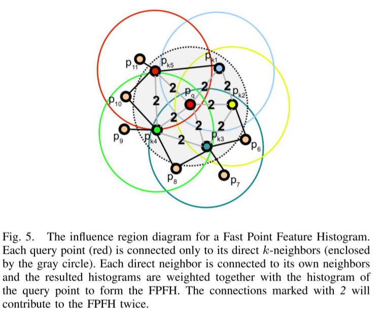

>  Record for the papers I have read and want to read
>
> survey的基本内容：
>
> - 对现在已有方法的一个基本梳理；
> - 对已有方法的一个发展的脉络，后面的人是如何在之前进行打补丁的，效果如何；
> - 后面的方法打补丁的方式，对于经典的方法肯定不能简单地进行评论，还是需要进行关系的梳理；
> - 当前的挑战和将来需要完成的工作。
> - 主要的目的是要自我感觉，给自己的工作进行梳理，然后找出不足，找到可能的改进方向。
>
> 可以总结的几个点：
>
> - Non-rigid
> - Multi-view
> - correspondence-free;
>   - ICP...
> - correspondence-based
> - Global的一些发展
> - Future work

# PSR(Point Set Registration)

- [Hard-Assignment](./Hard-Assignment.md)
- [Soft-Assignment](./Soft-Assignment.md)

## Soft-Assign

### Optimization

- **Point Set Registration via Particle Filtering and Stochastic Dynamics**

  > Sandhu, Romeil, Samuel Dambreville, and Allen Tannenbaum. "Point set registration via particle filtering and stochastic dynamics." *IEEE transactions on pattern analysis and machine intelligence* 32.8 (2009): 1459-1473.
  >
  > **Citations:** 

- **Model-Based Clustering, Discriminant Analysis, and Density Estimation**
  - 作为GMM的数学基础，可以进行参考。

### To Read

- **Simultaneous Covariance Driven Correspondence (CDC) and Transformation Estimation in the Expectation Maximization Framework**

  > M. Sofka, G. Yang and C. V. Stewart, "Simultaneous Covariance Driven Correspondence (CDC) and Transformation Estimation in the Expectation Maximization Framework," *2007 IEEE Conference on Computer Vision and Pattern Recognition*, 2007, pp. 1-8, doi: 10.1109/CVPR.2007.383166.
  >
  > **Citations:**  50

### Correlation

- **A New Algorithm for Non-Rigid Point Matching**

  > Chui, H., & Rangarajan, A. (2000, June). A new algorithm for non-rigid point matching. In *Proceedings IEEE Conference on Computer Vision and Pattern Recognition. CVPR 2000 (Cat. No. PR00662)* (Vol. 2, pp. 44-51). IEEE.
  >
  > **Citations:** 646
  >
  >  [[url]](https://ieeexplore.ieee.org/stamp/stamp.jsp?tp=&arnumber=854733)  [[pdf]](./papers/)

- **A feature registration framework using mixture models**

  > Chui, H., & Rangarajan, A. (2000, June). A feature registration framework using mixture models. In *Proceedings IEEE Workshop on Mathematical Methods in Biomedical Image Analysis. MMBIA-2000 (Cat. No. PR00737)* (pp. 190-197). IEEE.
  >
  > **Citations:**  205
  >
  >  [[url]](https://ieeexplore.ieee.org/stamp/stamp.jsp?tp=&arnumber=852377)  [[pdf]](./papers/A feature registration framework using mixture models.pdf)

- **Diffeomorphic Matching of Distributions: A New Approach for Unlabelled Point-Sets and Sub-Manifolds Matching**

  > Glaunes, J., Trouvé, A., & Younes, L. (2004, June). Diffeomorphic matching of distributions: A new approach for unlabelled point-sets and sub-manifolds matching. In *Proceedings of the 2004 IEEE Computer Society Conference on Computer Vision and Pattern Recognition, 2004. CVPR 2004.* (Vol. 2, pp. II-II). IEEE.
  >
  > **Citations:** 234
  >
  >  [[url]](https://ieeexplore.ieee.org/stamp/stamp.jsp?tp=&arnumber=1315234)  [[pdf]](./papers/Diffeomorphic Matching of Distributions A New Approach for Unlabelled Point-Sets and Sub-Manifolds Matching.pdf)

- **Uncertainty Modeling and Model Selection for Geometric Inference**

  > Kanatani, K. I. (2004). Uncertainty modeling and model selection for geometric inference. *IEEE Transactions on Pattern Analysis and Machine Intelligence*, *26*(10), 1307-1319.
  >
  > **Citations:** 86
  >
  >  [[url]](https://ieeexplore.ieee.org/stamp/stamp.jsp?tp=&arnumber=1323799)  [[pdf]](./papers/Uncertainty Modeling and Model Selection for Geometric Inference.pdf)

### GMM

- **The Motion Coherence Theory**

  > Yuille, Alan L., and Norberto M. Grzywacz. "The motion coherence theory." *ICCV*. 1988.
  >
  > **Citations:** 185
  >
  >  [[url]](https://ieeexplore.ieee.org/stamp/stamp.jsp?tp=&arnumber=590011)  [[pdf]](./papers/The Motion Coherence Theory.pdf)

- **Non-rigid point set registration: Coherent Point Drift** :green_book:

  > Myronenko, A., Song, X., & Carreira-Perpinán, M. A. (2007). Non-rigid point set registration: Coherent point drift. *Advances in neural information processing systems*, *19*, 1009.
  >
  > **Citations:** 383
  >
  >  [[url]](https://citeseerx.ist.psu.edu/viewdoc/download?doi=10.1.1.85.493&rep=rep1&type=pdf)  [[pdf]](./papers/Non-rigid point set registration Coherent Point Drift.pdf)

- **MLMD: Maximum Likelihood Mixture Decoupling for Fast and Accurate Point Cloud Registration**

  > Eckart, Ben, et al. "Mlmd: Maximum likelihood mixture decoupling for fast and accurate point cloud registration." *2015 International Conference on 3D Vision*. IEEE, 2015.
  >
  > **Citations:** 44

## Partial Overlapping

- **Fully Automatic Registration of 3D Point Clouds** :heavy_check_mark: **(Not really understand)**

  > Makadia, Ameesh, Alexander Patterson, and Kostas Daniilidis. "Fully automatic registration of 3D point clouds." *2006 IEEE Computer Society Conference on Computer Vision and Pattern Recognition (CVPR'06)*. Vol. 1. IEEE, 2006.
  >
  > **Citations:** 410
  >
  > [[url]](https://ieeexplore.ieee.org/stamp/stamp.jsp?tp=&arnumber=1640899) [[pdf]](./papers/Fully_Automatic_Registration_of_3D_Point_Clouds.pdf)

  - Summary
    - This paper propose a registration method using global features to register point sets. The paper claims that it can handle the registration problem in the case of overlap is about 40%(Low overlap.)
    - The features extraction are realized by *EGI(Extended Gaussian Image)*, it is a kind of *distribution* to represent the directional variable(Though this paper describe it by histogram). The rotation estimation is then computed by optimizing correletion of two histograms. (By the way, this kind of features is translation-invariant).
    - Translation is computed based on the rotation got from step 2.

- **A fast automatic method for registration of partially-overlapping range images**

  > Chen, Chu-Song, Yi-Ping Hung, and Jen-Bo Cheng. "A fast automatic method for registration of partially-overlapping range images." *Sixth International Conference on Computer Vision (IEEE Cat. No. 98CH36271)*. IEEE, 1998.
  >
  > **Citations:** 123

## PCA-based Algorithm

- **Shape Matching and Anisotropy**

  > Kazhdan, Michael, Thomas Funkhouser, and Szymon Rusinkiewicz. "Shape matching and anisotropy." *ACM SIGGRAPH 2004 Papers*. 2004. 623-629.
  >
  > **Citations:**  124
  >
  >  [[pdf]](./papers/Shape Matching and Anisotropy.pdf)

  - keywords: isanisotropy
  - 不准备读了, 引用这篇文献的文章都没有关于点云配准的；并且，里面提到的东西，我也不太懂。暂时不看，以后有机会再看吧。

## Fuzzy Algorithms

- **SFCM: A Fuzzy Clustering Algorithm of <u>Extracting the Shape Information</u> of Data**

  > Bui, Quang-Thinh, et al. "SFCM: A fuzzy clustering algorithm of extracting the shape information of data." *IEEE Transactions on Fuzzy Systems* 29.1 (2020): 75-89.
  >
  > **Citations:** 9
  >
  >  [[url]](https://ieeexplore.ieee.org/stamp/stamp.jsp?tp=&arnumber=9160881)  [[pdf]](./papers/SFCM A Fuzzy Clustering Algorithm of Extracting the Shape Information of Datahe Shape Information of Data.pdf)

- **Hyperplane Division in Fuzzy C-Means: Clustering Big Data**

  > Shen, Yinghua, et al. "Hyperplane division in fuzzy C-means: Clustering big data." *IEEE Transactions on Fuzzy Systems* 28.11 (2019): 3032-3046.

- **A Possibilistic Fuzzy c-Means Clustering Algorithm**

  > Pal, Nikhil R., et al. "A possibilistic fuzzy c-means clustering algorithm." *IEEE transactions on fuzzy systems* 13.4 (2005): 517-530.
  >
  > **Citations:** 1300

- **Adaptive fuzzy segmentation of magnetic resonance images**

  > Pham, Dzung L., and Jerry L. Prince. "Adaptive fuzzy segmentation of magnetic resonance images." *IEEE transactions on medical imaging* 18.9 (1999): 737-752.
  >
  > **Citations:** 1005

- **Unsupervised Optimal Fuzzy Clustering**

  > Gath, Isak, and Amir B. Geva. "Unsupervised optimal fuzzy clustering." *IEEE Transactions on pattern analysis and machine intelligence* 11.7 (1989): 773-780.
  >
  > **Citations:** 2276

- **Adaptive Hierarchical Probabilistic Model Using Structured Variational Inference for Point Set Registration**

## Optimization

- **TEASER: Fast and Certifiable Point Cloud Registration** :heavy_check_mark: :question:

  > Yang, Heng, Jingnan Shi, and Luca Carlone. "Teaser: Fast and certifiable point cloud registration." *IEEE Transactions on Robotics* 37.2 (2020): 314-333.
  >
  > **Citations:** 135
  >
  >  [[url]](https://sci-hub.ru/https://ieeexplore.ieee.org/abstract/document/9286491/)  [[pdf]](./papers/TEASER-Fast and Certifiable Point Cloud.pdf)
  >
  > [[notes]](./notes/TEASER-Fast and Certifiable Point Cloud.md)

- **Linearly Converging Quasi Branch and Bound Algorithms for Global Rigid Registration** :heavy_check_mark: :no_entry:

  > Dym, Nadav, and Shahar Ziv Kovalsky. "Linearly converging quasi branch and bound algorithms for global rigid registration." *Proceedings of the IEEE/CVF International Conference on Computer Vision*. 2019.
  >
  > **Citations:** 8
  >
  >  [[pdf]](./papers/Linearly Converging Quasi Branch and Bound Algorithms for Global Rigid Registration.pdf)

  - Acceleration based on the BnBs search, the time complexity changes from  $1/\epsilon$ to $ log(1/\epsilon)$ —— where $\epsilon$ is the accuracy.

- **Precision Range Image Registration Using a Robust Surface Interpenetration Measure and Enhanced Genetic Algorithms** :heavy_check_mark:

  > Silva, L., Bellon, O. R. P., & Boyer, K. L. (2005). Precision range image registration using a robust surface interpenetration measure and enhanced genetic algorithms. *IEEE transactions on pattern analysis and machine intelligence*, *27*(5), 762-776.
  >
  > **Citations:** 281
  >
  >  [[url]](https://ieeexplore.ieee.org/stamp/stamp.jsp?tp=&arnumber=1407879) [[pdf]](./papers/Precision_range_image_registration_using_a_robust_surface_interpenetration_measure_and_enhanced_genetic_algorithms.pdf)

  - Use robust genetic algorithm to search in the pose space and get a good registration result.
  - More robust and accurate than ICP
  - Slower than ICP

- **Provably Approximated Point Cloud Registration**

  > Jubran, Ibrahim, et al. "Provably Approximated Point Cloud Registration." *Proceedings of the IEEE/CVF International Conference on Computer Vision*. 2021.
  >
  >  [[url]](https://openaccess.thecvf.com/content/ICCV2021/papers/Jubran_Provably_Approximated_Point_Cloud_Registration_ICCV_2021_paper.pdf)  [[pdf]](./papers/Provably Approximated Point Cloud Registration.pdf)
  >
  > [[supp]](https://openaccess.thecvf.com/content/ICCV2021/supplemental/Jubran_Provably_Approximated_Point_ICCV_2021_supplemental.pdf)

- **Globally Optimal Linear Model Fitting with Unit-Norm Constraint**

  > Liu, Yinlong, et al. "Globally Optimal Linear Model Fitting with Unit-Norm Constraint." *International Journal of Computer Vision* (2022): 1-14.

- **Point Set Registration via Particle Filtering and Stochastic Dynamics**

  > Sandhu, Romeil, Samuel Dambreville, and Allen Tannenbaum. "Point set registration via particle filtering and stochastic dynamics." *IEEE transactions on pattern analysis and machine intelligence* 32.8 (2009): 1459-1473.
  >
  > **Citations:** 127

- **Convex Global 3D Registration With Lagrangian Duality**

  > Briales, Jesus, and Javier Gonzalez-Jimenez. "Convex global 3d registration with lagrangian duality." *Proceedings of the IEEE Conference on Computer Vision and Pattern Recognition*. 2017.
  >
  > **Citations**: 50

## Non-Rigid

- **Acceleration of Non-Rigid Point Set Registration With Downsampling and Gaussian Process Regression**

  > Hirose, Osamu. "Acceleration of non-rigid point set registration with downsampling and Gaussian process regression." *IEEE Transactions on Pattern Analysis and Machine Intelligence* 43.8 (2020): 2858-2865.
  >
  > **Citations:** 4
  >
  >  [[url]](https://ieeexplore.ieee.org/stamp/stamp.jsp?tp=&arnumber=9290402)
  
- **Point Set Registration with Global-local Correspondence and Transformation Estimation**

  > Zhang, Su, et al. "Point set registration with global-local correspondence and transformation estimation." *Proceedings of the IEEE international conference on computer vision*. 2017.
  >
  > **Citations:**  35

- **Probabilistic Model for Robust Affine and Non-Rigid Point Set Matching**

  > Qu, Han-Bing, et al. "Probabilistic model for robust affine and non-rigid point set matching." *IEEE transactions on pattern analysis and machine intelligence* 39.2 (2016): 371-384.
  >
  > **Citations:**  31

## To Read

- **Fine-To-Coarse Global Registration of RGB-D Scans**

## Feature-Based

### Outlier Removal

- **A Practical O(N2) Outlier Removal Method for Point Cloud Registration**

  > Li, Jiayuan. "A practical O (N2) outlier removal method for point cloud registration." *IEEE Transactions on Pattern Analysis and Machine Intelligence* (2021).
  >
  > **Citations:**  6

- **Guaranteed Outlier Removal for Point Cloud Registration with Correspondences**

  > Bustos, Alvaro Parra, and Tat-Jun Chin. "Guaranteed outlier removal for point cloud registration with correspondences." *IEEE transactions on pattern analysis and machine intelligence* 40.12 (2017): 2868-2882.
  >
  > **Citations:**  76

### Feature Detection

> Feature Detection 的含义是“检测”特征点，例如“line", "coner", "edge"等，而 *Feature Descriptor* 是如何描述这些这些点的特征

### Feature Descriptors

- **Aligning Point Cloud Views using Persistent Feature Histograms** **(PFH)** :heavy_check_mark:

  > Rusu, Radu Bogdan, et al. "Aligning point cloud views using persistent feature histograms." *2008 IEEE/RSJ international conference on intelligent robots and systems*. IEEE, 2008.
  >
  > **Citations:** 768
  >
  >  [[url]](https://ieeexplore.ieee.org/stamp/stamp.jsp?tp=&arnumber=4650967)  [[pdf]](./papers/Aligning Point Cloud Views using Persistent Feature Histograms.pdf)
  
  - Use persistent point feature histograms to describe a feature point in a point set.
  
    - Four features are extracted to describe a feature point.(3 angels based on norm, 1based on distance);
    - The ration is computed and showed in histograms, which can be used as a vector;
  
  - By analyzing the persistence of the features at different scales, we extract an optimal set which best characterizes a given point cloud.
  
    - By comparing the point with global description.
  
    - > In order to select the best feature points for a given cloud, we analyze the neighborhood of each point p multiple times, by enclosing p on a sphere of radius ri and p as its center. We vary r over an interval depending on the point cloud size and density, and compute the local point feature histograms for every point.
  
    - > By comparing the feature histogram of each point against the *µ-histogram* using a distance metric (see below), and building a distribution of distances (see Figure 8 – note that it can be approximated with a Gaussian distribution) , we can perform a statistical analysis of each feature’s persistence over multiple radii.
  
  - Pros and cons
  
    - pros
  
      - By using a higher dimensionality (16D) for characterizing the local geometry at a point p, the estimated features are robust in the presence of outliers, and invariant to the position, orientation, or sampling density of the cloud.
      - Expressive enough.
  
    - cons
  
      - > For real-time or near real-time applications however, the computation of Point Feature Histograms in dense point neighborhoods can represent one of the major bottlenecks in the registration framework.
  
  - :question: How to get correspondence? ( **Refer to[9]** )
  
- **Fast Point Feature Histograms (FPFH) for 3D registration** **(FPFH)** :heavy_check_mark:

  > Rusu, R. B., Blodow, N., & Beetz, M. (2009, May). Fast point feature histograms (FPFH) for 3D registration. In *2009 IEEE international conference on robotics and automation* (pp. 3212-3217). IEEE.
  >
  > **Citations:** 2755
  >
  >  [[url]](https://ieeexplore.ieee.org/stamp/stamp.jsp?tp=&arnumber=5152473)  [[pdf]](./papers/Fast Point Feature Histograms (FPFH) for 3D Registration.pdf)

  - Simplified *PFH* algo, which reduces the computational complexity of the algorithm from  $O(n\cdot k^2)$ to $O(n·k)$;

    

  - Pros and cons

    - Pros: Compared to FPH, it reduce the computational cost.
    - Cons: Handcrafted features are generally designed to work with relatively clean range data like laser scans, and may not work very well with the scans collected by commodity depth sensors

- **Demisting the Hough Transform for 3D Shape Recognition and Registration** :heavy_check_mark: :yellow_heart: 

  > Woodford, Oliver J., et al. "Demisting the Hough transform for 3D shape recognition and registration." *International Journal of Computer Vision* 106.3 (2014): 332-341.
  >
  > **Citations:** 82
  >
  >  [[url]](https://link.springer.com/content/pdf/10.1007/s11263-013-0623-2.pdf)  [[pdf]](./papers/Demisting the Hough transform for 3D shape recognition and registration.pdf)

  - :yellow_heart: Just roughly reading
  - Add two extensions to standard *Hough Transform*: 1) The *intrinsic Hough transform* which reduces the memory consuming; 2) *minimum-entropy Hough transform* which increases the detection accuracy.

- **Fast Registration Based on Noisy Planes With Unknown Correspondences for 3-D Mapping**

  > Pathak, K., Birk, A., Vaškevičius, N., & Poppinga, J. (2010). Fast registration based on noisy planes with unknown correspondences for 3-D mapping. *IEEE Transactions on Robotics*, *26*(3), 424-441.
  >
  > **Citations:** 257
  >
  >  [[url]](https://ieeexplore.ieee.org/stamp/stamp.jsp?tp=&arnumber=5431057)  [[pdf]](./papers/Fast Registration Based on Noisy Planes With Unknown Correspondences for 3-D Mapping.pdf)
  
- **Using spin images for efficient object recognition in cluttered 3D scenes**

  > Johnson, Andrew E., and Martial Hebert. "Using spin images for efficient object recognition in cluttered 3D scenes." *IEEE Transactions on pattern analysis and machine intelligence* 21.5 (1999): 433-449.
  >
  > **Citations:** 3080
  >
  >  [[url]](https://ieeexplore.ieee.org/stamp/stamp.jsp?tp=&arnumber=765655)  [[pdf]](./papers/Using Spin Images for Efficient Object Recognition in Cluttered 3D Scenes.pdf)

- **4-points congruent sets for robust pairwise surface registration**

  > Aiger, Dror, Niloy J. Mitra, and Daniel Cohen-Or. "4-points congruent sets for robust pairwise surface registration." *ACM SIGGRAPH 2008 papers*. 2008. 1-10.
  >
  > **Citations:** 687
  >
  >  [[url]](https://dl.acm.org/doi/pdf/10.1145/1399504.1360684)  [[pdf]](./papers/4-Points Congruent Sets for Robust Pairwise Surface Registration.pdf)

- **Super 4PCS Fast Global Pointcloud Registration via Smart Indexing**

  > Mellado, Nicolas, Dror Aiger, and Niloy J. Mitra. "Super 4pcs fast global pointcloud registration via smart indexing." *Computer graphics forum*. Vol. 33. No. 5. 2014.
  >
  > **Citations:** 393

  - Summary

- **Robust Point Matching for Nonrigid Shapes by Preserving Local Neighborhood Structures** :heavy_check_mark:

  > Zheng, Y., & Doermann, D. (2006). Robust point matching for nonrigid shapes by preserving local neighborhood structures. *IEEE transactions on pattern analysis and machine intelligence*, *28*(4), 643-649.
  >
  > **Citations:** 366
  >
  >  [[url]](https://ieeexplore.ieee.org/stamp/stamp.jsp?tp=&arnumber=1597120)  [[pdf]](./papers/Robust Point Matching for Nonrigid Shapes by Preserving Local Neighborhood Structures.pdf)

  - This paper gives an very direct and clear idea to find the correspondence between two transformmed point set: in the problem of rigid registration, the distance of a given point $x_i$ to other point $x_o$ will be the same with the corresponding point $y_i$ with other points $y_o$.
  - So if we construct the matrix which is of the size $M\times N$ $P$, the correspondence is described by a matrix P and the element of the matrix means the correspondence of the correspondending relationship between two points.
  - The problem is converted to a seperate combinational optimization problem.

- **Shape Matching and Object Recognition Using Shape Contexts**

  > Belongie, Serge, Jitendra Malik, and Jan Puzicha. "Shape matching and object recognition using shape contexts." *IEEE transactions on pattern analysis and machine intelligence* 24.4 (2002): 509-522.
  >
  > **Citations:**  **<u>8300</u>**
  >
  
- **3DMatch: Learning Local Geometric Descriptors from RGB-D Reconstructions**

  > Zeng, Andy, et al. "3dmatch: Learning local geometric descriptors from rgb-d reconstructions." *Proceedings of the IEEE conference on computer vision and pattern recognition*. 2017.
  >
  > **Citations:** 477
  
- **SpinNet: Learning a General Surface Descriptor for 3D Point Cloud Registration** :heavy_check_mark:

  > Ao, Sheng, et al. "Spinnet: Learning a general surface descriptor for 3d point cloud registration." *Proceedings of the IEEE/CVF Conference on Computer Vision and Pattern Recognition*. 2021.
  >
  > **Citations:** 23
  >
  >  [[pdf]](./papers/Ao_SpinNet_Learning_a_General_Surface_Descriptor_for_3D_Point_Cloud_CVPR_2021_paper.pdf)

  - Summary:
    - 
    - This paper proposes a neural network to learn correspondence point-wise, the core idea is transforming the raw point cloud to a cylindrical space, which can be used to maintain **rotation invariance**. The rotation invariance is beneficial to generalization.

- **Geometric Transformer for Fast and Robust Point Cloud Registration**

  > Qin, Zheng, et al. "Geometric Transformer for Fast and Robust Point Cloud Registration." *arXiv preprint arXiv:2202.06688* (2022).

- **NARF: 3D Range Image Features for Object Recognition**

  > Steder, Bastian, et al. "NARF: 3D range image features for object recognition." *Workshop on Defining and Solving Realistic Perception Problems in Personal Robotics at the IEEE/RSJ Int. Conf. on Intelligent Robots and Systems (IROS)*. Vol. 44. 2010.
  >
  > **Citations:** 248

- **STORM: Structure-based Overlap Matching for Partial Point Cloud Registration**

  > Wang, Yujie, et al. "STORM: Structure-based Overlap Matching for Partial Point Cloud Registration." *IEEE Transactions on Pattern Analysis and Machine Intelligence* (2022).
  >
  > **Citations:** 0
  
- **Colored Point Cloud Registration Revisited**

  > Park, Jaesik, Qian-Yi Zhou, and Vladlen Koltun. "Colored point cloud registration revisited." *Proceedings of the IEEE international conference on computer vision*. 2017.
  >
  > **Citations:** 142

### Feature-based Registration

- **PHASER: A Robust and Correspondence-Free Global Pointcloud Registration** :heavy_check_mark: **(Not really)**

  > Bernreiter, Lukas, et al. "PHASER: a Robust and Correspondence-free Global Pointcloud Registration." *IEEE Robotics and Automation Letters* 6.2 (2021): 855-862.
  >
  > **Citations:** 3
  >
  > [[pdf]](./papers/PHASER_A_Robust_and_Correspondence-Free_Global_Pointcloud_Registration.pdf)

  - Summary

    

    - The proposed method is similar to [Fully Automatic Registration of 3D Point Clouds](). First, the raw point cloud is projected on the sphere. The *spherical Fourier transform* is conducted and estimating rotation.
    - After getting rotation, the translation is estimated on spatial frequency domain.

- **Efficient Global Point Cloud Registration by Matching Rotation Invariant Features Through Translation Search** :heavy_check_mark:

  >  Liu, Yinlong, et al. "Efficient global point cloud registration by matching rotation invariant features through translation search." *Proceedings of the European Conference on Computer Vision (ECCV)*. 2018.
  >
  >  **Citations:** 40
  >
  >  [[url]](https://www.ecva.net/papers/eccv_2018/papers_ECCV/papers/Yinlong_Liu_Efficient_Global_Point_ECCV_2018_paper.pdf)  [[pdf]](./papers/Yinlong_Liu_Efficient_Global_Point_ECCV_2018_paper.pdf)
  >
  >  [[notes]](./notes/Efficient Global Point Cloud Registration by Matching Rotation Invariant Features Through Translation Search.md)

  - Summary

    

    - The method aims to find the global optimization for rigid pairwise optimization. The transformation is decomposed computing optimal translation and optimal rotation separately. Specifically,  optimal translation $t^*$ is computed first, and then rotation $r^*$ is computed then.

    - For computing $t^*$, the rotation-invariant features is constructed by two points $x_1$ and $x_2$:
      $$
      p_{i} = \{ |x_1|, |x_2|, |x_1 - x_2| \}^{T}
      $$
      is rotation invariant. Based on the consensus set constructed by two point sets. Constructed the cost function and optimized it by BnB-search to get optimal $t^*$ .

    - After finding the $t^*$, using local-method to compute $R$ or use *RANSAC* to get $R$ directly.

  - cons:

    - No code, the compared baseline methods are few.

- **Fast global registration** :heavy_check_mark:

  > Zhou, Q. Y., Park, J., & Koltun, V. (2016, October). Fast global registration. In *European conference on computer vision* (pp. 766-782). Springer, Cham.
  >
  > **Citations:** 421
  >
  > [[url]](http://vladlen.info/papers/fast-global-registration.pdf)  [[pdf]](./papers/Fast Global Registration.pdf)

  - Not the ICP variant
  - Need the correspondence, (FPFH or other)
  - Use an estimator called *scaled Geman-McClure estimator* to reject the outliers and noise
  - Induce the *Black-Rangarajan duality* to optimize the objective function
  - Faster and more accurate than ICP, no need to find the correspondence and closet in the inner loop.

- **Super4PCS: Fast Global Pointcloud Registration via Smart Indexing**

  > Mellado, Nicolas, Dror Aiger, and Niloy J. Mitra. "Super 4pcs fast global pointcloud registration via smart indexing." *Computer graphics forum*. Vol. 33. No. 5. 2014.
  >
  > **Citations:** 399
  
- **Random sample consensus: a paradigm for model fitting with applications to image analysis and automated cartography** **(RANSAC)** :heavy_check_mark: :x:

  > Fischler, Martin A., and Robert C. Bolles. "Random sample consensus: a paradigm for model fitting with applications to image analysis and automated cartography." *Communications of the ACM* 24.6 (1981): 381-395.
  >
  > **Citations:** 28407

  - Summary
    - A basic method, for registration, given the data correspondence, the *RANSAC* searches the transformation space and finds the optimal transformation which can make the consensus set largest.
  - Cons
    - Slow in converge and low accuracy with large outlier.[Ref](Guaranteed Outlier Removal for Point Cloud Registration with Correspondences)
  - **It has many variants, need to read.**

- **Least-Squares Fitting of Two 3-D Point Sets**

  > Arun, K. Somani, Thomas S. Huang, and Steven D. Blostein. "Least-squares fitting of two 3-D point sets." *IEEE Transactions on pattern analysis and machine intelligence* 5 (1987): 698-700.
  >
  > **Citations:** 4768

### Features-Combined

- **Integrating Deep Semantic Segmentation Into 3-D Point Cloud Registration**

  > Zaganidis, Anestis, et al. "Integrating deep semantic segmentation into 3-d point cloud registration." *IEEE Robotics and Automation Letters* 3.4 (2018): 2942-2949.
  >
  > [[pdf]](./papers/Integrating_Deep_Semantic_Segmentation_Into_3-D_Point_Cloud_Registration.pdf)
  >
  > **Citations:** 48

## Learning-Based

### Feature

- **PointDSC: Robust Point Cloud Registration using Deep Spatial Consistency**

  > Bai, Xuyang, et al. "Pointdsc: Robust point cloud registration using deep spatial consistency." *Proceedings of the IEEE/CVF Conference on Computer Vision and Pattern Recognition*. 2021.
  >
  > **Citations:** 17
  >
  >  [[pdf]](./papers/PointDSC_Robust_Point_Cloud_Registration_Using_Deep_Spatial_Consistency_CVPR_2021_paper.pdf) [[code]](https://github.com/XuyangBai/PointDSC)

- **PRNet: Self-Supervised Learning for Partial-to-Partial Registration**

  >  [[url]](https://arxiv.org/pdf/1910.12240.pdf)  [[pdf]](./papers/PRNet Self-Supervised Learning for Partial-to-Partial Registration.pdf)

- **The Perfect Match: 3D Point Cloud Matching with Smoothed Densities**

  > <CVPR2019>
  >
  >  [[url]](https://openaccess.thecvf.com/content_CVPR_2019/papers/Gojcic_The_Perfect_Match_3D_Point_Cloud_Matching_With_Smoothed_Densities_CVPR_2019_paper.pdf)

- **PREDATOR: Registration of 3D Point Clouds with Low Overlap** :heavy_check_mark: :red_circle:

  > Huang, Shengyu, et al. "PREDATOR: Registration of 3D Point Clouds with Low Overlap." *Proceedings of the IEEE/CVF Conference on Computer Vision and Pattern Recognition*. 2021.
  >
  > **Citations:** 29
  >
  >  [[url]](https://openaccess.thecvf.com/content/CVPR2021/papers/Huang_Predator_Registration_of_3D_Point_Clouds_With_Low_Overlap_CVPR_2021_paper.pdf)  [[pdf]](./papers/PREDATOR Registration of 3D Point Clouds with Low Overlap.pdf)

  - Our model is specifically designed to handle (also) point-cloud pairs with low overlap.
  - The core of the model is an overlap attention module that enables early information exchange between the point clouds’ latent encodings, in order to infer which of their points are likely to lie in their overlap region.
  - :question:所以这个模型的输出是啥？

- **Sampling Network Guided Cross-Entropy Method for Unsupervised Point Cloud Registration** :heavy_check_mark:

  > Jiang, Haobo, et al. "Sampling network guided cross-entropy method for unsupervised point cloud registration." *Proceedings of the IEEE/CVF International Conference on Computer Vision*. 2021.
  >
  > **Citations:** 1
  >
  >  [[url]](https://openaccess.thecvf.com/content/ICCV2021/papers/Jiang_Sampling_Network_Guided_Cross-Entropy_Method_for_Unsupervised_Point_Cloud_Registration_ICCV_2021_paper.pdf)  [[pdf]](./papers/Sampling Network Guided Cross-Entropy Method for Unsupervised Point Cloud Registration.pdf)

  - Reformulate the registration problem as a reinforcement learning problem.
  
- **Deep Hough Voting for Robust Global Registration**

  > Lee, Junha, et al. "Deep Hough Voting for Robust Global Registration." *Proceedings of the IEEE/CVF International Conference on Computer Vision*. 2021.
  >
  > **Citations:** 2
  >
  >  [[url]](https://openaccess.thecvf.com/content/ICCV2021/papers/Lee_Deep_Hough_Voting_for_Robust_Global_Registration_ICCV_2021_paper.pdf)  [[pdf]](./papers/Deep Hough Voting for Robust Global Registration.pdf)

- **PointNet: Deep Learning on Point Sets for 3D Classification and Segmentation** 

  > Qi, C. R., Su, H., Mo, K., & Guibas, L. J. (2017). Pointnet: Deep learning on point sets for 3d classification and segmentation. In *Proceedings of the IEEE conference on computer vision and pattern recognition* (pp. 652-660).
  >
  > **Citations:** 6347
  >
  >  [[url]](https://openaccess.thecvf.com/content_cvpr_2017/papers/Qi_PointNet_Deep_Learning_CVPR_2017_paper.pdf) [[pdf]](./papers/PointNet_Deep_Learning_CVPR_2017_paper.pdf)
  >
  > [[notes]](./notes/PointNet Deep Learning on Point Sets for 3D Classification and Segmentation.md)

- **PointNet++: Deep Hierarchical Feature Learning on Point Sets in a Metric Space**

  > Qi, C. R., Yi, L., Su, H., & Guibas, L. J. (2017). Pointnet++: Deep hierarchical feature learning on point sets in a metric space. *arXiv preprint arXiv:1706.02413*.
  >
  > **Citations:** 4083
  
- **PointNetLK: Robust & Efficient Point Cloud Registration using PointNet**

  > Aoki, Yasuhiro, et al. "Pointnetlk: Robust & efficient point cloud registration using pointnet." *Proceedings of the IEEE/CVF Conference on Computer Vision and Pattern Recognition*. 2019.
  >
  > **Citations:** 282
  
- **PointDSC: Robust Point Cloud Registration using Deep Spatial Consistency**

  > Bai, Xuyang, et al. "Pointdsc: Robust point cloud registration using deep spatial consistency." *Proceedings of the IEEE/CVF Conference on Computer Vision and Pattern Recognition*. 2021.
  >
  > **Citations:** 17

- **Deep Global Registration** :heavy_check_mark:

  > Choy, Christopher, Wei Dong, and Vladlen Koltun. "Deep global registration." *Proceedings of the IEEE/CVF conference on computer vision and pattern recognition*. 2020.
  >
  > **Citations:** 122
  >
  >  [[url]](https://arxiv.org/pdf/2004.11540.pdf)  [[pdf]](./papers/Deep Global Registration.pdf)

  - This paper propose a registration algorithm based-on deep-learning.
  - It uses the network to find the inlier features(The used features provided by "FCGF"); Use a kind of function to calculate the coarse alignment; Use the gradient-based methods to get a find registration.
  - **Some thoughts:** The positions of the points can also be regarded as a kind of "features".

- **Deep Closest Point: Learning Representations for Point Cloud Registration** :heavy_check_mark:

  > Wang, Yue, and Justin M. Solomon. "Deep closest point: Learning representations for point cloud registration." *Proceedings of the IEEE/CVF International Conference on Computer Vision*. 2019.
  >
  > **Citations:** 319
  >
  > [[pdf]](./papers/Wang_Deep_Closest_Point_Learning_Representations_for_Point_Cloud_Registration_ICCV_2019_paper.pdf)

  - Summary

    

    - Three steps: 1) Features extraction; 2) Soft correspondence; 3) SVD compute transformation.

  - Why

    - Soft correspondence: differentiable.

  - cons

    - Object-level input.(Which means the size of input point set is about 500-5k points).

- **3DRegNet: A Deep Neural Network for 3D Point Registration** :heavy_check_mark:

  > Pais, G. Dias, et al. "3dregnet: A deep neural network for 3d point registration." *Proceedings of the IEEE/CVF conference on computer vision and pattern recognition*. 2020.
  >
  > **Citations:** 62
  >
  > [[pdf]](./papers/Pais_3DRegNet_A_Deep_Neural_Network_for_3D_Point_Registration_CVPR_2020_paper.pdf)

  - Summary
    - Two neural work. One is for classifcation, and the other one is for regression. The classification network classify the input correspondence as inliers and outliers.(Compared to *RANSAC*). The *regression* network use the input inlier correspondence to compute the transformation(Compared to FGR).
  - Why
  - Comments
    - The paper investigates the performance of different representations of the rotation.

- **Large-scale Point Cloud Semantic Segmentation with Superpoint Graphs**

  > Landrieu, Loic, and Martin Simonovsky. "Large-scale point cloud semantic segmentation with superpoint graphs." *Proceedings of the IEEE conference on computer vision and pattern recognition*. 2018.
  >
  > **Citations:**  660

- **3D Local Features for Direct Pairwise Registration**

  > Deng, Haowen, Tolga Birdal, and Slobodan Ilic. "3d local features for direct pairwise registration." *Proceedings of the IEEE/CVF Conference on Computer Vision and Pattern Recognition*. 2019.
  >
  > **Citations:**  64
  
- **PPFNet: Global Context Aware Local Features for Robust 3D Point Matching** **(PPFNet)** :heavy_check_mark:

  > Deng, Haowen, Tolga Birdal, and Slobodan Ilic. "Ppfnet: Global context aware local features for robust 3d point matching." *Proceedings of the IEEE conference on computer vision and pattern recognition*. 2018.
  >
  > **Citations**: 264
  >
  > [[pdf]](./papers/Deng_PPFNet_Global_Context_CVPR_2018_paper.pdf)

  - Summary
    - The **correspondence**: The input is pair-points, the motivation is similar *PPF(hand crafter features)*, to find the local features. The output is the correspondence. These Networks aim to find invariant features.
    - How to compute the **transformation**: RANSAC
  - Comments
    - The **shortcomings** of the hand-crafted features: The hand-crafted features(such as *FPFH*) only consider the local features of the points, which may spread widely in the two point set, thus resulting in incorrect correspondence.
    - The author mentions that using set-input (pair or small patch) as the input of the network is beneficial to develop the invariance properties.

## Graph-Based / Spectral-Based

- **Spectral Correspondence for Point Pattern Matching**

  > Carcassoni, M., & Hancock, E. R. (2003). Spectral correspondence for point pattern matching. *Pattern Recognition*, *36*(1), 193-204.
  >
  > **Citations:** 271
  >
  >  [[url]](https://reader.elsevier.com/reader/sd/pii/S0031320302000547?token=9EC1420AF495A990060CF769F8859EB19D22B507DF305D3779BF0F968814EC067F756D046CD5429AF52B6FDC4807EBE9&originRegion=eu-west-1&originCreation=20220113140059)  [[pdf]](./papers/Spectral Correspondence for Point Pattern Matching.pdf)

- **Thirty Years of Graph Matching in Pattern Recognition**

  > Conte, D., Foggia, P., Sansone, C., & Vento, M. (2004). Thirty years of graph matching in pattern recognition. *International journal of pattern recognition and artificial intelligence*, *18*(03), 265-298.
  >
  > **Citations:** 1758
  >
  >  [[url]](http://citeseerx.ist.psu.edu/viewdoc/download?doi=10.1.1.455.7770&rep=rep1&type=pdf)  [[pdf]](./papers/Thirty Years of Graph Matching in Pattern Recognition.pdf)

- **Structural Graph Matching Using the EM Algorithm and Singular Value Decomposition**

  > Luo, Bin, and Edwin R. Hancock. "Structural graph matching using the EM algorithm and singular value decomposition." *IEEE Transactions on Pattern Analysis and Machine Intelligence* 23.10 (2001): 1120-1136.
  >
  > **Citations:** 459

- **A unified framework for alignment and correspondence** :heavy_check_mark: :x:

  > Luo, B., & Hancock, E. R. (2003). A unified framework for alignment and correspondence. *Computer Vision and Image Understanding*, *92*(1), 26-55.
  >
  > **Citations:** 73
  >
  >  [[url]](https://reader.elsevier.com/reader/sd/pii/S1077314203000973?token=0DBF0A87CDEC4BE21370C4E39E5A1906171CB67EBDAA80A064DB207F16AEF0881DB5CB50C2E751104DF082DBF0E688B6&originRegion=eu-west-1&originCreation=20220113135844)  [[pdf]](./papers/A unified framework for alignment and correspondence.pdf)

  - Summary

    - About the method: [Some paper](./papers/Robust_Point_Set_Registration_Using_Gaussian_Mixture_Models.pdf) refers to it as *Graph Matching*. Some paper(*CPD*) refers it as probalistic method similar to *CPD*, but the difference lies in the solution of *M-step*. (The later one is widely accepted.)

  - Understanding(May not be correct)

    - **I think** the main idea is that the proposed method model the correspondence and the alignment as two probability. The algorithm follows a 2-step *E-M* process to compute the correspondence and alignment separately.

      The difference from the previous methods is the framework to update the correspondence and transformation parameters.

    - **Need to read the previous papers first**

- **Graphical Models and Point Pattern Matching**

  > Caetano, T. S., Caelli, T., Schuurmans, D., & Barone, D. A. C. (2006). Graphical models and point pattern matching. *IEEE Transactions on pattern analysis and machine intelligence*, *28*(10), 1646-1663.
  >
  > **Citations:** 171
  >
  >  [[url]](https://ieeexplore.ieee.org/stamp/stamp.jsp?tp=&arnumber=1677520)  [[pdf]](./papers/Graphical Models and Point Pattern Matching.pdf)
  
- **3D Shape Registration Using Spectral Graph Embedding and Probabilistic Matching**

  > Sharma, Avinash, Radu Horaud, and Diana Mateus. "3D shape registration using spectral graph embedding and probabilistic matching." *arXiv preprint arXiv:2106.11166* (2021).
  >
  > **Citations:**  14

## Different kinds of Improvements

- **SDRSAC: Semidefinite-Based Randomized Approach for Robust Point Cloud Registration without Correspondences**

  > <CVPR2019>
  >
  >  [[url]](https://openaccess.thecvf.com/content_CVPR_2019/papers/Le_SDRSAC_Semidefinite-Based_Randomized_Approach_for_Robust_Point_Cloud_Registration_Without_CVPR_2019_paper.pdf)  [[pdf]](./papers/SDRSAC_Semidefinite-Based_Randomized_Approach_for_Robust_Point_Cloud_Registration_Without_CVPR_2019_paper.pdf)

- **Global Optimality for Point Set Registration Using Semidefinite Programming**

  > <CVPR2020>
  >  [[url]](https://openaccess.thecvf.com/content_CVPR_2020/papers/Iglesias_Global_Optimality_for_Point_Set_Registration_Using_Semidefinite_Programming_CVPR_2020_paper.pdf)  [[pdf]](./papers/Global_Optimality_for_Point_Set_Registration_Using_Semidefinite_Programming_CVPR_2020_paper.pdf)

## Extension

### Multiple Point set

- **Joint Alignment of Multiple Point Sets with Batch and Incremental Expectation-Maximization**

  > Evangelidis, G. D., & Horaud, R. (2017). Joint alignment of multiple point sets with batch and incremental expectation-maximization. *IEEE transactions on pattern analysis and machine intelligence*, *40*(6), 1397-1410.
  >
  > **Citations:**  87
  >
  > [[url]](https://ieeexplore.ieee.org/stamp/stamp.jsp?tp=&arnumber=7954698)  [[pdf]](./papers/Joint Alignment of Multiple Point Sets with Batch and Incremental Expectation-Maximization.pdf)
  
- **Multiview registration for large data sets**

### Non-rigid Point set

- **A new point matching algorithm for non-rigid registration**

  > Chui, H., & Rangarajan, A. (2003). A new point matching algorithm for non-rigid registration. *Computer Vision and Image Understanding*, *89*(2-3), 114-141.
  >
  >  [[url]](https://reader.elsevier.com/reader/sd/pii/S1077314203000092?token=1F6EDF85BEE9DB34579FF7916F9D35C900B8B71010B9E7F166D03A7050D1CD39F574900CBB0DAB444B3168C6A74F6A71&originRegion=eu-west-1&originCreation=20220116113608)  [[pdf]](./papers/A new point matching algorithm for non-rigid registration.pdf)

## Survey

- **A comprehensive survey on point cloud registration**

  > Huang, X., Mei, G., Zhang, J., & Abbas, R. (2021). A comprehensive survey on point cloud registration. *arXiv preprint arXiv:2103.02690*.
  >
  > **Citations:** 10
  >
  >  [[url]](https://arxiv.org/pdf/2103.02690.pdf)  [[pdf]](./papers/A comprehensive survey on point cloud registration.pdf)
  >
  > [[detailed notes]](./notes/A comprehensive survey on point cloud registration.md)

- **Registration of large-scale terrestrial laser scanner point clouds A review and benchmark**

  > <ISPRS Journal of Photogrammetry and Remote Sensing>
  >  [[url]](https://reader.elsevier.com/reader/sd/pii/S0924271620300836?token=601731D7F5A970C99DA0F576524F984B32A54C306453727528A63B21BE9B8B9B81E18ED8BE62C0ECA2F16B6CDC4CE878&originRegion=eu-west-1&originCreation=20211224092123)
  >  [[pdf]](./papers/Registration of large-scale terrestrial laser scanner point clouds A reviewand benchmark.pdf)
  > [[detailed notes]](./notes/Registration of large-scale terrestrial laser scanner point clouds A reviewand benchmark.pdf.md)
  
- **A Review of Point Cloud Registration Algorithms for Mobile Robotics**

  > Pomerleau, F., Colas, F., & Siegwart, R. (2015). A review of point cloud registration algorithms for mobile robotics. *Foundations and Trends in Robotics*, *4*(1), 1-104.
  >
  > **Citations**:423
  >
  >  [[url]](https://hal.archives-ouvertes.fr/hal-01178661/document)  [[pdf]](./papers/A Review of Point Cloud Registration Algorithms for Mobile Robotics.pdf)

- **Image Matching from Handcrafted to Deep Features: A Survey**

  > Ma, J., Jiang, X., Fan, A., Jiang, J., & Yan, J. (2021). Image matching from handcrafted to deep features: A survey. *International Journal of Computer Vision*, *129*(1), 23-79.
  >
  > **Citations:** 155
  >
  >  [[url]](https://link.springer.com/content/pdf/10.1007/s11263-020-01359-2.pdf)  [[pdf]](./papers/Image Matching from Handcrafted to Deep Features A Survey.pdf)
  
  - Registration is achieved by the minimization of a statistical discrepancy measure between the two **density** functions.
  
- **Deformable Medical Image Registration: A Survey**

  > Sotiras, A., Davatzikos, C., & Paragios, N. (2013). Deformable medical image registration: A survey. *IEEE transactions on medical imaging*, *32*(7), 1153-1190.
  >
  > **Citations:** 1413
  >
  >  [[url]](https://ieeexplore.ieee.org/stamp/stamp.jsp?tp=&arnumber=6522524)  [[pdf]](./papers/Deformable Medical Image Registration A Survey.pdf)
  
- **Registration of 3D Point Clouds and Meshes: A Survey from Rigid to Nonrigid**

  > Tam, Gary KL, et al. "Registration of 3D point clouds and meshes: A survey from rigid to nonrigid." *IEEE transactions on visualization and computer graphics* 19.7 (2012): 1199-1217.
  >
  > **Citations:** 621
  
- **<u>Deep Learning for 3D Point Clouds: A Survey</u>**

  > Guo, Yulan, et al. "Deep learning for 3d point clouds: A survey." *IEEE transactions on pattern analysis and machine intelligence* 43.12 (2020): 4338-4364.
  >
  > **Citations:** 452
  >
  >  [[pdf]](./papers/Deep_Learning_for_3D_Point_Clouds_A_Survey.pdf)

  - 本文的行文结构大致是：按照CV中点云的任务来进行分析：*shape classification*, *Object Detection and tracking*, *3D point set Segmentation*. 依据每个任务中的 *deep learning* 的应用进行分类，进行文献综述，并且每一个小章节有一个 *summary*， 其内容主要是：在测试集上的表现；缺点；未来的方向等。

- **LiDAR Odometry Methodologies for Autonomous Driving: A Survey**

  > Jonnavithula, Nikhil, Yecheng Lyu, and Ziming Zhang. "LiDAR Odometry Methodologies for Autonomous Driving: A Survey." *arXiv preprint arXiv:2109.06120* (2021).

- **A Comprehensive Performance Evaluation of 3D Local Feature Descriptors** :heavy_check_mark: :star:

   Worth reading for survey

  > Guo, Yulan, et al. "A comprehensive performance evaluation of 3D local feature descriptors." *International Journal of Computer Vision* 116.1 (2016): 66-89.
  >
  > **Citations:** 462
  >
  >  [[pdf]](./papers/A Comprehensive Performance Evaluation of 3D Local Feature Descriptors.pdf)

  - The **evaluation** paper of the local features descriptors, in the introduction of the paper, the author mention the skeleton of the paper: What's is the local descriptors, and the relevant algorithms; How to evaluate the local features, the meaning of the evaluation. The contribution and why to write the paper.

  - 一些值得借鉴的东西：

    - 为什么要做这篇论文：

      - Although a large number of feature descriptors have been proposed, they were exclusively designed for a specific **application** scenario.
      - they have only been tested on a limited number of **datasets.**
      - It is therefore, very challenging for **developers** to choose an **appropriate** descriptor for their particular appli-
        cation
      - Most of these evaluation articles tested only a small number of 3D local feature descriptors and for a specific application domain.

      —— 1) 选定的算法数目更多；2) 选定的测试集更多，之前的evaluation要么限定在某一两个测试环境，要么选定的算法比较少，无法做到统一的评估；3) 有一些没有被测试(robustness)；

    - 自己要做什么包括：1) 选取的测试集一定要广泛；2) 选定的测试方法；3) 在实际的应用环境中进行测试（例如本文可以专注于某一个领域, robotics?)

  - **非常值得借鉴和学习本文的组织结构，是写evaluation paper的重要参考。此外，刨除结构，本文的内容也非常的重要，对于点云的描述子来说。**
  
- **Recent developments and trends in point set registration methods**

  > Maiseli, Baraka, Yanfeng Gu, and Huijun Gao. "Recent developments and trends in point set registration methods." *Journal of Visual Communication and Image Representation* 46 (2017): 95-106.
  >
  > **Citations:** 90

- **Registration of Laser Scanning Point Clouds: A Review**

  > Cheng, Liang, et al. "Registration of laser scanning point clouds: A review." *Sensors* 18.5 (2018): 1641.
  
- **Registration of large-scale terrestrial laser scanner point clouds: A review and benchmark**

  > Dong, Zhen, et al. "Registration of large-scale terrestrial laser scanner point clouds: A review and benchmark." *ISPRS Journal of Photogrammetry and Remote Sensing* 163 (2020): 327-342.

## Comparison

- **Beyond points: Evaluating recent 3D scan-matching algorithms**

  > Magnusson, Martin, et al. "Beyond points: Evaluating recent 3D scan-matching algorithms." *2015 IEEE International Conference on Robotics and Automation (ICRA)*. IEEE, 2015.
  >
  > **Citations:** 68
  >
  >  [[pdf]](./papers/Beyond_points_Evaluating_recent_3D_scan-matching_algorithms.pdf)

- **Comparing ICP variants on real-world data sets** :heavy_check_mark:

  > Pomerleau, François, et al. "Comparing ICP variants on real-world data sets." *Autonomous Robots* 34.3 (2013): 133-148.
  >
  > **Citations:** 657
  >
  >  [[pdf]](./papers/Comparing ICP variants on real-world data sets.pdf)

  - This paper mainly propose a stadnard pipeline of ICP algorithms, and provbide a open-source sofrware which can be used for comparing ICP algorithms. The pipeline consists of different modules, which can be tuned by parameters.
  
  - However, the paper's foucus is narrow, the main contribution of the paper is the software. It research the variants of ICP little. The content is much but with no focus, the experiments are a little superficial.
  
  - If I were the author, I will refer to the paper 《Efficient ICP and its variants》,  this paper classify different metrics of ICP variants and compare the performance of these metrics. However, what I want to do？ I want to verify the real performance of these metrics. So, the baseline and the criteria should be established. What the problems they can solve?
  
    The limitations of the paper is that it is more engineering, but not the theoretical.
  
  - :question: However, how to express my idea if I wrote the paper?
  
    Refer to the paper: <secrets of optical flow> again! Though I can't get the content, but I should learn the main idea of it.
  
- **A Comprehensive Performance Evaluation of 3-D Transformation Estimation Techniques in Point Cloud Registration**

  > Zhao, Bao, et al. "A comprehensive performance evaluation of 3-d transformation estimation techniques in point cloud registration." *IEEE Transactions on Instrumentation and Measurement* 70 (2021): 1-14.
  >
  > **Citations:**  2

- **Benchmarking urban six-degree-of-freedom simultaneous localization and mapping**

  > Wulf, Oliver, et al. "Benchmarking urban six‐degree‐of‐freedom simultaneous localization and mapping." *Journal of Field Robotics* 25.3 (2008): 148-163.
  >
  > **Citations:**  75

## To Read

- **Gravitational Approach for Point Set Registration**

  > Golyanik, Vladislav, Sk Aziz Ali, and Didier Stricker. "Gravitational approach for point set registration." *Proceedings of the IEEE conference on computer vision and pattern recognition*. 2016.
  >
  > **Citations:** 36
  >
  > [[pdf]](./papers/Golyanik_Gravitational_Approach_for_CVPR_2016_paper.pdf)

# Mapping & Fusion

## Semantic

- **SegMap Segment-based mapping and localization using data-driven descriptors**

  > Dube, Renaud, et al. "SegMap: Segment-based mapping and localization using data-driven descriptors." *The International Journal of Robotics Research* 39.2-3 (2020): 339-355.
  >  [[pdf]](./papers/SegMap Segment-based mapping and localization using data-driven descriptors.pdf) [[url]](https://journals.sagepub.com/doi/pdf/10.1177/0278364919863090)
  >
  > [[notes]](./notes/SegMap Segment-based mapping and localization using data-driven descriptors.md)

- **Recurrent-OctoMap: Learning State-Based Map Refinement for Long-Term Semantic Mapping With 3-D-Lidar Data**

  > <RA-L2018>

- **Sattler_Understanding_the_Limitations_of_CNN-Based_Absolute_Camera_Pose_Regression_CVPR_2019_paper**

  > <CVPR>

  为端到端的localization的效果不如基于3D精确地图的位姿估计提供了理论依据.

  A key result is that current approaches do not consistently outperform a handcrafted image retrieval baseline

- **Self-Supervised_Learning_of_Lidar_Segmentation_for_Autonomous_Indoor_Navigation**

  > <ICRA>

- **Semantic Fusion_Dense_3D_semantic_mapping_with_convolutional_neural_networks**

  > <ICRA 2017>
  >
  >  [[pdf]](./papers/SemanticFusion_Dense_3D_semantic_mapping_with_convolutional_neural_networks.pdf)
  >
  > [[notes]](./notes/SemanticFusion_Dense_3D_semantic_mapping_with_convolutional_neural_networks.md)

  Combine the CNNs with the SLAM system ElasticFusion. The camera is RGB-D, use the RGB image as the input;

- **SuMa++: Efficient LiDAR-based Semantic SLAM**

  > <IROS 2019>

- **Integrating Deep Semantic Segmentation into 3D point cloud registration**

  > <RA-L 2018>
  >
  >  [[pdf]](./papers/Integrating Deep Semantic Segmentation into 3D point cloud registration.pdf)
  >
  > [[notes]](./notes/Integrating Deep Semantic Segmentation into 3D point cloud registration.md)

  - 使用PointNet作为语义分割的前端，对三维点云进行像素级别的语义分割；
  - 将分割后的点云按照class进行集合分类，使用NDT算法，对两个点云中同类的点云进行配准；objective function优化各个class的损失的和
  - **future work**: end-to-end, get the transformation directly;

# Math Basis

- **Global optimization through rotation space search**

  >  [[url]](https://link.springer.com/content/pdf/10.1007/s11263-008-0186-9.pdf)
  
- **Maximum Likelihood from Incomplete Data via the EM Algorithm**

  > Dempster, A. P., Laird, N. M., & Rubin, D. B. (1977). Maximum likelihood from incomplete data via the EM algorithm. *Journal of the Royal Statistical Society: Series B (Methodological)*, *39*(1), 1-22.
  >
  > **Citations:** 65630
  >
  >  [[url]](https://rss.onlinelibrary.wiley.com/doi/epdf/10.1111/j.2517-6161.1977.tb01600.x)  [[pdf]](./papers/Maximum Likelihood from Incomplete Data via the EM Algorithm.pdf)

- **Computational Optimal Transport** :green_book:

  > Peyré, G., & Cuturi, M. (2019). Computational optimal transport: With applications to data science. *Foundations and Trends® in Machine Learning*, *11*(5-6), 355-607.
  >
  >  [[url]](https://arxiv.org/pdf/1803.00567.pdf)  [[pdf]](./papers/Computational Optimal Transport.pdf)

# SLAM

> Especially for some registration algorithms used widely in SLAM applications

- **LOAM: Lidar Odometry and Mapping in Real-time**

  > Zhang, Ji, and Sanjiv Singh. "LOAM: Lidar Odometry and Mapping in Real-time." *Robotics: Science and Systems*. Vol. 2. No. 9. 2014.
  >
  >  [[pdf]](./papers/LOAM Lidar Odometry and Mapping in Real-time.pdf)
  >
  > **Citations:** 1333

  - A SLAM framework considering the motion distortion in the process.
  - The registration process is finished by extracting features and use them to register two scans. 

- **Past, Present, and Future of Simultaneous Localization and Mapping: Toward the Robust-Perception Age**

  > Cadena, Cesar, et al. "Past, present, and future of simultaneous localization and mapping: Toward the robust-perception age." *IEEE Transactions on robotics* 32.6 (2016): 1309-1332.
  >
  > **Citations:** 2316
  
- **PLADE: A Plane-Based Descriptor for Point Cloud Registration With Small Overlap**

  > Chen, Songlin, et al. "PLADE: A plane-based descriptor for point cloud registration with small overlap." *IEEE Transactions on Geoscience and Remote Sensing* 58.4 (2019): 2530-2540.
  >
  > **Citations:**  33

- **Point-plane SLAM for hand-held 3D sensors**

- **Point Set Registration With Semantic Region Association Using Cascaded Expectation Maximization**

## Mapping

- **Occupancy map building through Bayesian exploration**

  > Francis, Gilad, et al. "Occupancy map building through bayesian exploration." *The International Journal of Robotics Research* 38.7 (2019): 769-792.
  >
  > **Citations:** 9

# Data Set

- **Are we ready for autonomous driving? The KITTI vision benchmark suite** **(KITTI)**

  > Geiger, Andreas, Philip Lenz, and Raquel Urtasun. "Are we ready for autonomous driving? the kitti vision benchmark suite." *2012 IEEE conference on computer vision and pattern recognition*. IEEE, 2012.
  >
  > **Citations**: 8397
  >
  > [[pdf]](./papers/Are_we_ready_for_autonomous_driving_The_KITTI_vision_benchmark_suite.pdf)

- **Challenging data sets for point cloud registration algorithms**

  > Pomerleau, François, et al. "Challenging data sets for point cloud registration algorithms." *The International Journal of Robotics Research* 31.14 (2012): 1705-1711.
  >
  > [[pdf]](./papers/0278364912458814.pdf) [[data set]](http://projects.asl.ethz.ch/datasets)

# Other Applications

- **Grasp pose detection in point clouds**

  > ten Pas, Andreas, et al. "Grasp pose detection in point clouds." *The International Journal of Robotics Research* 36.13-14 (2017): 1455-1473.
  >
  > **Citations:**  271

# Reference

- **A Quantitative Analysis of Current Practices in Optical Flow Estimation and the Principles Behind Them**

  > Sun, Deqing, Stefan Roth, and Michael J. Black. "A quantitative analysis of current practices in optical flow estimation and the principles behind them." *International Journal of Computer Vision* 106.2 (2014): 115-137.
  >
  > **Citations:** 578
  >
  >  [[pdf]](./papers/A Quantitative Analysis of Current Practices in Optical Flow Estimation and the Principles Behind Them.pdf)

  - A good example for survey.

- **Secrets of optical flow estimation and their principles**

  > Sun, Deqing, Stefan Roth, and Michael J. Black. "Secrets of optical flow estimation and their principles." *2010 IEEE computer society conference on computer vision and pattern recognition*. IEEE, 2010.
  >
  > **Citations:** 1691
  >
  >  [[pdf]](./papers/Secrets of Optical Flow Estimation and Their Principles.pdf)

- **Rotation Averaging**

  > Hartley, Richard, et al. "Rotation averaging." *International journal of computer vision* 103.3 (2013): 267-305.
  >
  > **Citations:** 475
  >
  >  [[pdf]](./papers/Rotation Averaging.pdf)

  - The article intrduces how to calculate the average rotation of multiple rotations.
  - The summary recommends two good ways(No best and closed-form way)

---

- What's the unstructured environment?

  > Environment that contains many obstacles and where vehicle localization is difficult. Most natural **environment**s are **unstructured**.
