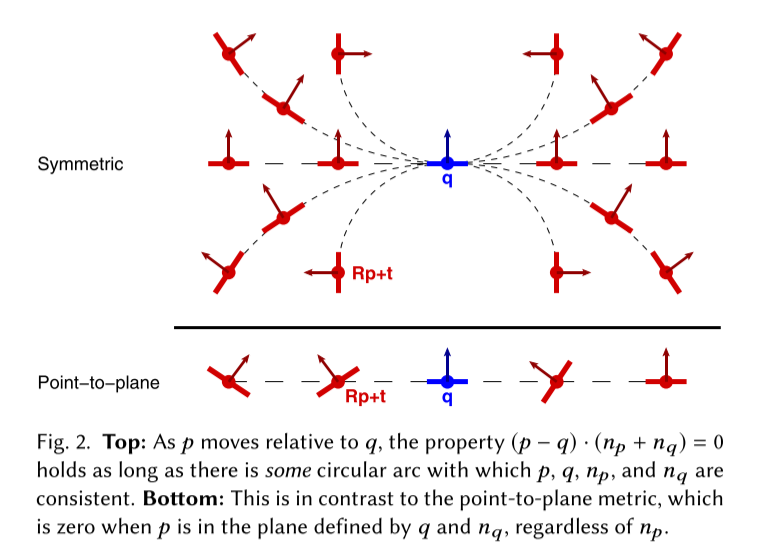
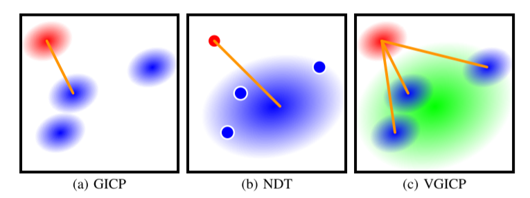
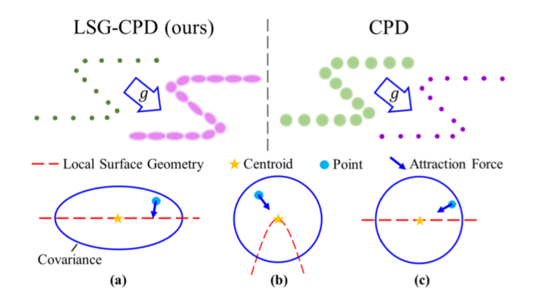
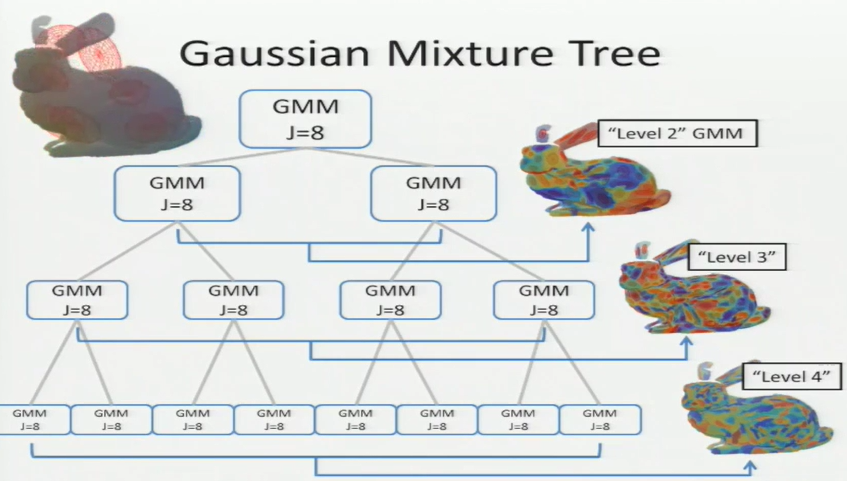
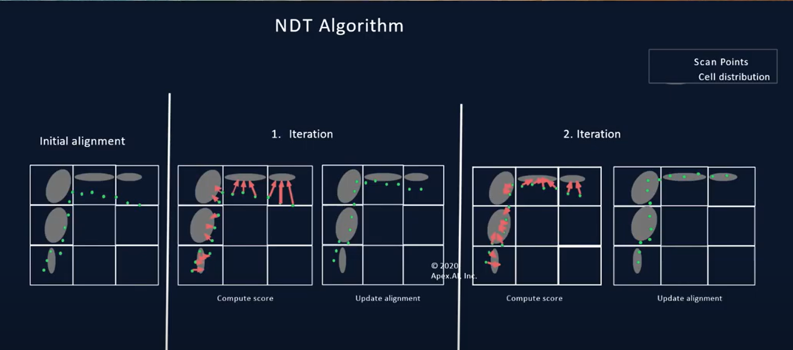

>  Record for the papers I have read and want to read
>
> survey的基本内容：
>
> - 对现在已有方法的一个基本梳理；
> - 对已有方法的一个发展的脉络，后面的人是如何在之前进行打补丁的，效果如何；
> - 后面的方法打补丁的方式，对于经典的方法肯定不能简单地进行评论，还是需要进行关系的梳理；
> - 当前的挑战和将来需要完成的工作。
> - 主要的目的是要自我感觉，给自己的工作进行梳理，然后找出不足，找到可能的改进方向。
>
> 可以总结的几个点：
>
> - Non-rigid
> - Multi-view
> - correspondence-free;
>   - ICP...
> - correspondence-based
> - Global的一些发展
> - Future work

# PSR(Point Set Registration)

## Linear-Assign

### Standard  ICP

- **Method for registration of 3-D shapes** **(Standard ICP)** :heavy_check_mark:

  > Besl, P. J., & McKay, N. D. (1992, April). Method for registration of 3-D shapes. In *Sensor fusion IV: control paradigms and data structures* (Vol. 1611, pp. 586-606). International Society for Optics and Photonics.
  >
  > **Citations:** 22173
  >
  >  [[url]](https://www.cvl.iis.u-tokyo.ac.jp/class2004/wedenesday/report/besl.pdf)  [[pdf]](./papers/A Method for Registration of 3-D Shapes.pdf)
  >
  > [[tutorial]](http://www.sci.utah.edu/~shireen/pdfs/tutorials/Elhabian_ICP09.pdf) [[ICP Related Material]](http://ais.informatik.uni-freiburg.de/teaching/ss12/robotics/slides/17-icp.pdf)
  >
  > [[notes]](./notes/A Method for Registration of 3-D Shapes.md)

  ​	The original paper of ICP.	

  > It alternates between the closest point query in the target set and minimization of the distance between corresponding points and is guaranteed to converge to a locally optimal alignment

- **Iterative Point Matching for Registration of Free-Form Curves and Surfaces** :heavy_check_mark: 

  > Zhang, Z. (1994). Iterative point matching for registration of free-form curves and surfaces. *International journal of computer vision*, *13*(2), 119-152.
  >
  > **Citations:** 3098
  >
  >  [[url]](http://citeseerx.ist.psu.edu/viewdoc/download?doi=10.1.1.175.770&rep=rep1&type=pdf)  [[pdf]](./papers/Iterative Point Matching for Registration of Free-Form Curves and Surfaces.pdf)
  >
  > [[notes]](./notes/Iterative Point Matching for Registration of Free-Form Curves and Surfaces.md)

  - The same work as ICP, but proposed independently.

### Optimization

- **Multi-scale EM-ICP: A Fast and Robust Approach for Surface Registration** :question:

  > Granger, S., & Pennec, X. (2002, May). Multi-scale EM-ICP: A fast and robust approach for surface registration. In *European Conference on Computer Vision* (pp. 418-432). Springer, Berlin, Heidelberg.
  >
  > **Citations:** 521
  >
  >  [[url]](http://citeseerx.ist.psu.edu/viewdoc/download?doi=10.1.1.18.5106&rep=rep1&type=pdf) [[pdf]](./papers/Multi-scale EM-ICP  A Fast and Robust.pdf)
  >
  > [[notes]](./notes/EM-ICP.md)

  - Can be viewed as 'Soft Assignment'
  - View the registration problem as the MLE(Maximum Likelihood Estimation) problem, and use E-M Algorithm to optimize the parameter.
  
- **Registering multiview range data to create 3D computer objects** :heavy_check_mark:

  > Blais, Gérard, and Martin D. Levine. "Registering multiview range data to create 3D computer objects." *IEEE Transactions on Pattern Analysis and Machine Intelligence* 17.8 (1995): 820-824.
  >
  > **Citations:** 666
  >
  > [[pdf]](./papers/Registering_multiview_range_data_to_create_3D_computer_objects.pdf)

  - Summary
    - The algorithm is similar to ICP, the difference is the optimization method: *VFSR*(Very Fast simulated annealing), but it is a a stochastic optimization method.

- **A Stochastic Iterative Closest Point Algorithm (stochastICP)** :heavy_check_mark:

  > Penney, Graeme P., et al. "A stochastic iterative closest point algorithm (stochastICP)." *International Conference on Medical Image Computing and Computer-Assisted Intervention*. Springer, Berlin, Heidelberg, 2001.
  >
  > **Citations:** 72
  >
  > [[pdf]](./papers/Penney2001_Chapter_AStochasticIterativeClosestPoi.pdf)

  - Summary

    - The method changes point set coordinate stochastically every iteration:
      $$
      p_j' = p_j + v_j
      $$
      The perturbation is generated by Gaussian Noise.

    - The stop criteria is the transformation parameter error between two iteration is small.

### Robustness

- **Efficient variants of the ICP algorithm** :heavy_check_mark:

  > Rusinkiewicz, S., & Levoy, M. (2001, May). Efficient Variants of the ICP algorithm. In *Proceedings third international conference on 3-D digital imaging and modelling (pp. 145-152). IEEE.
  >
  > **Citations:** 4711
  >
  >  [[url]](https://ieeexplore.ieee.org/stamp/stamp.jsp?tp=&arnumber=924423)  [[pdf]](./papers/Efficient Variants of the ICP Algorithm.pdf)
  >
  > [[notes]](./notes/Efficient variants of the ICP algorithm.md)

  Compare some variants of ICP-based algorithms, the effect of variants on steps of ICP. The paper proposes a sampling method by sampling points according to the normals to increase robustness.

- **The Trimmed Iterative Closest Point Algorithm** **(Tr-ICP)** :heavy_check_mark:

  > Chetverikov, D., Svirko, D., Stepanov, D., & Krsek, P. (2002, August). The trimmed iterative closest point algorithm. In *Object recognition supported by user interaction for service robots* (Vol. 3, pp. 545-548). IEEE.
  >
  > **Citations:** 598
  >
  >  [[url]](https://ieeexplore.ieee.org/stamp/stamp.jsp?tp=&arnumber=1047997&tag=1)  [[pdf]](./papers/The Trimmed Iterative Closest Point Algorithm.pdf)

  Tr-ICP: '*Tr*' means the '*Trimmed*', use the '*[Least Trimmed Square](https://en.wikipedia.org/wiki/Least_trimmed_squares)*' method in the process to improve robustness.
  Pros: can converge when the **overlapping** rate is under 50%;
  cons: still need a good initial pose;

- **Robust Euclidean alignment of 3D point sets the trimmed iterative closest point algorithm** :heavy_check_mark:

  > Chetverikov, D., Stepanov, D., & Krsek, P. (2005). Robust Euclidean alignment of 3D point sets: the trimmed iterative closest point algorithm. *Image and vision computing*, *23*(3), 299-309.
  >
  > **Citations:** 461
  >
  >  [[url]](https://reader.elsevier.com/reader/sd/pii/S0262885604001179?token=B6A29AD77A8BDB565DE4A2ACBB8EFE4B12056ED98E9FFC14E5AD96E10C8F7E04DB2E587E5F8487939EEAC731DC1B24E1&originRegion=eu-west-1&originCreation=20220107203632)  [[pdf]](./papers/Robust Euclidean alignment of 3D point sets the trimmediterative closest point algorithm.pdf)

  - Similar to Tr-ICP, they are the same authors, but I did not get the difference between them.

- **The dual-bootstrap iterative closest point algorithm with application to retinal image registration**

  > Stewart, C. V., Tsai, C. L., & Roysam, B. (2003). The dual-bootstrap iterative closest point algorithm with application to retinal image registration. *IEEE transactions on medical imaging*, *22*(11), 1379-1394.
  >
  > **Citations:** 520
  >
  >  [[url]](https://ieeexplore.ieee.org/stamp/stamp.jsp?tp=&arnumber=1242341)  [[pdf]](./papers/The dual-bootstrap iterative closest point algorithm with application to retinal image registration.pdf)

### Outlier

- **Robust point set registration using EM-ICP with information-theoretically optimal outlier handling**

  > Hermans, Jeroen, et al. "Robust point set registration using EM-ICP with information-theoretically optimal outlier handling." *CVPR 2011*. IEEE, 2011.
  >
  > **Citations:** 45
  
- **Robust matching of 3D contours using iterative closest point algorithm improved by M-estimation**

  > Kaneko, Shun'ichi, Tomonori Kondo, and Atsushi Miyamoto. "Robust matching of 3D contours using iterative closest point algorithm improved by M-estimation." *Pattern Recognition* 36.9 (2003): 2041-2047.
  >
  > **Citations:** 90
  >
  > [[pdf]](./papers/M_ICP.pdf)

  - Summary

    - Traditional ICP method uses the *Least Square* to compute the objective function. If we define the residuals as $e_1 = p_1 - q_1$ , the traditional ICP is $e_1^2 + e_2^2 + e_3^2$

      The M-ICP constructs a new objective function as:
      $$
      Obj = \sum{\rho_1(e_1)+\rho_2(e_2)+\rho_3(e_3)}
      $$

### A similar framework

- **Registration of Point Cloud Data from a Geometric Optimization Perspective**

  > Mitra, N. J., Gelfand, N., Pottmann, H., & Guibas, L. (2004, July). Registration of point cloud data from a geometric optimization perspective. In *Proceedings of the 2004 Eurographics/ACM SIGGRAPH Symposium on Geometry processing* (pp. 22-31).
  >
  > **citations**:346
  >
  >  [[url]](https://graphics.stanford.edu/courses/cs348a-17-winter/Handouts/mgpg-rpcdgop-04.pdf)  [[pdf]](./papers/Registration of Point Cloud Data from a Geometric Optimization Perspective.pdf)

- **Registration without ICP**

  > Pottmann, H., Leopoldseder, S., & Hofer, M. (2004). Registration without ICP. *Computer Vision and Image Understanding*, *95*(1), 54-71.
  >
  > **Citations:**  193
  >
  >  [[url]](https://reader.elsevier.com/reader/sd/pii/S1077314204000475?token=8DB8C5E4B144F2E8B057D208B85ACA76BB37E85C6014F18D2EF6C6B9F068840DC740ED9D345A8EC880FDA7ADABF1DF16&originRegion=eu-west-1&originCreation=20220108112859)  [[pdf]](./papers/Registration without ICP.pdf)

- **Geometry and convergence analysis of algorithms for registration of 3D shapes**

  > Pottmann, H., Huang, Q. X., Yang, Y. L., & Hu, S. M. (2006). Geometry and convergence analysis of algorithms for registration of 3D shapes. *International Journal of Computer Vision*, *67*(3), 277-296.
  >
  > **Citations:**  225
  >
  >  [[url]](https://link.springer.com/content/pdf/10.1007/s11263-006-5167-2.pdf)  [[pdf]](./papers/Geometry and Convergence Analysis of Algorithms for Registration of 3D Shapes.pdf)

### Objective Function

- **Object modelling by registration of multiple range images** **(Point-to-Plane ICP)** :heavy_check_mark:

  > Chen, Y., & Medioni, G. (1992). Object modelling by registration of multiple range images. *Image and vision computing*, *10*(3), 145-155.
  >
  > **Citations:** 4931
  >
  >  [[pdf]](./papers/Object modeling by registration of multiple range images.pdf) [[url]](http://graphics.stanford.edu/courses/cs348a-17-winter/Handouts/chen-medioni-align-rob91.pdf)
  >
  > [[notes]](./notes/Object modelling by registration of multiple range images.md)

  **Point-to-Plane ICP.**

  

- **Generalized-ICP** **(Plane-to-Plane ICP / GICP)** :heavy_check_mark:

  > Segal, A., Haehnel, D., & Thrun, S. (2009, June). Generalized-icp. In *Robotics: science and systems* (Vol. 2, No. 4, p. 435).
  >
  > **Citations:** 1365 :flags:
  >
  >  [[url]](https://www.robots.ox.ac.uk/~avsegal/resources/papers/Generalized_ICP.pdf)  [[pdf]](./papers/Generalized_ICP.pdf)
  >
  > [[notes]](./notes/Generalized-ICP.md)

  GICP: Generalize The ICP approach to probabilistic distribution, extend it to plane-to-plane format.

  将ICP的方法从点对点，点对面进行一般化，引入了两个点云的协方差矩阵描述各自的特征，降低了不匹配的特征的影响。

- **A symmetric objective function for ICP** **(Symmetric-ICP)**  :heavy_check_mark: 

  :question: 1. 对于该实验有问题，为什么选择每一次迭代的过程？ 2. 这个是否是解决feature的稀疏问题？3. 本论文还有一些引用文献没看

  > Rusinkiewicz, S. (2019). A symmetric objective function for ICP. *ACM Transactions on Graphics (TOG)*, *38*(4), 1-7.
  >
  > **citations**:41
  >
  >  [[url]](https://dl.acm.org/doi/pdf/10.1145/3306346.3323037)  [[pdf]](./papers/A Symmetric Objective Function for ICP.pdf)

  

  Symmetric-ICP: 在point-to-plane的基础上进行改进，point-to-plane的类型收敛域减小，因为如上图所示，如果p点在q点所在的平面，那么二者的 *loss function* 一定为0，那么p点就只能在q点的平面进行滑动。但是使用symmetric(上图所示)，可以允许p点与q点形成圆进行滑动。

  :question: 如何进行求解？

- **Robust symmetric iterative closest point**

  > Li, Jiayuan, et al. "Robust symmetric iterative closest point." *ISPRS Journal of Photogrammetry and Remote Sensing* 185 (2022): 219-231.
  >
  >  [[pdf]](./papers/Robust symmetric iterative closest point.pdf)

- **A robust method for registration and segmentation of multiple range images**

  > Masuda, T., & Yokoya, N. (1995). A robust method for registration and segmentation of multiple range images. *Computer vision and image understanding*, *61*(3), 295-307.
  >
  > **Citations:** 401
  >
  >  [[url]](https://www.sciencedirect.com/sdfe/reader/pii/S1077314285710247/pdf)  [[pdf]](./papers/A Robust Method for Registration and Segmentation of Multiple Range Images.pdf)

- **Robust motion and correspondence of noisy 3-d point sets with missing data**

  > Trucco, E., Fusiello, A., & Roberto, V. (1999). Robust motion and correspondence of noisy 3-D point sets with missing data. *Pattern recognition letters*, *20*(9), 889-898.
  >
  > **Citations:** 140
  >
  > [[url]](https://reader.elsevier.com/reader/sd/pii/S0167865599000550?token=80227EA90623477B34968113CCC67A768D7F900C9CECFDC7F9A7763C172BB9BC1A5C894B86D5D6169A3A26ED39EA8D59&originRegion=eu-west-1&originCreation=20220108114837)  [[pdf]](./papers/Robust motion and correspondence of noisy 3-d point sets with missing data.pdf)

- **Metric-based iterative closest point scan matching for sensor displacement estimation** :heavy_check_mark:

  > Minguez, Javier, Luis Montesano, and Florent Lamiraux. "Metric-based iterative closest point scan matching for sensor displacement estimation." *IEEE Transactions on Robotics* 22.5 (2006): 1047-1054.
  >
  > **Citations:** 195
  >
  > [[pdf]](./papers/Metric-based_iterative_closest_point_scan_matching_for_sensor_displacement_estimation.pdf)

  - Summary

    - Modify the error metric, similar to the Generlization ICP.

    - > MbICP is designed to improve convergence with large initial orientation errors by explicitly putting a measure of
      > rotational error as part of the distance metric to be minimized.
      >
      > —— **G-ICP**

  - Comments

    - When descriping the proposed method, many literature states that the proposed method considers the rotation error and combines it into the distance computation. 

- **A generalization of the metric-based Iterative Closest Point technique for 3D scan matching** :heavy_check_mark:

  > Armesto, Leopoldo, Javier Minguez, and Luis Montesano. "A generalization of the metric-based iterative closest point technique for 3D scan matching." *2010 IEEE International Conference on Robotics and Automation*. IEEE, 2010.
  >
  > **Citations:** 51
  >
  > [[pdf]](./papers/A_generalization_of_the_metric-based_Iterative_Closest_Point_technique_for_3D_scan_matching.pdf)

  - Summary
    - The method is the extension of MB-ICP to 3D space. The method define the distance of two points as the norm of the transformation parameter $||q||$, and depending on this to find the closest corresponding point.
  - Pros and cons
    - More robust and precise.
    - Much computation cost in each iteration.

- **Robust registration of 2D and 3D point sets** **(LM-ICP)**:heavy_check_mark: :question:

  > Fitzgibbon, A. W. (2003). Robust registration of 2D and 3D point sets. *Image and vision computing*, *21*(13-14), 1145-1153.
  >
  > **Citations:** 1089
  >
  >  [[url]](https://reader.elsevier.com/reader/sd/pii/S0262885603001835?token=76780F4CE6E03D857BA3240F3179D4A3ADDC641974808A73B35251E1D27D83CA1AC4345D6345686D2744544E4C647749&originRegion=eu-west-1&originCreation=20220105133411) [[pdf]](./papers/Robust registration of 2D and 3D point sets.pdf)
  >
  > [[notes]](./notes/Robust registration of 2D and 3D point sets.md)

  The article uses the LM (Levenberg–Marquardt algorithm) algorithm to optimize a non-linear process instead of a closed-form solution, which can get a wider converge basin. 

- **Sparse Iterative Closest Point** **(Sparse ICP)** :heavy_check_mark:

  > Bouaziz, S., Tagliasacchi, A., & Pauly, M. (2013, August). Sparse iterative closest point. In *Computer graphics forum* (Vol. 32, No. 5, pp. 113-123). Oxford, UK: Blackwell Publishing Ltd.
  >
  > **Citations:** 393
  >
  >  [[url]](https://onlinelibrary.wiley.com/doi/epdf/10.1111/cgf.12178) [[pdf]](./papers/Sparse Iterative Closest Point.pdf)
  >
  > [[notes]](./notes/Sparse Iterative Closest Point.md)

  Sparse ICP: 仍然使用欧式距离寻找ICP中的correspondence，但是在优化阶段，使用了$d_2^p$ 代替 $d_2$， 提高了稀疏性，对Outlier和noise有一定的鲁棒性。

- **ICP registration using invariant features** **（ICPIF)** :heavy_check_mark: :red_circle:

  > Sharp, Gregory C., Sang W. Lee, and David K. Wehe. "ICP registration using invariant features." *IEEE Transactions on Pattern Analysis and Machine Intelligence* 24.1 (2002): 90-102.
  >
  > **Citations:** 716
  >
  >  [[url]](https://ieeexplore.ieee.org/stamp/stamp.jsp?tp=&arnumber=982886&tag=1)  [[pdf]](./papers/ICP Registration Using Invariant Features.pdf)

  - Reading Notes:
    - Invariants:
      - Curvature
        - simplicity and efficiency;
        - sensitivity to both sensor noise and sampling rate;
      - Moment
      - Spherical Harmonics
  - [ ] 这些特征是否有几何意义？
  - [ ] 第四章和第五章还没看

- **A Robust Loss for Point Cloud Registration** :heavy_check_mark:

  > Deng, Zhi, et al. "A robust loss for point cloud registration." *Proceedings of the IEEE/CVF International Conference on Computer Vision*. 2021.
  >
  >  [[url]](https://openaccess.thecvf.com/content/ICCV2021/papers/Deng_A_Robust_Loss_for_Point_Cloud_Registration_ICCV_2021_paper.pdf)  [[pdf]](./papers/A Robust Loss for Point Cloud Registration.pdf)

  - First, the proposed metric is based on intersections of uniformly random straight lines set in space, which can obtain richer information and more likely to achieve the global minimum.

  - Second, our proposed metric can turn various supervised learning frameworks into unsupervised and has the
    ability to train on massive real unlabeled suitable data sets.

    :star:优缺点要看和谁进行比较；

  - More accurate and faster than ICP, FGR.
  
- **Registration and integration of textured 3D data** :heavy_check_mark:

  > Johnson, Andrew Edie, and Sing Bing Kang. "Registration and integration of textured 3D data." *Image and vision computing* 17.2 (1999): 135-147.
  >
  > **Citations:** 519
  >
  > [[pdf]](./papers/Registration_and_integration_of_textured_3D_data.pdf)

  - Summary

    - The proposed mthod combines the color information into the distance metric based on ICP algorithm. The color parameters are represented by *YIQ* color model. Because it can separate the intensity(which may be affected by the light.) and the intrinsic color.

    - The distance can be computed by
      $$
      p = (x_1,x_2,x_3,\alpha_1c_1, \alpha_2c_2, \alpha_3c_3)
      $$
      Where $\alpha$ is the coefficient, and the $c$ is the measure of color.

### Global

- **The 3D-3D registration problem revisited** :heavy_check_mark:

  > Li, H., & Hartley, R. (2007, October). The 3D-3D registration problem revisited. In *2007 IEEE 11th international conference on computer vision* (pp. 1-8). IEEE.
  >
  > **Citations:** 193
  >
  >  [[url]](https://ieeexplore.ieee.org/stamp/stamp.jsp?tp=&arnumber=4409077)  [[pdf]](./papers/The 3D-3D registration problem revisited.pdf)

  - SPC problem: simultaneous pose and correspondence problem. But if given the correspondence, or given the rotation matrix, the problem becomes **convex** which is easy to solve. SPC problem is non-convex.

  - This paper regard many existing algorithms(e.g. ICP) as a kind of **E-M** algorithm, which alternatively estimate the correspondence and the transformation. The original problem is divided into two sub-problems. However, the E-M algorithms are **local optimal**.

  - Some other existing approaches(Exploiting the geomertic features thar are **inariant** to either **correspondence**? or **transformation**): [PCA](Kazhdan, Michael, Thomas Funkhouser, and Szymon Rusinkiewicz. "Shape matching and anisotropy." *ACM SIGGRAPH 2004 Papers*. 2004. 623-629.), [Mondal matching and spectural matching](M. Leordeanu and M. Hebert, "A spectral technique for correspondence problems using pairwise constraints", *ICCV*, vol. 2, pp. 1482-1489, 2005.    &&    S. Sclaroff and A. Pentland, "Model matching for correspondence and recognition", *PAMI*, June 1995.)

  - The core idea of this paper is the theory of **Lipschitz optimization**.

  - The above problems mentioned above:

    - If the correspondence is fixed, the problem can be solved by: RANSAC, [quaternion method](B. Horn, "Closed-form solution of absolute orientation using unit quatemions", *JOSA-A*, vol. 4, pp. 629-642, April 1987.) [colsed-form1](D. W. Eggert, A. Lorusso and R. B. Fisher, "Estimating 3-d rigid body transformations: a comparison of four major algorithms", *Machine Vision and Applications*, vol. 9, pp. 272-290, 1997.) [closed-form2]( N. Ohta and K. Kanatani, "Optimal estimation of three-dimensional rotation and reliability evaluation", *ECCV*, pp. 175-187, June 1998.)
    - if the Rotation is fixed, the correspondence can also be solved(Here I do not write here, it can be regarded as a pure mathematical problem)

  - To globally optimize the problem, two ways can be considered:

    - Search all the permutations, and then solve the rotation. This idea is simple and effiective, but the cons is that if the input's size is large, the searching space's size is $n!$.
    - Search the rotation space and slove foe the correspondence, which uses the Lipschitz optimization and Brounch-and-bound algorithm.

  - For the brounch-and-bound algorithm, in my view, it estimate the lower bound of each interval and choose the lower bound, and iteratively search the space until converge.

    :question: The details of the algorithm I have not understood.

  - Pros and cons:

    - pros: Global optimal, insensitive to the initialization.
    - cons: 1) Time consuming. 2) Senstive to the outlier. 3) The algorithm complexity is unkown.

  - Can be considered as the pre-paper for the Go-ICP

- **Branch-and-bound methods for euclidean registration problems**

  > Olsson, C., Kahl, F., & Oskarsson, M. (2008). Branch-and-bound methods for euclidean registration problems. *IEEE Transactions on Pattern Analysis and Machine Intelligence*, *31*(5), 783-794.
  >
  > **Citations:** 138
  >
  >  [[url]](https://ieeexplore.ieee.org/stamp/stamp.jsp?tp=&arnumber=4531744)  [[pdf]](./papers/Branch-and-Bound Methods for Euclidean Registration Problems.pdf)

- **Go-ICP_A_Globally_Optimal_Solution_to_3D_ICP_Point-Set_Registration** **(Go-ICP)** :heavy_check_mark:

  > Yang, J., Li, H., Campbell, D., & Jia, Y. (2015). Go-ICP: A globally optimal solution to 3D ICP point-set registration. *IEEE transactions on pattern analysis and machine intelligence*, *38*(11), 2241-2254.
  >
  > **Citations:** 522
  >
  >  [[pdf]](./papers/Go-ICP_A_Globally_Optimal_Solution_to_3D_ICP_Point-Set_Registration.pdf)  [[url]](https://ieeexplore.ieee.org/stamp/stamp.jsp?tp=&arnumber=7368945) 

  - Get the global optimal for ICP algorithm.

### Acceleration

- **AA-ICP Iterative Closest Point with Anderson Acceleration** :heavy_check_mark:

  > Pavlov, A. L., Ovchinnikov, G. W., Derbyshev, D. Y., Tsetserukou, D., & Oseledets, I. V. (2018, May). AA-ICP: Iterative closest point with Anderson acceleration. In *2018 IEEE International Conference on Robotics and Automation (ICRA)* (pp. 3407-3412). IEEE.
  >
  > **Citations:** 29
  >
  >  [[url]](https://ieeexplore.ieee.org/stamp/stamp.jsp?tp=&arnumber=8461063) [[pdf]](./papers/AA-ICP Iterative Closest Point with Anderson Acceleration.pdf)

  AA-ICP: (Anderson Acceleration ICP), use Anderson acceleration to accelerate the process of the algorithm(About 30% compared to standard ICP).

- **Fast and Robust Iterative Closest Point** :heavy_check_mark:

  > Zhang, J., Yao, Y., & Deng, B. (2021). Fast and Robust Iterative Closest Point. *IEEE Transactions on Pattern Analysis and Machine Intelligence*.
  >
  >  [[url]](https://ieeexplore.ieee.org/stamp/stamp.jsp?tp=&arnumber=9336308)  [[pdf]](./papers/Fast_and_Robust_Iterative_Closest_Point.pdf)

  1. Fast: Use Anderson acceleration to make the iteration process quickly;

  2. Robust: Use Welsch’s function to formulate an objective function.

     Extend them to the p2p and p2plane algos, but not globally and need a good initialization.

- **Speeding Up Iterative Closest Point Using Stochastic Gradient Descent** **(SGD-ICP)** :heavy_check_mark:

  > Maken, F. A., Ramos, F., & Ott, L. (2019, May). Speeding up iterative closest point using stochastic gradient descent. In *2019 International Conference on Robotics and Automation (ICRA)* (pp. 6395-6401). IEEE.
  >
  > **Citations:** 6
  >
  >  [[url]](https://ieeexplore.ieee.org/stamp/stamp.jsp?tp=&arnumber=8794011)  [[pdf]](./papers/Speeding Up Iterative Closest Point Using Stochastic Gradient Descent.pdf)

  - Summary
    - Use stochastic gradient descent (SGD) to iterate the parameter.
  - Why
    - The gradient: In a short process, the correspondence points are fixed, the function can be viewed as differentiable.
  - Faster than standard ICP and GICP, not resulting in loss in accuracy.

- **Estimating Motion Uncertainty with Bayesian ICP** :heavy_check_mark:

  > Maken, F. A., Ramos, F., & Ott, L. (2020, May). Estimating Motion Uncertainty with Bayesian ICP. In *2020 IEEE International Conference on Robotics and Automation (ICRA)* (pp. 8602-8608). IEEE.
  >
  > **Citations:** 2
  >
  >  [[url]](https://ieeexplore.ieee.org/stamp/stamp.jsp?tp=&arnumber=9197085)  [[pdf]](./papers/Estimating Motion Uncertainty with Bayesian ICP.pdf)

  - Based on the SGD-ICP,  the SGLD adds the noise to the SGD-ICP.
  - Seems not novel, but **Add uncertainty to the algorithm seems very common**, which I mean can be used widely.
  
- **Stein ICP for Uncertainty Estimation in Point Cloud Matching**

  > Maken, Fahira Afzal, Fabio Ramos, and Lionel Ott. "Stein ICP for Uncertainty Estimation in Point Cloud Matching." *IEEE Robotics and Automation Letters* 7.2 (2021): 1063-1070.
  >
  > **Citations:** 0
  >
  >  [[pdf]](./papers/Stein_ICP_for_Uncertainty_Estimation_in_Point_Cloud_Matching.pdf)

  - How to use ICP to estimate the uncertainty of the point cloud ?
  
- **A Multi-Resolution ICP with Heuristic Closest Point Search for Fast and Robust 3D Registration of Range Images ** :heavy_check_mark:

  > Jost, Timothée, and Heinz Hugli. "A multi-resolution ICP with heuristic closest point search for fast and robust 3D registration of range images." *Fourth International Conference on 3-D Digital Imaging and Modeling, 2003. 3DIM 2003. Proceedings.*. IEEE, 2003.
  >
  > **Citations:** 156
  >
  > [[pdf]](./papers/A_multi-resolution_ICP_with_heuristic_closest_point_search_for_fast_and_robust_3D_registration_of_range_images.pdf)

  - Summary

    - The algorithm aims to accelerate the ICP process. Two methods are used: 

      > At a coarse resolution (i.e., with a limited number of points) ICP converges faster but with less accuracy than at a fine resolution. However, by initializing a finer-resolution ICP with the result of the coarser one, the convergence of the fine-resolution ICP is much faster than with a single-shot ICP, as the initial alignment is mostly correct. These authors also used a pre-computed list of NN to approximate the matching step. With both of these techniques, they showed a significant increase of the speed of ICP while maintaining adequate robustness
      >
      > —— *《A Review of Point Cloud Registration Algorithms for Mobile Robotics 》*

- **The Parallel Iterative Closest Point Algorithm** :heavy_check_mark:

  > Langis, Christian, Michael Greenspan, and Guy Godin. "The parallel iterative closest point algorithm." *Proceedings Third International Conference on 3-D Digital Imaging and Modeling*. IEEE, 2001.
  >
  > **Citations:** 76

- **Softassign and EM-ICP on GPU** :heavy_check_mark:

  > Tamaki, Toru, et al. "Softassign and em-icp on gpu." *2010 First International Conference on Networking and Computing*. IEEE, 2010.
  >
  > **Citations:**66

### Features-combination

- **Color supported generalized-icp** :heavy_check_mark:

  > Korn, Michael, Martin Holzkothen, and Josef Pauli. "Color supported generalized-ICP." *2014 International Conference on Computer Vision Theory and Applications (VISAPP)*. Vol. 3. IEEE, 2014.
  >
  > **Citations:** 62
  >
  > [[pdf]](./papers/Color_supported_generalized-ICP.pdf)

  - Summary

    - Integrating color information into GICP. The pointwise color is represented by *L\*a\*b\* color space*. The point is represented as:
      $$
      p_{\alpha,i} = (x_i, y_i, z_i, \alpha L_i, \alpha a_i, \alpha b_i)^{T}
      $$
      The distance of two point is represented as :
      $$
      d_i = || p_{\alpha,i} - q_{\alpha,i}||_{2}
      $$

    The method is used in finding correspondences.

  - Pros and cons

    - Compared to GICP, the proposed method is more accurate.
    - The running time arises.

  - Comments

    - GICP reduces the distances of corresponding points in the direction of the surface normals. 

- **Color point cloud registration with 4d ICP algorithm**

  > Men, Hao, Biruk Gebre, and Kishore Pochiraju. "Color point cloud registration with 4D ICP algorithm." *2011 IEEE International Conference on Robotics and Automation*. IEEE, 2011.
  >
  > **Citations:** 117
  >
  > [[pdf]](./papers/Color_point_cloud_registration_with_4D_ICP_algorithm.pdf)

### Not Read

- **CELLO-3D: Estimating the Covariance of ICP in the Real World**

  > Landry, David, François Pomerleau, and Philippe Giguere. "CELLO-3D: Estimating the Covariance of ICP in the Real World." *2019 International Conference on Robotics and Automation (ICRA)*. IEEE, 2019.
  >
  > **Citations:** 24
  
- **An accurate closed-form estimate of ICP's covariance**

  > Censi, Andrea. "An accurate closed-form estimate of ICP's covariance." *Proceedings 2007 IEEE international conference on robotics and automation*. IEEE, 2007.
  >
  > **Citations:**  219
  >
  >  [[pdf]](./papers/An_accurate_closed-form_estimate_of_ICPs_covariance.pdf)

  - 和SLAM的应用非常相关，暂时不研究这个，等后续真的需要研究SLAM，再看这篇文章。

- **An ICP variant using a point-to-line metric** :heavy_check_mark:

  > Censi, Andrea. "An ICP variant using a point-to-line metric." *2008 IEEE International Conference on Robotics and Automation*. Ieee, 2008.
  >
  > **Citations:**  528
  >
  > [[pdf]](./papers/An_ICP_variant_using_a_point-to-line_metric.pdf)
  
  - Summary
  
    - The proposed method call them *point-to-line* metric, but the formulation is similar to *poin-to-plane*. In the paper, the author explicitly says that the proposed method is based on the *point-to-plane* formulation.
  
    - The difference between the proposed method and *point-to-plane* method is the optimization. Different from *least square solution*, the proposed method uses a closed-form solution to optimize which makes the converge quicker.
  
    - For **optimization**, 
  
      > A classical approach involves the computation of all the stationary points (among which there is the global minimum). This approach is used by Censi [13] for the global resolution of the 2D registration problem, reducing the problem to solving a 4-th order polynomial equation. 
      >
      > ***Convex Global 3D Registration With Lagrangian Duality***
      >
      > The cons: it is hard to extend to 3-D space because of explosion of complexity.
  
      The proposed method utilizes the ***Lagrange’s multipliers* to optimize the formulation.** And the rotation parameter is expressed in a different way.
  
      The proposed method also proposes a search algorithm to find the correspondence.
  
  - Commetns
  
    - This method is used widely in SLAM application.
  
- **Voxelized GICP for Fast and Accurate 3D Point Cloud Registration** :heavy_check_mark:

  > Koide, Kenji, et al. "Voxelized gicp for fast and accurate 3d point cloud registration." *2021 IEEE International Conference on Robotics and Automation (ICRA)*. IEEE, 2021.
  >
  > **Citations:** 29
  >
  > [[pdf]](./papers/Voxelized_GICP_for_Fast_and_Accurate_3D_Point_Cloud_Registration.pdf)

  - Summary

    

    - The proposed is based on G-ICP(Which first computes the covariance of each point in the two point sets.) Then the GICP finds nearest point and optimizes the cost function combined with the covariance. NDT firstly divides the raw point set into fixed grids, and computes covariance of each grid(a distribution), then finds the nearest gird to optimize the cost function.

    - VGICP

      - Compute the covariance of each point in point sets.

      - For the fixed set, the mean value and covariance is computed together. (Maybe it can be viewed as a "distribution of distribution?").

      - Acceleration: Instead of searching the nearest point/grid. The method uses a trick of voxelization:
        $$
        voxel\_index\_a = cast\_to\_int(a_i / voxle\_resolution) \\
        voxel\_index\_b = cast\_to\_int(b_i / voxle\_resolution) \\
        $$
        In each iteration, the point in moving set will find the equal index in b to optimize.

    - Pros:

      - Run in parallel because it does not need to search the nearest point every iteration.

- **Iterative Global Similarity Points: A Robust Coarse-to-Fine Integration Solution for Pairwise 3D Point Cloud Registration** :heavy_check_mark:

  > Pan, Yue, et al. "Iterative global similarity points: A robust coarse-to-fine integration solution for pairwise 3d point cloud registration." *2018 International Conference on 3D Vision (3DV)*. IEEE, 2018.
  >
  > **Citations:** 21
  >
  > [[pdf]](./papers/Iterative_Global_Similarity_Points_A_Robust_Coarse-to-Fine_Integration_Solution_for_Pairwise_3D_Point_Cloud_Registration.pdf)

  - Summary
    - The proposed method follows the iteration process of ICP method.
      - The difference: In ICP, the correspondence is provided by finding the nearest points correspondence. But in this paper, the correspondence is estimated by finding the *feature correspondence*.  The features are provided by *Binary Shape Context (BSC)*. 
      - The process of features correspondence can be summarized by: 1) Keypoints detecting; 2) computing the descriptors. 3) Computing the correspondence by miniminzing a energy function.
      - After getting the correspondence, SVD is used to compute the transformation.
  - Pros and cons
    - From the experiments, the features seem to hadle **partial overlap** well.
    - The method need involve feature correspondence computation, it is really **time consuming**.

- **Visually bootstrapped generalized ICP**

  > Pandey, Gaurav, et al. "Visually bootstrapped generalized ICP." *2011 IEEE International Conference on Robotics and Automation*. IEEE, 2011.
  >
  > **Citations:** 50
  >
  > [[pdf]](./papers/)

- **Multi-Channel Generalized-ICP: A robust framework for multi-channel scan registration**

  > Servos, James, and Steven L. Waslander. "Multi-Channel Generalized-ICP: A robust framework for multi-channel scan registration." *Robotics and Autonomous systems* 87 (2017): 247-257.
  
- **LiTAMIN: LiDAR-based Tracking And Mapping by Stabilized ICP for Geometry Approximation with Normal Distributions** :heavy_check_mark:

  > Yokozuka, Masashi, et al. "Litamin: Lidar-based tracking and mapping by stabilized icp for geometry approximation with normal distributions." *2020 IEEE/RSJ International Conference on Intelligent Robots and Systems (IROS)*. IEEE, 2020.
  >
  > **Citations**: 9
  >
  > [[pdf]](./papers/LiTAMIN_LiDAR-based_Tracking_And_Mapping_by_Stabilized_ICP_for_Geometry_Approximation_with_Normal_Distributions.pdf)

  - Summary
    - The paper is good that it provides a perspective of cost function to describe the point set registration. 
    - **Motivation**: The achieve balance between robustness and accuracy for ICP-based methods. The *G-ICP* and *NDT* methods provide robustness but they are time consuming due to PCA.
    - The proposed method use a effiective way to compute the inverse of covariance matrix to improve computation effiency.(Based on P2D NDT)
    - **Representation**: The data are represented by voxel grids. **Data Association**: K-D tree.

- **LiTAMIN2: Ultra Light LiDAR-based SLAM using Geometric Approximation applied with KL-Divergence** :heavy_check_mark:

  > Yokozuka, Masashi, et al. "LiTAMIN2: Ultra light lidar-based slam using geometric approximation applied with KL-divergence." *2021 IEEE International Conference on Robotics and Automation (ICRA)*. IEEE, 2021.
  >
  > **Citations:** 11
  >
  > [[pdf]](./papers/LiTAMIN2_Ultra_Light_LiDAR-based_SLAM_using_Geometric_Approximation_applied_with_KL-Divergence.pdf)

  - 
  - Summary
    - The proposed method is based on or *D2D NDT*. 
    - The **Representation** of the point cloud is voxel grid. The *symmetric K-L Divergence* is used to measure similarity of two  sub-point-set(distribution). The difference is adding a extra *penalty function* which is used to estimate the covariance of  two distribution.

- **Convergent iterative closest-point algorithm to accomodate anisotropic and inhomogenous localization error** :heavy_check_mark:

  > Maier-Hein, Lena, et al. "Convergent iterative closest-point algorithm to accomodate anisotropic and inhomogenous localization error." *IEEE transactions on pattern analysis and machine intelligence* 34.8 (2011): 1520-1532.
  >
  > **Citations:** 127
  >
  > [[pdf]](./papers/Convergent_Iterative_Closest-Point_Algorithm_to_Accomodate_Anisotropic_and_Inhomogenous_Localization_Error.pdf)

  - Summary

    - Maybe due to the density or other things, the location error of corresponding points may be anisotropic. The previous method mainly consider the location error as the isotropic error.

    - To formulate the metric error, the anisotropic consideration is combined into the steps of the iteration:
      $$
      distance:d_{new} = || W_{\vec{x}\vec{y}}(\vec{x}-\vec{y})||_{2}^2\\
      cost function = \sum_{i=1}^{M}||W_{i}(R\vec{x_i}+\vec{t}-\vec{y}_{corresponding})||_2^2
      $$
      The coefficient is related to the covariance of both inputs' covariance

    - How to compute the covariance? —— **PCA**

  - Cons:

    - PCA computes covariance consume too much time.

- **Iterative Most-Likely Point Registration (IMLP): A Robust Algorithm for Computing Optimal Shape Alignment**

  > Billings, Seth D., Emad M. Boctor, and Russell H. Taylor. "Iterative most-likely point registration (IMLP): A robust algorithm for computing optimal shape alignment." *PloS one* 10.3 (2015): e0117688.

- **Efficient and Accurate Registration of Point Clouds With Plane to Plane Correspondences**

  > Forstner, Wolfgang, and Kourosh Khoshelham. "Efficient and accurate registration of point clouds with plane to plane correspondences." *Proceedings of the IEEE International Conference on Computer Vision Workshops*. 2017.
  >
  > **Citations:** 33
  >
  > [[pdf]](./papers/Forstner_Efficient_and_Accurate_ICCV_2017_paper.pdf)

- **Joint Rigid Registration of Multiple Generalized Point Sets With Hybrid Mixture Models**

  > Min, Zhe, Jiaole Wang, and Max Q-H. Meng. "Joint rigid registration of multiple generalized point sets with hybrid mixture models." *IEEE Transactions on Automation Science and Engineering* 17.1 (2019): 334-347.
  >
  > **Citations:** 30

- **Learning anisotropic ICP (LA-ICP) for robust and efficient 3D registration** :heavy_check_mark: :x:

  > Lee, Bhoram, and Daniel D. Lee. "Learning anisotropic ICP (LA-ICP) for robust and efficient 3D registration." *2016 IEEE international conference on robotics and automation (ICRA)*. IEEE, 2016.
  >
  > **Citations:** 11
  >
  > [[pdf]](./papers/Learning_anisotropic_ICP_LA-ICP_for_robust_and_efficient_3D_registration.pdf)

  - Summary

    - I do not understand this paper. The proposed method is based on *G-ICP*. It aims to estimate the covariance in the equation;
    - The ideas of the author show as follows:
      - The generalized ICP equation with covariance; And include the point2plane, GICP into this feamework;
      - **The problem to solve** is how to get the covariance?  

    - The method proposes a *online learning* method to estimate covariance. In my view, the proposed method first iteratively estimate the covariance and transformation.

- **An Efficient EM-ICP Algorithm for Symmetric Consistent Non-linear Registration of Point Sets**

  > Combès, Benoît, and Sylvain Prima. "An efficient EM-ICP algorithm for symmetric consistent non-linear registration of point sets." *International Conference on Medical Image Computing and Computer-Assisted Intervention*. Springer, Berlin, Heidelberg, 2010.
  >
  > **Citations:** 26

## Soft-Assign

- **Model-Based Clustering, Discriminant Analysis, and Density Estimation**
  - 作为GMM的数学基础，可以进行参考。

### To Read

- **Simultaneous Covariance Driven Correspondence (CDC) and Transformation Estimation in the Expectation Maximization Framework**

  > M. Sofka, G. Yang and C. V. Stewart, "Simultaneous Covariance Driven Correspondence (CDC) and Transformation Estimation in the Expectation Maximization Framework," *2007 IEEE Conference on Computer Vision and Pattern Recognition*, 2007, pp. 1-8, doi: 10.1109/CVPR.2007.383166.
  >
  > **Citations:**  50

### Correlation

- **A New Algorithm for Non-Rigid Point Matching**

  > Chui, H., & Rangarajan, A. (2000, June). A new algorithm for non-rigid point matching. In *Proceedings IEEE Conference on Computer Vision and Pattern Recognition. CVPR 2000 (Cat. No. PR00662)* (Vol. 2, pp. 44-51). IEEE.
  >
  > **Citations:** 646
  >
  >  [[url]](https://ieeexplore.ieee.org/stamp/stamp.jsp?tp=&arnumber=854733)  [[pdf]](./papers/)

- **A feature registration framework using mixture models**

  > Chui, H., & Rangarajan, A. (2000, June). A feature registration framework using mixture models. In *Proceedings IEEE Workshop on Mathematical Methods in Biomedical Image Analysis. MMBIA-2000 (Cat. No. PR00737)* (pp. 190-197). IEEE.
  >
  > **Citations:**  205
  >
  >  [[url]](https://ieeexplore.ieee.org/stamp/stamp.jsp?tp=&arnumber=852377)  [[pdf]](./papers/A feature registration framework using mixture models.pdf)

- **A Correlation-Based Approach to Robust Point Set Registration** :heavy_check_mark: 

  > Tsin, Y., & Kanade, T. (2004, May). A correlation-based approach to robust point set registration. In *European conference on computer vision* (pp. 558-569). Springer, Berlin, Heidelberg.
  >
  > **Citations:** 435
  >
  >  [[url]](http://www.cs.cmu.edu/afs/.cs.cmu.edu/Web/People/ytsin/research/kcreg.pdf)  [[pdf]](./papers/A Correlation-Based Approach to Robust Point Set Registration.pdf)

- **Diffeomorphic Matching of Distributions: A New Approach for Unlabelled Point-Sets and Sub-Manifolds Matching**

  > Glaunes, J., Trouvé, A., & Younes, L. (2004, June). Diffeomorphic matching of distributions: A new approach for unlabelled point-sets and sub-manifolds matching. In *Proceedings of the 2004 IEEE Computer Society Conference on Computer Vision and Pattern Recognition, 2004. CVPR 2004.* (Vol. 2, pp. II-II). IEEE.
  >
  > **Citations:** 234
  >
  >  [[url]](https://ieeexplore.ieee.org/stamp/stamp.jsp?tp=&arnumber=1315234)  [[pdf]](./papers/Diffeomorphic Matching of Distributions A New Approach for Unlabelled Point-Sets and Sub-Manifolds Matching.pdf)

- **Uncertainty Modeling and Model Selection for Geometric Inference**

  > Kanatani, K. I. (2004). Uncertainty modeling and model selection for geometric inference. *IEEE Transactions on Pattern Analysis and Machine Intelligence*, *26*(10), 1307-1319.
  >
  > **Citations:** 86
  >
  >  [[url]](https://ieeexplore.ieee.org/stamp/stamp.jsp?tp=&arnumber=1323799)  [[pdf]](./papers/Uncertainty Modeling and Model Selection for Geometric Inference.pdf)

- **New algorithms for 2D and 3D point matching: pose estimation and correspondence** :heavy_check_mark:

  > Gold, Steven, et al. "New algorithms for 2D and 3D point matching: pose estimation and correspondence." *Pattern recognition* 31.8 (1998): 1019-1031.
  >
  > **Citations:** 647
  >
  > [[pdf]](./papers/New_algorithms_for_2D_and_3D_point_matching_pose_estimation_and_correspondence.pdf)

  - Summary

    - The *new* of the proposed method is because it is different ICP methods which defines linear association. The method introduces the *soft-assignment* to the point set registration.
    - To relax the discrete optimization by introducing the *softmax* function to describe the the assignment matrix. Then using the *deterministic annealing* to estimating the parameter matrix. (Nested iteration).
    - To estimate the transformation parameter, coordinate descent is used.

  - **Formulation**:

    The registration is presented as a engery function(cost function):
    $$
    E = \sum_{j=1}^{J}\sum_{k=1}^{K} m_{jk} (|| X_j -t -AY_k||_{2}^{2} - \alpha)
    $$

​			In the formulation, the term $m_{jk}$ represents the assignment of the point $i$ and $j$. The parameter $\alpha$ can be regarded as the 	*threshold* for outlier rejecting.

​			**Optimization**: Colsed-form solution is got directly(Analytical solution by equating partial derivatives = 0)

- **A Robust Point Matching Algorithm for Autoradiograph Alignment** :heavy_check_mark: (**RPM**)

  > Rangarajan, Anand, et al. "A robust point-matching algorithm for autoradiograph alignment." *Medical image analysis* 1.4 (1997): 379-398.
  >
  > **Citations:** 232
  >
  > [[url\]](https://reader.elsevier.com/reader/sd/pii/S1361841597850086?token=939D9B6CF93E55670F0907F7557812B247EDCE053FF3112F4DB6EC1213E1EAEBFB46FB87D8B7B47BE7D583E195092E11&originRegion=eu-west-1&originCreation=20220201205118)  [[pdf\]](./papers/A robust point-matching algorithm for autoradiograph alignment.pdf)

  - Summary

    - The proposed method is similar to *New algorithms for 2D and 3D point matching: pose estimation and correspondence*.

      The difference is the input points are based on *Canny edge detection*. (Can be viewed as a variant of **RMP**).

### GMM

- **The Motion Coherence Theory**

  > Yuille, Alan L., and Norberto M. Grzywacz. "The motion coherence theory." *ICCV*. 1988.
  >
  > **Citations:** 185
  >
  >  [[url]](https://ieeexplore.ieee.org/stamp/stamp.jsp?tp=&arnumber=590011)  [[pdf]](./papers/The Motion Coherence Theory.pdf)

- **Non-rigid point set registration: Coherent Point Drift** :green_book:

  > Myronenko, A., Song, X., & Carreira-Perpinán, M. A. (2007). Non-rigid point set registration: Coherent point drift. *Advances in neural information processing systems*, *19*, 1009.
  >
  > **Citations:** 383
  >
  >  [[url]](https://citeseerx.ist.psu.edu/viewdoc/download?doi=10.1.1.85.493&rep=rep1&type=pdf)  [[pdf]](./papers/Non-rigid point set registration Coherent Point Drift.pdf)

- **Point Set Registration: Coherent Point Drift** **(CPD)** :heavy_check_mark:

  > Myronenko, A., & Song, X. (2010). Point set registration: Coherent point drift. *IEEE transactions on pattern analysis and machine intelligence*, *32*(12), 2262-2275.
  >
  > **Citations:** 2323
  >
  >  [[url]](https://ieeexplore.ieee.org/stamp/stamp.jsp?tp=&arnumber=5432191)  [[pdf]](./papers/Point_Set_Registration_Coherent_Point_Drift.pdf)
  >
  > [[notes]](./notes/Point Set Registration - Coherent Point Drift.md)

  - **Some Notes**：
    - 无论对于rigid还是non-rigid，计算的复杂度，计算时间以及鲁棒性都是必须要进行比较的东西。
  - For **rigid** registration, given two point set X and Y. Y is represented as the centroids of 
  - The CPD algorithm is more robust and accurate than LM-ICP, but will perform slower than it.
  - The algorithm will perform very slow then the input's size is big(35947*3), FGT can get faster, but will be less robust.
  - For non-rigid registration, compared to TPS-RPM, CPD algorithm is more accurate, but still slow when the input size is large. The time consumption mainly lies in matrix computation. 
  - **Representation**: The moving point set is represented by a GMMs, the components of which have the same isotropic covariance.
  
- **Rigid and Articulated Point Registration with Expectation Conditional Maximization** :heavy_check_mark:

  > Horaud, R., Forbes, F., Yguel, M., Dewaele, G., & Zhang, J. (2010). Rigid and articulated point registration with expectation conditional maximization. *IEEE Transactions on Pattern Analysis and Machine Intelligence*, *33*(3), 587-602.
  >
  > **Citations:** 219
  >
  >  [[url]](https://ieeexplore.ieee.org/stamp/stamp.jsp?tp=&arnumber=5444893)  [[pdf]](./papers/Rigid and Articulated Point Registration with Expectation Conditional Maximization.pdf)
  
  - Summary:

    - This method is similar to CPD, the difference is that in this algorithm(which is called **ECM**), the **isotropic covariance** is replaced by **anisotropic covariance**. To solve the problem of estimating $R$ under the case of anisotropic covariance, the orthogonal constraint is put on the rotation matrix, and get the estimation of $R$ by *SDP*.
    - The reason the author mentions using the anisotropic covariance is to treat the covariance as a parameter of the model and to be optimized in the *E-M* process. The former methods use isotropic covariance combined with annealing where covariance works as a parameter of the process of annealing.
  
  - Cons:
  
    - Other papers mention that using anisotropic covariance improve little in fact.
  
  - The paper has some assumptions which are interesting:
  
    - This paper treat the algorithm as a **Cluster and parameter estimation** problem. The root can be referred to:
  
      [Model-Based Clustering, Discriminant Analysis, and Density Estimation]([Model-Based Clustering, Discriminant Analysis, and Density Estimation (tandfonline.com)](https://www.tandfonline.com/doi/pdf/10.1198/016214502760047131?needAccess=true))
  
    - Using the isotropic covariance has two advantages:
  
      - With isotropic covariance, the Mahalanobis Distance is replaced by Euclidean Distance, the rotation can be computed in a closed-form way.
  
      - The isotropic covariance can be combined with annealing. 
  
        > **The drawback**: Anisotropic noise in the data is not properly handled, it does not use the full Gaussian model, and it does not fully benefit from the convergence properties ofEMbecause it anneals the variance
        > rather than considering it as a parameter to be estimated
  
  - Some more considerations:
  
    - Replacing the EM process by **CEM**, which means *Classification EM*, forcing posterior probability to 0/1.
    - Finding the connection to ICP.
    - Some ways to accelerate E-step: *block-like organizations* or *KD-trees*.
  
- **An Adaptive Data Representation for Robust Point-Set Registration and Merging** :heavy_check_mark:

  > Campbell, Dylan, and Lars Petersson. "An adaptive data representation for robust point-set registration and merging." *Proceedings of the IEEE international conference on computer vision*. 2015.
  >
  > **Citations:** 60
  >
  > [[pdf]](./papers/Campbell_An_Adaptive_Data_ICCV_2015_paper.pdf)
  
  - **SVR**
  - Summary
    - The method uses a *SVM* to generate two GMMs for the two point sets.(Compared to GMMReg, the GMMs components do not equal to the number of the points). The two GMMs have the same covariance, (Every component has the same covariance).
    - Similar to GMMReg, registration is conducted by minimizing the L2 distance between two GMMs. The transformation parameter is updated by gradient-based method(*interior-reflective Newton* method). The covariance $\sigma$ works as the annealingp arameter.
  - Pros
    - The GMM constructed by the SVM is more robust especially for occlusion.
  
- **FilterReg: Robust and Efficient Probabilistic Point-Set Registration using Gaussian Filter and Twist Parameterization** :heavy_check_mark: :no_entry:

  > Gao, Wei, and Russ Tedrake. "Filterreg: Robust and efficient probabilistic point-set registration using gaussian filter and twist parameterization." *Proceedings of the IEEE/CVF Conference on Computer Vision and Pattern Recognition*. 2019.
  >
  > **Citations:** 58
  >
  >  [[url]](https://openaccess.thecvf.com/content_CVPR_2019/papers/Gao_FilterReg_Robust_and_Efficient_Probabilistic_Point-Set_Registration_Using_Gaussian_Filter_CVPR_2019_paper.pdf)  [[pdf]](./papers/FilterReg-Robust and Efficient Probabilistic Point-Set Registration using Gaussian Filter and Twist Parameterization.pdf)
  
  - Point-to-Plane GMM.
  - Formulate the E step as a filtering problem and solve it using advances in efficient Gaussian filters.
  
- **LSG-CPD: Coherent Point Drift with Local Surface Geometry for Point Cloud Registration** :heavy_check_mark:

  > Liu, Weixiao, Hongtao Wu, and Gregory Chirikjian. "LSG-CPD: Coherent Point Drift with Local Surface Geometry for Point Cloud Registration." *arXiv preprint arXiv:2103.15039* (2021).
  >
  >  [[url]](https://openaccess.thecvf.com/content/ICCV2021/papers/Liu_LSG-CPD_Coherent_Point_Drift_With_Local_Surface_Geometry_for_Point_ICCV_2021_paper.pdf)  [[pdf]](./papers/LSG-CPD Coherent Point Drift with Local Surface Geometry.pdf)
  
  - Adjust the point-to-point / point-to-plane based on surface normal and surface variation by adjusting covariance:
  
    

  - Some tricks to increase robustness:
  
    - Adjust the uniform distribution, and the weight of GMM;
  
  - Some tricks to get faster:
  
    - We propose an efficient optimization method to solve for the optimal transformation on a matrix
      Lie group in the EM process.
    - The proposed method is about 20 times faster than modern implementations of CPD.
  
- **Non-Rigid Point Set Registration by Preserving Global and Local Structures** :heavy_check_mark:

  > Ma, Jiayi, Ji Zhao, and Alan L. Yuille. "Non-rigid point set registration by preserving global and local structures." *IEEE Transactions on image Processing* 25.1 (2015): 53-64.
  >
  > **Citations:** 279
  >
  >  [[pdf]](./papers/Non-Rigid Point Set Registration by Preserving Global and Local Structures.pdf)
  
  - Considering the local features(provided by *FPFH*) as the prior knowledge to give a prio estimation of parameter if $\pi_{mn}$ in the process of *E-M* process of algorithm of CPD;
  
    - In the original paper, $\pi_{mn}$ is given in the uniform form: $\pi_{mn}=\frac{1}{N}$ , but this paper demonstrates that the $\pi_{mn}$ can be calculated by $\pi_{mn}=\frac{\tau}{|D|}$, where $|D|$ is the corresponding features' number of the point.
  
      > Here, the author changes the prior estimation, there is also related work about changing the covariance about the local structure, where can be found in [[LSG-CPD]](./papers/LSG-CPD Coherent Point Drift with Local Surface Geometry.pdf)
  
    - In the *M* step, the parameter can be obtained by calculate the partial derviation directly. The difficulty lies in the non-rigid term, in the original paper, the author adds a regularization term to form a smotthness. <u>The transformation is calculated by solving a linear system</u>.
  
  - Pros and cons
  
    - For 3D rigid experiments, the author give the cases of *rotation*, *noise*, *occulsion*, compared to CPD, the proposed algorithm provides a wider biasn.
  
      > The exp needs to include: noise/ occulsion/ rotation.
      >
      > Refer to other paper, find out how they do the experiments.
  
    - Cons: It needs feature, but may not be found easily.
  
- **A robust algorithm for point set registration using mixture of Gaussians** **:green_book:** :heavy_check_mark:

  > Jian, B., & Vemuri, B. C. (2005, October). A robust algorithm for point set registration using mixture of Gaussians. In *Tenth IEEE International Conference on Computer Vision (ICCV'05) Volume 1* (Vol. 2, pp. 1246-1251). IEEE.
  >
  > **Citations:** 408
  >
  >  [[url]](https://ieeexplore.ieee.org/stamp/stamp.jsp?tp=&arnumber=1544863)  [[pdf]](./papers/A Robust Algorithm for Point Set Registration Using Mixture of Gaussians.pdf)

- **Robust Point Set Registration Using Gaussian Mixture Models** **(GMM)** :heavy_check_mark: :flags: :question:

  > Jian, B., & Vemuri, B. C. (2010). Robust point set registration using gaussian mixture models. *IEEE transactions on pattern analysis and machine intelligence*, *33*(8), 1633-1645.
  >
  > **Citations:** 869
  >
  >  [[url]](https://ieeexplore.ieee.org/stamp/stamp.jsp?tp=&arnumber=5674050)  [[pdf]](./papers/Robust_Point_Set_Registration_Using_Gaussian_Mixture_Models.pdf)
  >
  > [[notes]]()

  > 文章的行文逻辑读起来非常顺畅，值得多读几遍。
  
  - Use GMM to model the point set; Get a local optimal by iterating closed-form solution of L2 distance between two GMMs(rigid); For non-rigid: numerical optimization
  - Distribution-to-distribution GMM
  - Every point serves as a centroid of GMM
  - More robust than CPD
  - :question: How to calculate the L2 distance?
  
- **A Bayesian Formulation of Coherent Point Drift** :heavy_check_mark: :no_entry:

  > Hirose, Osamu. "A Bayesian formulation of coherent point drift." *IEEE transactions on pattern analysis and machine intelligence* (2020).
  >
  > **Citations:** 28
  >
  >  [[url]](https://ieeexplore.ieee.org/stamp/stamp.jsp?tp=&arnumber=8985307)  [[pdf]](./papers/A Bayesian Formulation of Coherent Point Drift.pdf)
  
- **A generative model for the joint registration of multiple point sets** :heavy_check_mark: (**JR-MPS**)

  > Evangelidis, Georgios D., et al. "A generative model for the joint registration of multiple point sets." *European Conference on Computer Vision*. Springer, Cham, 2014.
  >
  > **Citations:**  83
  >
  >  [[pdf]](./papers/Evangelidis2014_Chapter_AGenerativeModelForTheJointReg.pdf)
  
  - This paper view the problem in a different view. The CPD or GMM view the point set registration as a *point fitting probaility model* problem, to estimate the parameter. But in this paper, the author view the problem as a *cluster* problem. Many point sets together find the cluster model.
  
  - The covariance is a by-product which can be used to smooth the result( Rejecting the outliers. )
  
  - cons:
  
    - The experiments show that the four points with 1200 points need to take 20+s to get the result. (Compared to the GMM, ICP seems always more efficient). Mainly beacuse GMM-based methods involve much computation(Matrix and Exponentiation)
  
    - > is orders of **magnitude slower than** common ICP variants or our approach
  
- **Density Adaptive Point Set Registration** :heavy_check_mark: :imp:(important)

  > Lawin, Felix Järemo, et al. "Density adaptive point set registration." *Proceedings of the IEEE Conference on Computer Vision and Pattern Recognition*. 2018.
  >
  > **Citations:**  39
  >
  >  [[pdf]](./papers/Lawin_Density_Adaptive_Point_CVPR_2018_paper.pdf) [[supp]](./papers/2354-supp.pdf)

  - Summary:
    - 
    - The method is based on *JRMPC* (It firstly construct GMM clusters and register point sets by estimating cluster parameters. Also similar to fuzzy-cluster, the difference is to use GMM cluster or fuzzy cluster). 
    - In real sensors, the points are sparse in remote areas, and points are dense in close areas, which will result in more clusters in dense areas. These uneven samples will result in inaccurate registration.
    - The paper uses a latent distribution to replace the original sample distribution by minimizing *K-L Divergence* to get a relatively uniform distribution. In practice, an extra term $f(x)$ is added in the GMM as a kind of weight.
  - Pros:
    - Compared to baseline methods(JR-MPC), the proposed method performs better in real datasets.
  - Related work and comments
    - To solve the uneven samples, there are also many other ways:
      - Re-sample: Divide the point set into many many **girds**, and compute the *mean* point for each grid. (Looks like the NDT method). The **shortcomings** of the method: It neglects the original geometric structure of the point set, And it is hard to tune the parameter such as grid size.
  - :train2: Can be used in other algorithms.

- **Accelerated Generative Models for 3D Point Cloud Data** :heavy_check_mark: :imp:

  > Eckart, Benjamin, et al. "Accelerated generative models for 3d point cloud data." *Proceedings of the IEEE conference on computer vision and pattern recognition*. 2016.
  >
  > **Citations:** 46
  >
  > [[pdf]](./papers/Eckart_Accelerated_Generative_Models_CVPR_2016_paper.pdf)

  - Summary:
    - 
    - This paper is about how to represent a 3-D point set. The author proposes to use the *Hierarchy of Gaussian Mixtures*.
    - The main consideration of *Hierarchy* is a trade-off between *Fidelity* and *memory usage*. 
    - The authors are from *Nvidia*, the hierarchical representation is beneficial to computing parallelly by GPU, which results in *accelerated* in the title.
  - Comments
    - Representing continuous geometry through voxels creates discretization artifacts and offers no clear way of handling
      noise or data uncertainty.
    - Furthermore, the discrete nature of voxels and sub-sampled point clouds greatly complicate spatial processing procedures that require continuous derivatives or high-quality normal estimates.
    - Voxelization and occupancy grids [6, 19] have been established as a popular method to discretize raw PCD over a dense grid, but memory problems emerge when needing fine resolution or large grids. Many voxels may be unoccupied, leading to inefficient memory usage.
    - (KD-trees and Oct-trees): These structures incur additional overhead compared to dense grids, however, requiring superlinear construction time with respect to the size of the PCD.
    - (NDT): Though the construction of such a data structure is very efficient, the requirement to voxelize at the beginning
      can cause a loss of fidelity.
  - :question: TODO
    - Occupancy Grid Generation -- To read(The application.)

- **HGMR: Hierarchical Gaussian Mixtures for Adaptive 3D Registration** :heavy_check_mark: :imp:

  > Eckart, Benjamin, Kihwan Kim, and Jan Kautz. "Hgmr: Hierarchical gaussian mixtures for adaptive 3d registration." *Proceedings of the European Conference on Computer Vision (ECCV)*. 2018.
  >
  > **Citations:**  48
  >
  > [[pdf]](./papers/Benjamin_Eckart_Fast_and_Accurate_ECCV_2018_paper.pdf)

  - Summary:
    - 
    - The consideration of the paper shows above: the deterministic division of point sets can not represent the raw point set well.
    - The algorithm is based on the hierarchical GMM model to accelerate the posterior estimation. The algorithm uses the covariance of the cluster to describe the geometry property of the cluster which can be used to decide the level of the cluster. The covariance of the Gaussian model has three eigenvalue $\lambda_{1} \lambda_{2} \lambda_{3}$, if $\lambda_{3} << \lambda_{1},\lambda_{2}$, this Gaussian model can be viewed very similar to a planar, and no need to divide in deeper.
  - Comments
    - ICP and its dozens of variants [34] often fail to produce correct results in many common but challenging scenarios, where the presence of noise, uneven point density, occlusions, or when large pose displacements can cause a large proportion of points to be without valid matches.
    - but these algorithms(statistical methods) tend to be much slower than ICP and often offer only marginal improvement in all but a few specific circumstances. As a result, ICP-based methods are still heavily used
      in practice for many real-world applications.
    - Intuitively, we can view EM as a statistical generalization of ICP: The E Step estimates data associations, replacing ICP’s matching step, while the M Step maximizes the expected likelihood conditioned on these data associations, replacing ICP’s distance minimization step over matched pairs.
    - Under a single scale, the point cloud modeling and matching process might succumb to noise or sampling inadequacies if the given modeling fidelity is not appropriate to the local data distribution.
  - Cons:
    - But it does not account for outliers in its probabilistic modeling, making it not robust to outliers and missing points.
  - Tips:
    - The covariance of the Gaussian model can be used to describe the geometric features of the point cluster.
  - TODO: (:question:)
    - How to solve the optimization need more read.
  - :train2: Can be used in other algorithms.
  - :high_brightness: 1. Speed up by estimating the weight of two GMMs to speed up the process.
       2) Wether can be added the assessment similar to Fuzzy-based.
       3) Globally Registration.
       4) set-to-set? 在Hierarchical条件下？
       5) Estimate the geomertic features by the property of cluster?
       6) Use the property of the GMM(eigen value) to make a robust cluster?

- **MLMD: Maximum Likelihood Mixture Decoupling for Fast and Accurate Point Cloud Registration**

  > Eckart, Ben, et al. "Mlmd: Maximum likelihood mixture decoupling for fast and accurate point cloud registration." *2015 International Conference on 3D Vision*. IEEE, 2015.
  >
  > **Citations:** 44

- **A Probabilistic Framework for Color-Based Point Set Registration** :heavy_check_mark:

  > Lawin, Felix Järemo, et al. "Density adaptive point set registration." *Proceedings of the IEEE Conference on Computer Vision and Pattern Recognition*. **2018**.
  >
  > **Citations:**  39
  >
  > [[pdf]](./papers/Danelljan_A_Probabilistic_Framework_CVPR_2016_paper.pdf)

  - Summary
    - Incorporating the colour information for each spatial GMM component in the E-M framework. The colour information serves as an independent conditional probability.
    - The color serves as a feature, the point distribution is a joint distribution in with both spatial space and feature space. $f(x,y)$ conditioned by latent variabled $z$.

- **DeepGMR: Learning Latent Gaussian Mixture Models for Registration** :heavy_check_mark:

  > Yuan, Wentao, et al. "Deepgmr: Learning latent gaussian mixture models for registration." *European conference on computer vision*. Springer, Cham, 2020.
  >
  > **Citations:**  51
  >
  > [[pdf]](./papers/DeepGMR2008.09088.pdf)
  
  
  
  - Summary:
  
    
  
    - The author proposes a network $f_{\psi}$ to work as an *E* step in the *E-M* framework to classify a point and the Gaussian cluster it belongs to. The two following computing blocks $M_{\theta}$ and $M_{T}$ work as the *M* step in the *E-M* framework.
    - The *E-M* framework is different from previous methods which find the correspondence between points-to-clusters or clusters-to-clusters. But find a deterministic correspondence between clusters? (:question: How?)
  
  - Comments:
  
    - The major difficulty of global registration lies in data association.
  
    - In addition, real-world point clouds don’t contain exact point-level correspondences due to sensor noise.
  
    - FPFH features used in [48] rely on consistent normal estimation, which is difficult to obtain in practice due to varying sparsity or non-rectilinear geometry.
  
    - Moreover, these sparse correspondences are still point-level and suffer the same problem when exact point-level correspondences don’t exist.
  
    - However, the iterative EM procedure makes it much more computationally expensive.
  
    - *<u>This is because Eq. 6 used in the E Step performs point-to-cluster correspondence based on locality, i.e. a point likely belongs to a component if it is close to the component’s center, which leads to spurious data association between Pˆ and Θ∗ when T is large.</u>*
  
      > 从直觉的角度分析为什么local optimal, 是一个很好的角度.
  
  - Thoughts
  
    - What's novelty? 1. Solve the hard problem which is accepted publicly. 2. Improve the understanding of some problems(Include a brief overview of the past methods, add your own understanding —— 要对一类问题进行抽象化/泛化，找出共性/瓶颈，然后解决). 3. Introduce some new ideas to the problems.
  
  - Future work :question:
  
- **GOGMA: Globally-Optimal Gaussian Mixture Alignment** :heavy_check_mark: 

  > Campbell, Dylan, and Lars Petersson. "Gogma: Globally-optimal gaussian mixture alignment." *Proceedings of the IEEE conference on computer vision and pattern recognition*. 2016.
  >
  > **Citations:** 73
  >
  > [[pdf]](./papers/Campbell_GOGMA_Globally-Optimal_Gaussian_CVPR_2016_paper.pdf)

  - Summary:
    - Find the global optimal transformation based-on GMMs(L2-distance).  Global optimization is realized by *BnB*. 
    - Isotropic covariance is set and closed-form solution can be derived, the representation of the rotation and translation is the same as *GO-ICP*, where rotation is represented by a $\pi-ball$.
    - The termination condition is the difference of cost function $|f - f^{*}| < \epsilon$ .

- **Efficient Global Point Cloud Alignment Using Bayesian Nonparametric Mixtures** :heavy_check_mark: :imp:

  > Straub, Julian, et al. "Efficient global point cloud alignment using Bayesian nonparametric mixtures." *Proceedings of the IEEE Conference on Computer Vision and Pattern Recognition*. 2017.
  >
  > **Citations:** 31
  >
  > [[pdf]](./papers/Straub_Efficient_Global_Point_CVPR_2017_paper.pdf)

  - Summary

    

    

    - The method aims to find the global optimal transformation by decomposition to translation $t^*$, rotation $R^*$. Specifically, computing $R^*$ firstly by search the translation-invariants features space(point-wise normals). After getting $R^*$, using it to compute $t^*$ to search translation space by BnB.

      ```mermaid
      graph LR
      	T((R,t)) --Rot-invariant --> A[R*] --> B[t*]
      ```

    - $R^*$ :
      - pointwise **normals**: vonMises-Fisher mixture models (vMF-MM) **Used to model angle distribution**. 
      - **Rotation space representation** 
      - Distribution-to-distribution; **Numbers of Model: nonparametric method automatically.**
    - $t^*$ : DP(Dirichlet process)Gaussian mixure model(GMM).

  - Why

    - DP(Dirichlet process)
      - Automatically compute the numbers of mixtures.
      - This allows adaptive compression of the data, enabling the processing of large **noisy** point clouds, (is a kind of way to compressing data)
    - Decomposition: Efficiency (Two low-dimension searching space *VS* one high-dimension searching space)
      - Based on a invariant features.
    - Rotation Searching Space: Less overlap, more accurate subdivision, faster.

  - Comments:

    - BB requires three major components: (1) a tessellation method for covering the optimization domain with subsets; (2) a branch/refinement procedure for subdividing any subset into smaller subsets; and (3) upper and lower bounds of the maximum objective on each subset to be used for pruning.
    - About the representation of rotation space: 
      - axis-angle (AA) space:  First, it covers 46% of rotation space twice. Second, it does not lead to uniform tessellation in rotation space.

  - Coms

    - The complicated mixture models introduce heavy computation.

  - Usuage

    - The proposed distribution of estimating the distribution of normals can be used in SLAM.

### **NDT & Variants**

- **The Normal Distributions Transform: A New Approach to Laser Scan Matching** **(2D-NDT)** :heavy_check_mark:

  > Biber, P., & Straßer, W. (2003, October). The normal distributions transform: A new approach to laser scan matching. In *Proceedings 2003 IEEE/RSJ International Conference on Intelligent Robots and Systems (IROS 2003)(Cat. No. 03CH37453)* (Vol. 3, pp. 2743-2748). IEEE.
  >
  > **Citations:** 1096
  >
  >  [[url]](https://ieeexplore.ieee.org/stamp/stamp.jsp?tp=&arnumber=1249285) [[pdf]](./papers/The_normal_distributions_transform_a_new_approach_to_laser_scan_matching.pdf) 
  > [[materials]](https://autowarefoundation.gitlab.io/autoware.auto/AutowareAuto/ndt-literature-review.html)
  
  2D-NDT(Normalized Distribution Transform):
  
  - keywords: grid; ndt; newton optimization;
  
  
  
  - A kind of low-level description, no feature and structural information.


  - **Scan Registration for Autonomous Mining Vehicles Using 3D-NDT** **(P2D-NDT)** :heavy_check_mark:

    > Magnusson, M., Lilienthal, A., & Duckett, T. (2007). Scan registration for autonomous mining vehicles using 3D‐NDT. *Journal of Field Robotics*, *24*(10), 803-827.
    >
    > **Citations:** 558
    >
    >  [[url]](https://onlinelibrary.wiley.com/doi/epdf/10.1002/rob.20204) [[pdf]](./papers/Scan registration for autonomous mining vehicles using 3D‐NDT.pdf) 
    
    - 3D-NDT(P2D-NDT)
    - Faster; Less memory; compared to ICP
    
  - **The three-dimensional normal-distributions transform an efficient representation for registration, surface analysis, and loop detection**

    > Magnusson, M. (2009). *The three-dimensional normal-distributions transform: an efficient representation for registration, surface analysis, and loop detection* (Doctoral dissertation, Örebro universitet).
    >
    > **Citations:** 324
    >
    >  [[url]](https://www.diva-portal.org/smash/get/diva2:276162/FULLTEXT02.pdf)  [[pdf]](./papers/The three-dimensional normal-distributions transform an efficient representation for registration, surface analysis, and loop detection.pdf)
    
  - **Fast and accurate scan registration through minimization of the distance between compact 3D NDT representations** **(D2D-NDT)** :heavy_check_mark:

    > Stoyanov, T., Magnusson, M., Andreasson, H., & Lilienthal, A. J. (2012). Fast and accurate scan registration through minimization of the distance between compact 3D NDT representations. *The International Journal of Robotics Research*, *31*(12), 1377-1393.
    >
    > **Citations:**  180
    >
    >  [[url]](http://citeseerx.ist.psu.edu/viewdoc/download?doi=10.1.1.817.5962&rep=rep1&type=pdf)  [[pdf]](./papers/Fast and accurate scan registration through minimization of the distance between compact 3D NDT representations.pdf)
    
    - D2D 3D NDT
    - Faster than P2D NDT
    
  - **IRON: A fast interest point descriptor for robust NDT-map matching and its application to robot localization**

    > Schmiedel, Thomas, Erik Einhorn, and Horst-Michael Gross. "IRON: A fast interest point descriptor for robust NDT-map matching and its application to robot localization." *2015 IEEE/RSJ International Conference on Intelligent Robots and Systems (IROS)*. IEEE, 2015.
    >
    > **Citations:** 31
    >
    > [[pdf]](./papers/IRON_A_fast_interest_point_descriptor_for_robust_NDT-map_matching_and_its_application_to_robot_localization.pdf)

  - **Semantic-assisted 3D Normal Distributions Transform for scan registration in environments with limited structure**

    > Zaganidis, Anestis, et al. "Semantic-assisted 3D normal distributions transform for scan registration in environments with limited structure." *2017 IEEE/RSJ International Conference on Intelligent Robots and Systems (IROS)*. IEEE, 2017.
    >
    > **Citations:** 21
    >
    > [[pdf]](./papers/Semantic-assisted_3D_normal_distributions_transform_for_scan_registration_in_environments_with_limited_structure.pdf)

    - Summary

      - This papar proposes a partition depending on the points' semantic lables. (1DNT or many NDTs?)
        - The semantic labels are *edge* and *plane*.
        - The point will be put a value reveals confidence.
        - :question: How many NDTs will be constructed?
      - The registration process does not find the closet NDT, but find the NDTs with the same label. 

    - Pros

      - Fitst, the points with no labels will be filtered out, resulting less points and faster registration. 
      - Second, only registering the NDTs with the same label will result int more accurate result.

    - Experiments

      - The experiments are conducted on KITTI(SLAM) and ETH. 

        - KITTI provides the ground truth and provide the evaluation metric. **Features:** SLAM, outdoor, large overlap.

          **Do we need to modify the dataset?**

## Partial Overlapping

- **Fully Automatic Registration of 3D Point Clouds** :heavy_check_mark: **(Not really understand)**

  > Makadia, Ameesh, Alexander Patterson, and Kostas Daniilidis. "Fully automatic registration of 3D point clouds." *2006 IEEE Computer Society Conference on Computer Vision and Pattern Recognition (CVPR'06)*. Vol. 1. IEEE, 2006.
  >
  > **Citations:** 410
  >
  > [[url]](https://ieeexplore.ieee.org/stamp/stamp.jsp?tp=&arnumber=1640899) [[pdf]](./papers/Fully_Automatic_Registration_of_3D_Point_Clouds.pdf)

  - Summary
    - This paper propose a registration method using global features to register point sets. The paper claims that it can handle the registration problem in the case of overlap is about 40%(Low overlap.)
    - The features extraction are realized by *EGI(Extended Gaussian Image)*, it is a kind of *distribution* to represent the directional variable(Though this paper describe it by histogram). The rotation estimation is then computed by optimizing correletion of two histograms. (By the way, this kind of features is translation-invariant).
    - Translation is computed based on the rotation got from step 2.

- **A fast automatic method for registration of partially-overlapping range images**

  > Chen, Chu-Song, Yi-Ping Hung, and Jen-Bo Cheng. "A fast automatic method for registration of partially-overlapping range images." *Sixth International Conference on Computer Vision (IEEE Cat. No. 98CH36271)*. IEEE, 1998.
  >
  > **Citations:** 123

## PCA-based Algorithm

- **Shape Matching and Anisotropy**

  > Kazhdan, Michael, Thomas Funkhouser, and Szymon Rusinkiewicz. "Shape matching and anisotropy." *ACM SIGGRAPH 2004 Papers*. 2004. 623-629.
  >
  > **Citations:**  124
  >
  >  [[pdf]](./papers/Shape Matching and Anisotropy.pdf)

  - keywords: isanisotropy
  - 不准备读了, 引用这篇文献的文章都没有关于点云配准的；并且，里面提到的东西，我也不太懂。暂时不看，以后有机会再看吧。

## Fuzzy Registration

- **Point Set Registration for 3D Range Scans Using Fuzzy Cluster-based Metric and Efficient Global Optimization** :heavy_check_mark:

  > Liao, Qianfang, Da Sun, and Henrik Andreasson. "Point set registration for 3d range scans using fuzzy cluster-based metric and efficient global optimization." *IEEE transactions on pattern analysis and machine intelligence* (2020).
  >
  > **Citations:** 7
  >
  >  [[url]](https://ieeexplore.ieee.org/stamp/stamp.jsp?tp=&arnumber=9026868)  [[pdf]](./papers/Point_Set_Registration_for_3D_Range_Scans_Using_Fuzzy_Cluster-Based_Metric_and_Efficient_Global_Optimization.pdf) 
  >
  > [[notes]](./notes/Point Set Registration for 3D Range Scans Using Fuzzy Cluster-based Metric and Efficient Global Optimization.md)

  - In our method, fuzzy clusters are utilized to represent a scan, and the registration of two given scans is realized by minimizing a fuzzy weighted sum of the distances between their fuzzy cluster centers.
  - Use a coarse-to-fine framework, BnBs to get a global registration and provide a good initialization for refinement.(coarse: center-to-center; fine: point-to-center)
  - TODO：
    - [ ] 神经网络识别overlap的区域，然后进行registration.
    - [ ] 混合聚类；
    - [ ] 分层聚类

- **FuzzyPSReg: Strategies of Fuzzy Cluster-Based Point Set Registration** :heavy_check_mark: :red_circle:

  > Liao, Qianfang, Da Sun, and Henrik Andreasson. "FuzzyPSReg: Strategies of Fuzzy Cluster-Based Point Set Registration." *IEEE Transactions on Robotics* (2021).
  >
  >  [[url]](https://ieeexplore.ieee.org/stamp/stamp.jsp?arnumber=9623345)  [[pdf]](./papers/FuzzyPSReg_Strategies_of_Fuzzy_Cluster-Based_Point_Set_Registration.pdf)
  >
  > [[notes]](./notes/FuzzyPSReg_Strategies_of_Fuzzy_Cluster-Based_Point_Set_Registration.md)

  > - First, we propose a new metric based on Gustafson–Kessel (GK) fuzzy clustering to measure the alignment
  >   of two point clouds.
  > - We then develop the registration quality assessment of the GK-based metric, which is more sensitive
  >   to small misalignments than that of the FCM-based metric.
  > - The FCM-based metric can be regarded as point-to-point ICP; The GK-based metric can be regarded as point-to-plane ICP.
  > - If given the dozens of cluster centers, GK-based metric can provide more accurate result than FCM-based metric.
  > - FCM can use the points as cluster centers directly.
  > - Compared to FCM-based metric, 
  >   - cons
  >     - GK-based metric takes longer time because of calculating the norm-inducing matrices;
  >     - Narrower converge basin than FCM-based metric(So it may need a good initialization);
  >   - pros
  >     - Much faster;
  >     - With the same cluster centers, GK-based is more accurate;
  > - Compare to TEASER++:
  >   - more accurate and faster ( SUN3D dataset )
  
  - To
    - What kind of other distance that can be used to do fuzzy clustering, what's this advantage?
    - Can local feature be added into the distance calculating while doing clustering?
    - Similar to Generalized-ICP, can this kind of plane-to-plane correspondence be added when cpmputing transformation?
    - Can quality assessment be added into GMM-based methods?
    - How to extend fuzzy to non-rigid registration?
    - 感觉搞一个soft的其他聚类方法可能也是一个好的尝试；
  - Compared to FCM, the GK-based(In fanct the *M-Distance*) fuzzy clustering's advantage is :
  
- **SFCM: A Fuzzy Clustering Algorithm of <u><font color=red>Extracting the Shape Information</font></u> of Data**

  > Bui, Quang-Thinh, et al. "SFCM: A fuzzy clustering algorithm of extracting the shape information of data." *IEEE Transactions on Fuzzy Systems* 29.1 (2020): 75-89.
  >
  > **Citations:** 9
  >
  >  [[url]](https://ieeexplore.ieee.org/stamp/stamp.jsp?tp=&arnumber=9160881)  [[pdf]](./papers/SFCM A Fuzzy Clustering Algorithm of Extracting the Shape Information of Datahe Shape Information of Data.pdf)

- **Hyperplane Division in Fuzzy C-Means: Clustering Big Data**

  > Shen, Yinghua, et al. "Hyperplane division in fuzzy C-means: Clustering big data." *IEEE Transactions on Fuzzy Systems* 28.11 (2019): 3032-3046.

- **A Possibilistic Fuzzy c-Means Clustering Algorithm**

  > Pal, Nikhil R., et al. "A possibilistic fuzzy c-means clustering algorithm." *IEEE transactions on fuzzy systems* 13.4 (2005): 517-530.
  >
  > **Citations:** 1300

- **Adaptive fuzzy segmentation of magnetic resonance images**

  > Pham, Dzung L., and Jerry L. Prince. "Adaptive fuzzy segmentation of magnetic resonance images." *IEEE transactions on medical imaging* 18.9 (1999): 737-752.
  >
  > **Citations:** 1005

- **Unsupervised Optimal Fuzzy Clustering**

  > Gath, Isak, and Amir B. Geva. "Unsupervised optimal fuzzy clustering." *IEEE Transactions on pattern analysis and machine intelligence* 11.7 (1989): 773-780.
  >
  > **Citations:** 2276
  
- **Adaptive Hierarchical Probabilistic Model Using Structured Variational Inference for Point Set Registration**

## Optimization

- **TEASER: Fast and Certifiable Point Cloud Registration** :heavy_check_mark: :question:

  > Yang, Heng, Jingnan Shi, and Luca Carlone. "Teaser: Fast and certifiable point cloud registration." *IEEE Transactions on Robotics* 37.2 (2020): 314-333.
  >
  > **Citations:** 135
  >
  >  [[url]](https://sci-hub.ru/https://ieeexplore.ieee.org/abstract/document/9286491/)  [[pdf]](./papers/TEASER-Fast and Certifiable Point Cloud.pdf)
  >
  > [[notes]](./notes/TEASER-Fast and Certifiable Point Cloud.md)

- **Linearly Converging Quasi Branch and Bound Algorithms for Global Rigid Registration** :heavy_check_mark: :no_entry:

  > Dym, Nadav, and Shahar Ziv Kovalsky. "Linearly converging quasi branch and bound algorithms for global rigid registration." *Proceedings of the IEEE/CVF International Conference on Computer Vision*. 2019.
  >
  > **Citations:** 8
  >
  >  [[pdf]](./papers/Linearly Converging Quasi Branch and Bound Algorithms for Global Rigid Registration.pdf)

  - Acceleration based on the BnBs search, the time complexity changes from  $1/\epsilon$ to $ log(1/\epsilon)$ —— where $\epsilon$ is the accuracy.

- **Precision Range Image Registration Using a Robust Surface Interpenetration Measure and Enhanced Genetic Algorithms** :heavy_check_mark:

  > Silva, L., Bellon, O. R. P., & Boyer, K. L. (2005). Precision range image registration using a robust surface interpenetration measure and enhanced genetic algorithms. *IEEE transactions on pattern analysis and machine intelligence*, *27*(5), 762-776.
  >
  > **Citations:** 281
  >
  >  [[url]](https://ieeexplore.ieee.org/stamp/stamp.jsp?tp=&arnumber=1407879) [[pdf]](./papers/Precision_range_image_registration_using_a_robust_surface_interpenetration_measure_and_enhanced_genetic_algorithms.pdf)

  - Use robust genetic algorithm to search in the pose space and get a good registration result.
  - More robust and accurate than ICP
  - Slower than ICP

- **Provably Approximated Point Cloud Registration**

  > Jubran, Ibrahim, et al. "Provably Approximated Point Cloud Registration." *Proceedings of the IEEE/CVF International Conference on Computer Vision*. 2021.
  >
  >  [[url]](https://openaccess.thecvf.com/content/ICCV2021/papers/Jubran_Provably_Approximated_Point_Cloud_Registration_ICCV_2021_paper.pdf)  [[pdf]](./papers/Provably Approximated Point Cloud Registration.pdf)
  >
  > [[supp]](https://openaccess.thecvf.com/content/ICCV2021/supplemental/Jubran_Provably_Approximated_Point_ICCV_2021_supplemental.pdf)

- **Globally Optimal Linear Model Fitting with Unit-Norm Constraint**

  > Liu, Yinlong, et al. "Globally Optimal Linear Model Fitting with Unit-Norm Constraint." *International Journal of Computer Vision* (2022): 1-14.

- **Point Set Registration via Particle Filtering and Stochastic Dynamics**

  > Sandhu, Romeil, Samuel Dambreville, and Allen Tannenbaum. "Point set registration via particle filtering and stochastic dynamics." *IEEE transactions on pattern analysis and machine intelligence* 32.8 (2009): 1459-1473.
  >
  > **Citations:** 127

- **Convex Global 3D Registration With Lagrangian Duality**

  > Briales, Jesus, and Javier Gonzalez-Jimenez. "Convex global 3d registration with lagrangian duality." *Proceedings of the IEEE Conference on Computer Vision and Pattern Recognition*. 2017.
  >
  > **Citations**: 50

## Non-Rigid

- **Acceleration of Non-Rigid Point Set Registration With Downsampling and Gaussian Process Regression**

  > Hirose, Osamu. "Acceleration of non-rigid point set registration with downsampling and Gaussian process regression." *IEEE Transactions on Pattern Analysis and Machine Intelligence* 43.8 (2020): 2858-2865.
  >
  > **Citations:** 4
  >
  >  [[url]](https://ieeexplore.ieee.org/stamp/stamp.jsp?tp=&arnumber=9290402)
  
- **Point Set Registration with Global-local Correspondence and Transformation Estimation**

  > Zhang, Su, et al. "Point set registration with global-local correspondence and transformation estimation." *Proceedings of the IEEE international conference on computer vision*. 2017.
  >
  > **Citations:**  35

- **Probabilistic Model for Robust Affine and Non-Rigid Point Set Matching**

  > Qu, Han-Bing, et al. "Probabilistic model for robust affine and non-rigid point set matching." *IEEE transactions on pattern analysis and machine intelligence* 39.2 (2016): 371-384.
  >
  > **Citations:**  31

## To Read

- **Fine-To-Coarse Global Registration of RGB-D Scans**

## Feature-Based

### Outlier Removal

- **A Practical O(N2) Outlier Removal Method for Point Cloud Registration**

  > Li, Jiayuan. "A practical O (N2) outlier removal method for point cloud registration." *IEEE Transactions on Pattern Analysis and Machine Intelligence* (2021).
  >
  > **Citations:**  6

- **Guaranteed Outlier Removal for Point Cloud Registration with Correspondences**

  > Bustos, Alvaro Parra, and Tat-Jun Chin. "Guaranteed outlier removal for point cloud registration with correspondences." *IEEE transactions on pattern analysis and machine intelligence* 40.12 (2017): 2868-2882.
  >
  > **Citations:**  76

### Feature Detection

> Feature Detection 的含义是“检测”特征点，例如“line", "coner", "edge"等，而 *Feature Descriptor* 是如何描述这些这些点的特征

### Feature Descriptors

- **Aligning Point Cloud Views using Persistent Feature Histograms** **(PFH)** :heavy_check_mark:

  > Rusu, Radu Bogdan, et al. "Aligning point cloud views using persistent feature histograms." *2008 IEEE/RSJ international conference on intelligent robots and systems*. IEEE, 2008.
  >
  > **Citations:** 768
  >
  >  [[url]](https://ieeexplore.ieee.org/stamp/stamp.jsp?tp=&arnumber=4650967)  [[pdf]](./papers/Aligning Point Cloud Views using Persistent Feature Histograms.pdf)
  
  - Use persistent point feature histograms to describe a feature point in a point set.
  
    - Four features are extracted to describe a feature point.(3 angels based on norm, 1based on distance);
    - The ration is computed and showed in histograms, which can be used as a vector;
  
  - By analyzing the persistence of the features at different scales, we extract an optimal set which best characterizes a given point cloud.
  
    - By comparing the point with global description.
  
    - > In order to select the best feature points for a given cloud, we analyze the neighborhood of each point p multiple times, by enclosing p on a sphere of radius ri and p as its center. We vary r over an interval depending on the point cloud size and density, and compute the local point feature histograms for every point.
  
    - > By comparing the feature histogram of each point against the *µ-histogram* using a distance metric (see below), and building a distribution of distances (see Figure 8 – note that it can be approximated with a Gaussian distribution) , we can perform a statistical analysis of each feature’s persistence over multiple radii.
  
  - Pros and cons
  
    - pros
  
      - By using a higher dimensionality (16D) for characterizing the local geometry at a point p, the estimated features are robust in the presence of outliers, and invariant to the position, orientation, or sampling density of the cloud.
      - Expressive enough.
  
    - cons
  
      - > For real-time or near real-time applications however, the computation of Point Feature Histograms in dense point neighborhoods can represent one of the major bottlenecks in the registration framework.
  
  - :question: How to get correspondence? ( **Refer to[9]** )
  
- **Fast Point Feature Histograms (FPFH) for 3D registration** **(FPFH)** :heavy_check_mark:

  > Rusu, R. B., Blodow, N., & Beetz, M. (2009, May). Fast point feature histograms (FPFH) for 3D registration. In *2009 IEEE international conference on robotics and automation* (pp. 3212-3217). IEEE.
  >
  > **Citations:** 2755
  >
  >  [[url]](https://ieeexplore.ieee.org/stamp/stamp.jsp?tp=&arnumber=5152473)  [[pdf]](./papers/Fast Point Feature Histograms (FPFH) for 3D Registration.pdf)

  - Simplified *PFH* algo, which reduces the computational complexity of the algorithm from  $O(n\cdot k^2)$ to $O(n·k)$;

    

  - Pros and cons

    - Pros: Compared to FPH, it reduce the computational cost.
    - Cons: Handcrafted features are generally designed to work with relatively clean range data like laser scans, and may not work very well with the scans collected by commodity depth sensors

- **Demisting the Hough Transform for 3D Shape Recognition and Registration** :heavy_check_mark: :yellow_heart: 

  > Woodford, Oliver J., et al. "Demisting the Hough transform for 3D shape recognition and registration." *International Journal of Computer Vision* 106.3 (2014): 332-341.
  >
  > **Citations:** 82
  >
  >  [[url]](https://link.springer.com/content/pdf/10.1007/s11263-013-0623-2.pdf)  [[pdf]](./papers/Demisting the Hough transform for 3D shape recognition and registration.pdf)

  - :yellow_heart: Just roughly reading
  - Add two extensions to standard *Hough Transform*: 1) The *intrinsic Hough transform* which reduces the memory consuming; 2) *minimum-entropy Hough transform* which increases the detection accuracy.

- **Fast Registration Based on Noisy Planes With Unknown Correspondences for 3-D Mapping**

  > Pathak, K., Birk, A., Vaškevičius, N., & Poppinga, J. (2010). Fast registration based on noisy planes with unknown correspondences for 3-D mapping. *IEEE Transactions on Robotics*, *26*(3), 424-441.
  >
  > **Citations:** 257
  >
  >  [[url]](https://ieeexplore.ieee.org/stamp/stamp.jsp?tp=&arnumber=5431057)  [[pdf]](./papers/Fast Registration Based on Noisy Planes With Unknown Correspondences for 3-D Mapping.pdf)
  
- **Using spin images for efficient object recognition in cluttered 3D scenes**

  > Johnson, Andrew E., and Martial Hebert. "Using spin images for efficient object recognition in cluttered 3D scenes." *IEEE Transactions on pattern analysis and machine intelligence* 21.5 (1999): 433-449.
  >
  > **Citations:** 3080
  >
  >  [[url]](https://ieeexplore.ieee.org/stamp/stamp.jsp?tp=&arnumber=765655)  [[pdf]](./papers/Using Spin Images for Efficient Object Recognition in Cluttered 3D Scenes.pdf)

- **4-points congruent sets for robust pairwise surface registration**

  > Aiger, Dror, Niloy J. Mitra, and Daniel Cohen-Or. "4-points congruent sets for robust pairwise surface registration." *ACM SIGGRAPH 2008 papers*. 2008. 1-10.
  >
  > **Citations:** 687
  >
  >  [[url]](https://dl.acm.org/doi/pdf/10.1145/1399504.1360684)  [[pdf]](./papers/4-Points Congruent Sets for Robust Pairwise Surface Registration.pdf)

- **Super 4PCS Fast Global Pointcloud Registration via Smart Indexing**

  > Mellado, Nicolas, Dror Aiger, and Niloy J. Mitra. "Super 4pcs fast global pointcloud registration via smart indexing." *Computer graphics forum*. Vol. 33. No. 5. 2014.
  >
  > **Citations:** 393

  - Summary

- **Robust Point Matching for Nonrigid Shapes by Preserving Local Neighborhood Structures** :heavy_check_mark:

  > Zheng, Y., & Doermann, D. (2006). Robust point matching for nonrigid shapes by preserving local neighborhood structures. *IEEE transactions on pattern analysis and machine intelligence*, *28*(4), 643-649.
  >
  > **Citations:** 366
  >
  >  [[url]](https://ieeexplore.ieee.org/stamp/stamp.jsp?tp=&arnumber=1597120)  [[pdf]](./papers/Robust Point Matching for Nonrigid Shapes by Preserving Local Neighborhood Structures.pdf)

  - This paper gives an very direct and clear idea to find the correspondence between two transformmed point set: in the problem of rigid registration, the distance of a given point $x_i$ to other point $x_o$ will be the same with the corresponding point $y_i$ with other points $y_o$.
  - So if we construct the matrix which is of the size $M\times N$ $P$, the correspondence is described by a matrix P and the element of the matrix means the correspondence of the correspondending relationship between two points.
  - The problem is converted to a seperate combinational optimization problem.

- **Shape Matching and Object Recognition Using Shape Contexts**

  > Belongie, Serge, Jitendra Malik, and Jan Puzicha. "Shape matching and object recognition using shape contexts." *IEEE transactions on pattern analysis and machine intelligence* 24.4 (2002): 509-522.
  >
  > **Citations:**  **<u>8300</u>**
  >
  
- **3DMatch: Learning Local Geometric Descriptors from RGB-D Reconstructions**

  > Zeng, Andy, et al. "3dmatch: Learning local geometric descriptors from rgb-d reconstructions." *Proceedings of the IEEE conference on computer vision and pattern recognition*. 2017.
  >
  > **Citations:** 477
  
- **SpinNet: Learning a General Surface Descriptor for 3D Point Cloud Registration** :heavy_check_mark:

  > Ao, Sheng, et al. "Spinnet: Learning a general surface descriptor for 3d point cloud registration." *Proceedings of the IEEE/CVF Conference on Computer Vision and Pattern Recognition*. 2021.
  >
  > **Citations:** 23
  >
  >  [[pdf]](./papers/Ao_SpinNet_Learning_a_General_Surface_Descriptor_for_3D_Point_Cloud_CVPR_2021_paper.pdf)

  - Summary:
    - 
    - This paper proposes a neural network to learn correspondence point-wise, the core idea is transforming the raw point cloud to a cylindrical space, which can be used to maintain **rotation invariance**. The rotation invariance is beneficial to generalization.

- **Geometric Transformer for Fast and Robust Point Cloud Registration**

  > Qin, Zheng, et al. "Geometric Transformer for Fast and Robust Point Cloud Registration." *arXiv preprint arXiv:2202.06688* (2022).

- **NARF: 3D Range Image Features for Object Recognition**

  > Steder, Bastian, et al. "NARF: 3D range image features for object recognition." *Workshop on Defining and Solving Realistic Perception Problems in Personal Robotics at the IEEE/RSJ Int. Conf. on Intelligent Robots and Systems (IROS)*. Vol. 44. 2010.
  >
  > **Citations:** 248

- **STORM: Structure-based Overlap Matching for Partial Point Cloud Registration**

  > Wang, Yujie, et al. "STORM: Structure-based Overlap Matching for Partial Point Cloud Registration." *IEEE Transactions on Pattern Analysis and Machine Intelligence* (2022).
  >
  > **Citations:** 0
  
- **Colored Point Cloud Registration Revisited**

  > Park, Jaesik, Qian-Yi Zhou, and Vladlen Koltun. "Colored point cloud registration revisited." *Proceedings of the IEEE international conference on computer vision*. 2017.
  >
  > **Citations:** 142

### Feature-based Registration

- **PHASER: A Robust and Correspondence-Free Global Pointcloud Registration** :heavy_check_mark: **(Not really)**

  > Bernreiter, Lukas, et al. "PHASER: a Robust and Correspondence-free Global Pointcloud Registration." *IEEE Robotics and Automation Letters* 6.2 (2021): 855-862.
  >
  > **Citations:** 3
  >
  > [[pdf]](./papers/PHASER_A_Robust_and_Correspondence-Free_Global_Pointcloud_Registration.pdf)

  - Summary

    

    - The proposed method is similar to [Fully Automatic Registration of 3D Point Clouds](). First, the raw point cloud is projected on the sphere. The *spherical Fourier transform* is conducted and estimating rotation.
    - After getting rotation, the translation is estimated on spatial frequency domain.

- **Efficient Global Point Cloud Registration by Matching Rotation Invariant Features Through Translation Search** :heavy_check_mark:

  >  Liu, Yinlong, et al. "Efficient global point cloud registration by matching rotation invariant features through translation search." *Proceedings of the European Conference on Computer Vision (ECCV)*. 2018.
  >
  >  **Citations:** 40
  >
  >  [[url]](https://www.ecva.net/papers/eccv_2018/papers_ECCV/papers/Yinlong_Liu_Efficient_Global_Point_ECCV_2018_paper.pdf)  [[pdf]](./papers/Yinlong_Liu_Efficient_Global_Point_ECCV_2018_paper.pdf)
  >
  >  [[notes]](./notes/Efficient Global Point Cloud Registration by Matching Rotation Invariant Features Through Translation Search.md)

  - Summary

    

    - The method aims to find the global optimization for rigid pairwise optimization. The transformation is decomposed computing optimal translation and optimal rotation separately. Specifically,  optimal translation $t^*$ is computed first, and then rotation $r^*$ is computed then.

    - For computing $t^*$, the rotation-invariant features is constructed by two points $x_1$ and $x_2$:
      $$
      p_{i} = \{ |x_1|, |x_2|, |x_1 - x_2| \}^{T}
      $$
      is rotation invariant. Based on the consensus set constructed by two point sets. Constructed the cost function and optimized it by BnB-search to get optimal $t^*$ .

    - After finding the $t^*$, using local-method to compute $R$ or use *RANSAC* to get $R$ directly.

  - cons:

    - No code, the compared baseline methods are few.

- **Fast global registration** :heavy_check_mark:

  > Zhou, Q. Y., Park, J., & Koltun, V. (2016, October). Fast global registration. In *European conference on computer vision* (pp. 766-782). Springer, Cham.
  >
  > **Citations:** 421
  >
  > [[url]](http://vladlen.info/papers/fast-global-registration.pdf)  [[pdf]](./papers/Fast Global Registration.pdf)

  - Not the ICP variant
  - Need the correspondence, (FPFH or other)
  - Use an estimator called *scaled Geman-McClure estimator* to reject the outliers and noise
  - Induce the *Black-Rangarajan duality* to optimize the objective function
  - Faster and more accurate than ICP, no need to find the correspondence and closet in the inner loop.

- **Super4PCS: Fast Global Pointcloud Registration via Smart Indexing**

  > Mellado, Nicolas, Dror Aiger, and Niloy J. Mitra. "Super 4pcs fast global pointcloud registration via smart indexing." *Computer graphics forum*. Vol. 33. No. 5. 2014.
  >
  > **Citations:** 399
  
- **Random sample consensus: a paradigm for model fitting with applications to image analysis and automated cartography** **(RANSAC)** :heavy_check_mark: :x:

  > Fischler, Martin A., and Robert C. Bolles. "Random sample consensus: a paradigm for model fitting with applications to image analysis and automated cartography." *Communications of the ACM* 24.6 (1981): 381-395.
  >
  > **Citations:** 28407

  - Summary
    - A basic method, for registration, given the data correspondence, the *RANSAC* searches the transformation space and finds the optimal transformation which can make the consensus set largest.
  - Cons
    - Slow in converge and low accuracy with large outlier.[Ref](Guaranteed Outlier Removal for Point Cloud Registration with Correspondences)
  - **It has many variants, need to read.**

- **Least-Squares Fitting of Two 3-D Point Sets**

  > Arun, K. Somani, Thomas S. Huang, and Steven D. Blostein. "Least-squares fitting of two 3-D point sets." *IEEE Transactions on pattern analysis and machine intelligence* 5 (1987): 698-700.
  >
  > **Citations:** 4768

### Features-Combined

- **Integrating Deep Semantic Segmentation Into 3-D Point Cloud Registration**

  > Zaganidis, Anestis, et al. "Integrating deep semantic segmentation into 3-d point cloud registration." *IEEE Robotics and Automation Letters* 3.4 (2018): 2942-2949.
  >
  > [[pdf]](./papers/Integrating_Deep_Semantic_Segmentation_Into_3-D_Point_Cloud_Registration.pdf)
  >
  > **Citations:** 48

## Learning-Based

### Feature

- **PointDSC: Robust Point Cloud Registration using Deep Spatial Consistency**

  > Bai, Xuyang, et al. "Pointdsc: Robust point cloud registration using deep spatial consistency." *Proceedings of the IEEE/CVF Conference on Computer Vision and Pattern Recognition*. 2021.
  >
  > **Citations:** 17
  >
  >  [[pdf]](./papers/PointDSC_Robust_Point_Cloud_Registration_Using_Deep_Spatial_Consistency_CVPR_2021_paper.pdf) [[code]](https://github.com/XuyangBai/PointDSC)

- **PRNet: Self-Supervised Learning for Partial-to-Partial Registration**

  >  [[url]](https://arxiv.org/pdf/1910.12240.pdf)  [[pdf]](./papers/PRNet Self-Supervised Learning for Partial-to-Partial Registration.pdf)

- **The Perfect Match: 3D Point Cloud Matching with Smoothed Densities**

  > <CVPR2019>
  >
  >  [[url]](https://openaccess.thecvf.com/content_CVPR_2019/papers/Gojcic_The_Perfect_Match_3D_Point_Cloud_Matching_With_Smoothed_Densities_CVPR_2019_paper.pdf)

- **Registration Loss Learning for Deep Probabilistic Point Set Registration** :heavy_check_mark: 

  > Lawin, Felix Järemo, and Per-Erik Forssén. "Registration loss learning for deep probabilistic point set registration." *2020 International Conference on 3D Vision (3DV)*. IEEE, 2020.
  >
  > [[pdf]](./papers/Registration Loss Learning for Deep Probabilistic Point Set Registration.pdf)
  >
  > [[NOTES]](./notes/Registration Loss Learning for Deep Probabilistic Point Set Registration.md)
  
  - Summary:
    - 
    - Similar to GMMs with color, but the colour is replaced by feature. In general, there are two distributions to form a joint distribution: $p(x,y)$ —— $x$ is the sptial information, $y$ is the feature distribution. The nueral network set a point-wise feature and a weight.
    - For the network: Input: coordinate of points; Output: Featurs & weights. The feature distribution: von Mises-Fisher distribution.
  
- **PREDATOR: Registration of 3D Point Clouds with Low Overlap** :heavy_check_mark: :red_circle:

  > Huang, Shengyu, et al. "PREDATOR: Registration of 3D Point Clouds with Low Overlap." *Proceedings of the IEEE/CVF Conference on Computer Vision and Pattern Recognition*. 2021.
  >
  > **Citations:** 29
  >
  >  [[url]](https://openaccess.thecvf.com/content/CVPR2021/papers/Huang_Predator_Registration_of_3D_Point_Clouds_With_Low_Overlap_CVPR_2021_paper.pdf)  [[pdf]](./papers/PREDATOR Registration of 3D Point Clouds with Low Overlap.pdf)

  - Our model is specifically designed to handle (also) point-cloud pairs with low overlap.
  - The core of the model is an overlap attention module that enables early information exchange between the point clouds’ latent encodings, in order to infer which of their points are likely to lie in their overlap region.
  - :question:所以这个模型的输出是啥？

- **Sampling Network Guided Cross-Entropy Method for Unsupervised Point Cloud Registration** :heavy_check_mark:

  > Jiang, Haobo, et al. "Sampling network guided cross-entropy method for unsupervised point cloud registration." *Proceedings of the IEEE/CVF International Conference on Computer Vision*. 2021.
  >
  > **Citations:** 1
  >
  >  [[url]](https://openaccess.thecvf.com/content/ICCV2021/papers/Jiang_Sampling_Network_Guided_Cross-Entropy_Method_for_Unsupervised_Point_Cloud_Registration_ICCV_2021_paper.pdf)  [[pdf]](./papers/Sampling Network Guided Cross-Entropy Method for Unsupervised Point Cloud Registration.pdf)

  - Reformulate the registration problem as a reinforcement learning problem.
  
- **Deep Hough Voting for Robust Global Registration**

  > Lee, Junha, et al. "Deep Hough Voting for Robust Global Registration." *Proceedings of the IEEE/CVF International Conference on Computer Vision*. 2021.
  >
  > **Citations:** 2
  >
  >  [[url]](https://openaccess.thecvf.com/content/ICCV2021/papers/Lee_Deep_Hough_Voting_for_Robust_Global_Registration_ICCV_2021_paper.pdf)  [[pdf]](./papers/Deep Hough Voting for Robust Global Registration.pdf)

- **PointNet: Deep Learning on Point Sets for 3D Classification and Segmentation** 

  > Qi, C. R., Su, H., Mo, K., & Guibas, L. J. (2017). Pointnet: Deep learning on point sets for 3d classification and segmentation. In *Proceedings of the IEEE conference on computer vision and pattern recognition* (pp. 652-660).
  >
  > **Citations:** 6347
  >
  >  [[url]](https://openaccess.thecvf.com/content_cvpr_2017/papers/Qi_PointNet_Deep_Learning_CVPR_2017_paper.pdf) [[pdf]](./papers/PointNet_Deep_Learning_CVPR_2017_paper.pdf)
  >
  > [[notes]](./notes/PointNet Deep Learning on Point Sets for 3D Classification and Segmentation.md)

- **PointNet++: Deep Hierarchical Feature Learning on Point Sets in a Metric Space**

  > Qi, C. R., Yi, L., Su, H., & Guibas, L. J. (2017). Pointnet++: Deep hierarchical feature learning on point sets in a metric space. *arXiv preprint arXiv:1706.02413*.
  >
  > **Citations:** 4083
  
- **PointNetLK: Robust & Efficient Point Cloud Registration using PointNet**

  > Aoki, Yasuhiro, et al. "Pointnetlk: Robust & efficient point cloud registration using pointnet." *Proceedings of the IEEE/CVF Conference on Computer Vision and Pattern Recognition*. 2019.
  >
  > **Citations:** 282
  
- **PointDSC: Robust Point Cloud Registration using Deep Spatial Consistency**

  > Bai, Xuyang, et al. "Pointdsc: Robust point cloud registration using deep spatial consistency." *Proceedings of the IEEE/CVF Conference on Computer Vision and Pattern Recognition*. 2021.
  >
  > **Citations:** 17

- **Deep Global Registration** :heavy_check_mark:

  > Choy, Christopher, Wei Dong, and Vladlen Koltun. "Deep global registration." *Proceedings of the IEEE/CVF conference on computer vision and pattern recognition*. 2020.
  >
  > **Citations:** 122
  >
  >  [[url]](https://arxiv.org/pdf/2004.11540.pdf)  [[pdf]](./papers/Deep Global Registration.pdf)

  - This paper propose a registration algorithm based-on deep-learning.
  - It uses the network to find the inlier features(The used features provided by "FCGF"); Use a kind of function to calculate the coarse alignment; Use the gradient-based methods to get a find registration.
  - **Some thoughts:** The positions of the points can also be regarded as a kind of "features".

- **Deep Closest Point: Learning Representations for Point Cloud Registration** :heavy_check_mark:

  > Wang, Yue, and Justin M. Solomon. "Deep closest point: Learning representations for point cloud registration." *Proceedings of the IEEE/CVF International Conference on Computer Vision*. 2019.
  >
  > **Citations:** 319
  >
  > [[pdf]](./papers/Wang_Deep_Closest_Point_Learning_Representations_for_Point_Cloud_Registration_ICCV_2019_paper.pdf)

  - Summary

    

    - Three steps: 1) Features extraction; 2) Soft correspondence; 3) SVD compute transformation.

  - Why

    - Soft correspondence: differentiable.

  - cons

    - Object-level input.(Which means the size of input point set is about 500-5k points).

- **3DRegNet: A Deep Neural Network for 3D Point Registration** :heavy_check_mark:

  > Pais, G. Dias, et al. "3dregnet: A deep neural network for 3d point registration." *Proceedings of the IEEE/CVF conference on computer vision and pattern recognition*. 2020.
  >
  > **Citations:** 62
  >
  > [[pdf]](./papers/Pais_3DRegNet_A_Deep_Neural_Network_for_3D_Point_Registration_CVPR_2020_paper.pdf)

  - Summary
    - Two neural work. One is for classifcation, and the other one is for regression. The classification network classify the input correspondence as inliers and outliers.(Compared to *RANSAC*). The *regression* network use the input inlier correspondence to compute the transformation(Compared to FGR).
  - Why
  - Comments
    - The paper investigates the performance of different representations of the rotation.

- **Large-scale Point Cloud Semantic Segmentation with Superpoint Graphs**

  > Landrieu, Loic, and Martin Simonovsky. "Large-scale point cloud semantic segmentation with superpoint graphs." *Proceedings of the IEEE conference on computer vision and pattern recognition*. 2018.
  >
  > **Citations:**  660

- **3D Local Features for Direct Pairwise Registration**

  > Deng, Haowen, Tolga Birdal, and Slobodan Ilic. "3d local features for direct pairwise registration." *Proceedings of the IEEE/CVF Conference on Computer Vision and Pattern Recognition*. 2019.
  >
  > **Citations:**  64
  
- **PPFNet: Global Context Aware Local Features for Robust 3D Point Matching** **(PPFNet)** :heavy_check_mark:

  > Deng, Haowen, Tolga Birdal, and Slobodan Ilic. "Ppfnet: Global context aware local features for robust 3d point matching." *Proceedings of the IEEE conference on computer vision and pattern recognition*. 2018.
  >
  > **Citations**: 264
  >
  > [[pdf]](./papers/Deng_PPFNet_Global_Context_CVPR_2018_paper.pdf)

  - Summary
    - The **correspondence**: The input is pair-points, the motivation is similar *PPF(hand crafter features)*, to find the local features. The output is the correspondence. These Networks aim to find invariant features.
    - How to compute the **transformation**: RANSAC
  - Comments
    - The **shortcomings** of the hand-crafted features: The hand-crafted features(such as *FPFH*) only consider the local features of the points, which may spread widely in the two point set, thus resulting in incorrect correspondence.
    - The author mentions that using set-input (pair or small patch) as the input of the network is beneficial to develop the invariance properties.

## Graph-Based / Spectral-Based

- **Spectral Correspondence for Point Pattern Matching**

  > Carcassoni, M., & Hancock, E. R. (2003). Spectral correspondence for point pattern matching. *Pattern Recognition*, *36*(1), 193-204.
  >
  > **Citations:** 271
  >
  >  [[url]](https://reader.elsevier.com/reader/sd/pii/S0031320302000547?token=9EC1420AF495A990060CF769F8859EB19D22B507DF305D3779BF0F968814EC067F756D046CD5429AF52B6FDC4807EBE9&originRegion=eu-west-1&originCreation=20220113140059)  [[pdf]](./papers/Spectral Correspondence for Point Pattern Matching.pdf)

- **Thirty Years of Graph Matching in Pattern Recognition**

  > Conte, D., Foggia, P., Sansone, C., & Vento, M. (2004). Thirty years of graph matching in pattern recognition. *International journal of pattern recognition and artificial intelligence*, *18*(03), 265-298.
  >
  > **Citations:** 1758
  >
  >  [[url]](http://citeseerx.ist.psu.edu/viewdoc/download?doi=10.1.1.455.7770&rep=rep1&type=pdf)  [[pdf]](./papers/Thirty Years of Graph Matching in Pattern Recognition.pdf)

- **Structural Graph Matching Using the EM Algorithm and Singular Value Decomposition**

  > Luo, Bin, and Edwin R. Hancock. "Structural graph matching using the EM algorithm and singular value decomposition." *IEEE Transactions on Pattern Analysis and Machine Intelligence* 23.10 (2001): 1120-1136.
  >
  > **Citations:** 459

- **A unified framework for alignment and correspondence** :heavy_check_mark: :x:

  > Luo, B., & Hancock, E. R. (2003). A unified framework for alignment and correspondence. *Computer Vision and Image Understanding*, *92*(1), 26-55.
  >
  > **Citations:** 73
  >
  >  [[url]](https://reader.elsevier.com/reader/sd/pii/S1077314203000973?token=0DBF0A87CDEC4BE21370C4E39E5A1906171CB67EBDAA80A064DB207F16AEF0881DB5CB50C2E751104DF082DBF0E688B6&originRegion=eu-west-1&originCreation=20220113135844)  [[pdf]](./papers/A unified framework for alignment and correspondence.pdf)

  - Summary

    - About the method: [Some paper](./papers/Robust_Point_Set_Registration_Using_Gaussian_Mixture_Models.pdf) refers to it as *Graph Matching*. Some paper(*CPD*) refers it as probalistic method similar to *CPD*, but the difference lies in the solution of *M-step*. (The later one is widely accepted.)

  - Understanding(May not be correct)

    - **I think** the main idea is that the proposed method model the correspondence and the alignment as two probability. The algorithm follows a 2-step *E-M* process to compute the correspondence and alignment separately.

      The difference from the previous methods is the framework to update the correspondence and transformation parameters.

    - **Need to read the previous papers first**

- **Graphical Models and Point Pattern Matching**

  > Caetano, T. S., Caelli, T., Schuurmans, D., & Barone, D. A. C. (2006). Graphical models and point pattern matching. *IEEE Transactions on pattern analysis and machine intelligence*, *28*(10), 1646-1663.
  >
  > **Citations:** 171
  >
  >  [[url]](https://ieeexplore.ieee.org/stamp/stamp.jsp?tp=&arnumber=1677520)  [[pdf]](./papers/Graphical Models and Point Pattern Matching.pdf)
  
- **3D Shape Registration Using Spectral Graph Embedding and Probabilistic Matching**

  > Sharma, Avinash, Radu Horaud, and Diana Mateus. "3D shape registration using spectral graph embedding and probabilistic matching." *arXiv preprint arXiv:2106.11166* (2021).
  >
  > **Citations:**  14


## Different kinds of Improvements

- **SDRSAC: Semidefinite-Based Randomized Approach for Robust Point Cloud Registration without Correspondences**

  > <CVPR2019>
  >
  >  [[url]](https://openaccess.thecvf.com/content_CVPR_2019/papers/Le_SDRSAC_Semidefinite-Based_Randomized_Approach_for_Robust_Point_Cloud_Registration_Without_CVPR_2019_paper.pdf)  [[pdf]](./papers/SDRSAC_Semidefinite-Based_Randomized_Approach_for_Robust_Point_Cloud_Registration_Without_CVPR_2019_paper.pdf)

- **Global Optimality for Point Set Registration Using Semidefinite Programming**

  > <CVPR2020>
  >  [[url]](https://openaccess.thecvf.com/content_CVPR_2020/papers/Iglesias_Global_Optimality_for_Point_Set_Registration_Using_Semidefinite_Programming_CVPR_2020_paper.pdf)  [[pdf]](./papers/Global_Optimality_for_Point_Set_Registration_Using_Semidefinite_Programming_CVPR_2020_paper.pdf)

## Extension

### Multiple Point set

- **Joint Alignment of Multiple Point Sets with Batch and Incremental Expectation-Maximization**

  > Evangelidis, G. D., & Horaud, R. (2017). Joint alignment of multiple point sets with batch and incremental expectation-maximization. *IEEE transactions on pattern analysis and machine intelligence*, *40*(6), 1397-1410.
  >
  > **Citations:**  87
  >
  > [[url]](https://ieeexplore.ieee.org/stamp/stamp.jsp?tp=&arnumber=7954698)  [[pdf]](./papers/Joint Alignment of Multiple Point Sets with Batch and Incremental Expectation-Maximization.pdf)
  
- **Multiview registration for large data sets**

### Non-rigid Point set

- **A new point matching algorithm for non-rigid registration**

  > Chui, H., & Rangarajan, A. (2003). A new point matching algorithm for non-rigid registration. *Computer Vision and Image Understanding*, *89*(2-3), 114-141.
  >
  >  [[url]](https://reader.elsevier.com/reader/sd/pii/S1077314203000092?token=1F6EDF85BEE9DB34579FF7916F9D35C900B8B71010B9E7F166D03A7050D1CD39F574900CBB0DAB444B3168C6A74F6A71&originRegion=eu-west-1&originCreation=20220116113608)  [[pdf]](./papers/A new point matching algorithm for non-rigid registration.pdf)

## Survey

- **A comprehensive survey on point cloud registration**

  > Huang, X., Mei, G., Zhang, J., & Abbas, R. (2021). A comprehensive survey on point cloud registration. *arXiv preprint arXiv:2103.02690*.
  >
  > **Citations:** 10
  >
  >  [[url]](https://arxiv.org/pdf/2103.02690.pdf)  [[pdf]](./papers/A comprehensive survey on point cloud registration.pdf)
  >
  > [[detailed notes]](./notes/A comprehensive survey on point cloud registration.md)

- **Registration of large-scale terrestrial laser scanner point clouds A review and benchmark**

  > <ISPRS Journal of Photogrammetry and Remote Sensing>
  >  [[url]](https://reader.elsevier.com/reader/sd/pii/S0924271620300836?token=601731D7F5A970C99DA0F576524F984B32A54C306453727528A63B21BE9B8B9B81E18ED8BE62C0ECA2F16B6CDC4CE878&originRegion=eu-west-1&originCreation=20211224092123)
  >  [[pdf]](./papers/Registration of large-scale terrestrial laser scanner point clouds A reviewand benchmark.pdf)
  > [[detailed notes]](./notes/Registration of large-scale terrestrial laser scanner point clouds A reviewand benchmark.pdf.md)
  
- **A Review of Point Cloud Registration Algorithms for Mobile Robotics**

  > Pomerleau, F., Colas, F., & Siegwart, R. (2015). A review of point cloud registration algorithms for mobile robotics. *Foundations and Trends in Robotics*, *4*(1), 1-104.
  >
  > **Citations**:423
  >
  >  [[url]](https://hal.archives-ouvertes.fr/hal-01178661/document)  [[pdf]](./papers/A Review of Point Cloud Registration Algorithms for Mobile Robotics.pdf)

- **Image Matching from Handcrafted to Deep Features: A Survey**

  > Ma, J., Jiang, X., Fan, A., Jiang, J., & Yan, J. (2021). Image matching from handcrafted to deep features: A survey. *International Journal of Computer Vision*, *129*(1), 23-79.
  >
  > **Citations:** 155
  >
  >  [[url]](https://link.springer.com/content/pdf/10.1007/s11263-020-01359-2.pdf)  [[pdf]](./papers/Image Matching from Handcrafted to Deep Features A Survey.pdf)
  
  - Registration is achieved by the minimization of a statistical discrepancy measure between the two **density** functions.
  
- **Deformable Medical Image Registration: A Survey**

  > Sotiras, A., Davatzikos, C., & Paragios, N. (2013). Deformable medical image registration: A survey. *IEEE transactions on medical imaging*, *32*(7), 1153-1190.
  >
  > **Citations:** 1413
  >
  >  [[url]](https://ieeexplore.ieee.org/stamp/stamp.jsp?tp=&arnumber=6522524)  [[pdf]](./papers/Deformable Medical Image Registration A Survey.pdf)
  
- **Registration of 3D Point Clouds and Meshes: A Survey from Rigid to Nonrigid**

  > Tam, Gary KL, et al. "Registration of 3D point clouds and meshes: A survey from rigid to nonrigid." *IEEE transactions on visualization and computer graphics* 19.7 (2012): 1199-1217.
  >
  > **Citations:** 621
  
- **<u>Deep Learning for 3D Point Clouds: A Survey</u>**

  > Guo, Yulan, et al. "Deep learning for 3d point clouds: A survey." *IEEE transactions on pattern analysis and machine intelligence* 43.12 (2020): 4338-4364.
  >
  > **Citations:** 452
  >
  >  [[pdf]](./papers/Deep_Learning_for_3D_Point_Clouds_A_Survey.pdf)

  - 本文的行文结构大致是：按照CV中点云的任务来进行分析：*shape classification*, *Object Detection and tracking*, *3D point set Segmentation*. 依据每个任务中的 *deep learning* 的应用进行分类，进行文献综述，并且每一个小章节有一个 *summary*， 其内容主要是：在测试集上的表现；缺点；未来的方向等。

- **LiDAR Odometry Methodologies for Autonomous Driving: A Survey**

  > Jonnavithula, Nikhil, Yecheng Lyu, and Ziming Zhang. "LiDAR Odometry Methodologies for Autonomous Driving: A Survey." *arXiv preprint arXiv:2109.06120* (2021).

- **<font color=red>A Comprehensive Performance Evaluation of 3D Local Feature Descriptors</font>** :heavy_check_mark: :star:

  <font color=blue> Worth reading for survey</font>

  > Guo, Yulan, et al. "A comprehensive performance evaluation of 3D local feature descriptors." *International Journal of Computer Vision* 116.1 (2016): 66-89.
  >
  > **Citations:** 462
  >
  >  [[pdf]](./papers/A Comprehensive Performance Evaluation of 3D Local Feature Descriptors.pdf)

  - The **evaluation** paper of the local features descriptors, in the introduction of the paper, the author mention the skeleton of the paper: What's is the local descriptors, and the relevant algorithms; How to evaluate the local features, the meaning of the evaluation. The contribution and why to write the paper.

  - 一些值得借鉴的东西：

    - 为什么要做这篇论文：

      - Although a large number of feature descriptors have been proposed, they were exclusively designed for a specific **application** scenario.
      - they have only been tested on a limited number of **datasets.**
      - It is therefore, very challenging for **developers** to choose an **appropriate** descriptor for their particular appli-
        cation
      - Most of these evaluation articles tested only a small number of 3D local feature descriptors and for a specific application domain.

      —— 1) 选定的算法数目更多；2) 选定的测试集更多，之前的evaluation要么限定在某一两个测试环境，要么选定的算法比较少，无法做到统一的评估；3) 有一些没有被测试(robustness)；

    - 自己要做什么包括：1) 选取的测试集一定要广泛；2) 选定的测试方法；3) 在实际的应用环境中进行测试（例如本文可以专注于某一个领域, robotics?)

  - **非常值得借鉴和学习本文的组织结构，是写evaluation paper的重要参考。此外，刨除结构，本文的内容也非常的重要，对于点云的描述子来说。**
  
- **Recent developments and trends in point set registration methods**

  > Maiseli, Baraka, Yanfeng Gu, and Huijun Gao. "Recent developments and trends in point set registration methods." *Journal of Visual Communication and Image Representation* 46 (2017): 95-106.
  >
  > **Citations:** 90

- **Registration of Laser Scanning Point Clouds: A Review**

  > Cheng, Liang, et al. "Registration of laser scanning point clouds: A review." *Sensors* 18.5 (2018): 1641.

## Comparison

- **Beyond points: Evaluating recent 3D scan-matching algorithms**

  > Magnusson, Martin, et al. "Beyond points: Evaluating recent 3D scan-matching algorithms." *2015 IEEE International Conference on Robotics and Automation (ICRA)*. IEEE, 2015.
  >
  > **Citations:** 68
  >
  >  [[pdf]](./papers/Beyond_points_Evaluating_recent_3D_scan-matching_algorithms.pdf)

- **Comparing ICP variants on real-world data sets** :heavy_check_mark:

  > Pomerleau, François, et al. "Comparing ICP variants on real-world data sets." *Autonomous Robots* 34.3 (2013): 133-148.
  >
  > **Citations:** 657
  >
  >  [[pdf]](./papers/Comparing ICP variants on real-world data sets.pdf)

  - This paper mainly propose a stadnard pipeline of ICP algorithms, and provbide a open-source sofrware which can be used for comparing ICP algorithms. The pipeline consists of different modules, which can be tuned by parameters.
  
  - However, the paper's foucus is narrow, the main contribution of the paper is the software. It research the variants of ICP little. The content is much but with no focus, the experiments are a little superficial.
  
  - If I were the author, I will refer to the paper 《Efficient ICP and its variants》,  this paper classify different metrics of ICP variants and compare the performance of these metrics. However, what I want to do？ I want to verify the real performance of these metrics. So, the baseline and the criteria should be established. What the problems they can solve?
  
    The limitations of the paper is that it is more engineering, but not the theoretical.
  
  - :question: However, how to express my idea if I wrote the paper?
  
    Refer to the paper: <secrets of optical flow> again! Though I can't get the content, but I should learn the main idea of it.
  
- **A Comprehensive Performance Evaluation of 3-D Transformation Estimation Techniques in Point Cloud Registration**

  > Zhao, Bao, et al. "A comprehensive performance evaluation of 3-d transformation estimation techniques in point cloud registration." *IEEE Transactions on Instrumentation and Measurement* 70 (2021): 1-14.
  >
  > **Citations:**  2

- **Benchmarking urban six-degree-of-freedom simultaneous localization and mapping**

  > Wulf, Oliver, et al. "Benchmarking urban six‐degree‐of‐freedom simultaneous localization and mapping." *Journal of Field Robotics* 25.3 (2008): 148-163.
  >
  > **Citations:**  75

## To Read

- **Gravitational Approach for Point Set Registration**

  > Golyanik, Vladislav, Sk Aziz Ali, and Didier Stricker. "Gravitational approach for point set registration." *Proceedings of the IEEE conference on computer vision and pattern recognition*. 2016.
  >
  > **Citations:** 36
  >
  > [[pdf]](./papers/Golyanik_Gravitational_Approach_for_CVPR_2016_paper.pdf)

# Mapping & Fusion

## Semantic

- **SegMap Segment-based mapping and localization using data-driven descriptors**

  > Dube, Renaud, et al. "SegMap: Segment-based mapping and localization using data-driven descriptors." *The International Journal of Robotics Research* 39.2-3 (2020): 339-355.
  >  [[pdf]](./papers/SegMap Segment-based mapping and localization using data-driven descriptors.pdf) [[url]](https://journals.sagepub.com/doi/pdf/10.1177/0278364919863090)
  >
  > [[notes]](./notes/SegMap Segment-based mapping and localization using data-driven descriptors.md)

- **Recurrent-OctoMap: Learning State-Based Map Refinement for Long-Term Semantic Mapping With 3-D-Lidar Data**

  > <RA-L2018>

- **Sattler_Understanding_the_Limitations_of_CNN-Based_Absolute_Camera_Pose_Regression_CVPR_2019_paper**

  > <CVPR>

  为端到端的localization的效果不如基于3D精确地图的位姿估计提供了理论依据.

  A key result is that current approaches do not consistently outperform a handcrafted image retrieval baseline

- **Self-Supervised_Learning_of_Lidar_Segmentation_for_Autonomous_Indoor_Navigation**

  > <ICRA>

- **Semantic Fusion_Dense_3D_semantic_mapping_with_convolutional_neural_networks**

  > <ICRA 2017>
  >
  >  [[pdf]](./papers/SemanticFusion_Dense_3D_semantic_mapping_with_convolutional_neural_networks.pdf)
  >
  > [[notes]](./notes/SemanticFusion_Dense_3D_semantic_mapping_with_convolutional_neural_networks.md)

  Combine the CNNs with the SLAM system ElasticFusion. The camera is RGB-D, use the RGB image as the input;

- **SuMa++: Efficient LiDAR-based Semantic SLAM**

  > <IROS 2019>

- **Integrating Deep Semantic Segmentation into 3D point cloud registration**

  > <RA-L 2018>
  >
  >  [[pdf]](./papers/Integrating Deep Semantic Segmentation into 3D point cloud registration.pdf)
  >
  > [[notes]](./notes/Integrating Deep Semantic Segmentation into 3D point cloud registration.md)

  - 使用PointNet作为语义分割的前端，对三维点云进行像素级别的语义分割；
  - 将分割后的点云按照class进行集合分类，使用NDT算法，对两个点云中同类的点云进行配准；objective function优化各个class的损失的和
  - **future work**: end-to-end, get the transformation directly;

# Math Basis

- **Global optimization through rotation space search**

  >  [[url]](https://link.springer.com/content/pdf/10.1007/s11263-008-0186-9.pdf)
  
- **Maximum Likelihood from Incomplete Data via the EM Algorithm**

  > Dempster, A. P., Laird, N. M., & Rubin, D. B. (1977). Maximum likelihood from incomplete data via the EM algorithm. *Journal of the Royal Statistical Society: Series B (Methodological)*, *39*(1), 1-22.
  >
  > **Citations:** 65630
  >
  >  [[url]](https://rss.onlinelibrary.wiley.com/doi/epdf/10.1111/j.2517-6161.1977.tb01600.x)  [[pdf]](./papers/Maximum Likelihood from Incomplete Data via the EM Algorithm.pdf)

- **Computational Optimal Transport** :green_book:

  > Peyré, G., & Cuturi, M. (2019). Computational optimal transport: With applications to data science. *Foundations and Trends® in Machine Learning*, *11*(5-6), 355-607.
  >
  >  [[url]](https://arxiv.org/pdf/1803.00567.pdf)  [[pdf]](./papers/Computational Optimal Transport.pdf)

# SLAM

> Especially for some registration algorithms used widely in SLAM applications

- **LOAM: Lidar Odometry and Mapping in Real-time**

  > Zhang, Ji, and Sanjiv Singh. "LOAM: Lidar Odometry and Mapping in Real-time." *Robotics: Science and Systems*. Vol. 2. No. 9. 2014.
  >
  >  [[pdf]](./papers/LOAM Lidar Odometry and Mapping in Real-time.pdf)
  >
  > **Citations:** 1333

  - A SLAM framework considering the motion distortion in the process.
  - The registration process is finished by extracting features and use them to register two scans. 

- **Past, Present, and Future of Simultaneous Localization and Mapping: Toward the Robust-Perception Age**

  > Cadena, Cesar, et al. "Past, present, and future of simultaneous localization and mapping: Toward the robust-perception age." *IEEE Transactions on robotics* 32.6 (2016): 1309-1332.
  >
  > **Citations:** 2316
  
- **PLADE: A Plane-Based Descriptor for Point Cloud Registration With Small Overlap**

  > Chen, Songlin, et al. "PLADE: A plane-based descriptor for point cloud registration with small overlap." *IEEE Transactions on Geoscience and Remote Sensing* 58.4 (2019): 2530-2540.
  >
  > **Citations:**  33

- **Point-plane SLAM for hand-held 3D sensors**

- **Point Set Registration With Semantic Region Association Using Cascaded Expectation Maximization**

## Mapping

- **Occupancy map building through Bayesian exploration**

  > Francis, Gilad, et al. "Occupancy map building through bayesian exploration." *The International Journal of Robotics Research* 38.7 (2019): 769-792.
  >
  > **Citations:** 9

# Data Set

- **Are we ready for autonomous driving? The KITTI vision benchmark suite** **(KITTI)**

  > Geiger, Andreas, Philip Lenz, and Raquel Urtasun. "Are we ready for autonomous driving? the kitti vision benchmark suite." *2012 IEEE conference on computer vision and pattern recognition*. IEEE, 2012.
  >
  > **Citations**: 8397
  >
  > [[pdf]](./papers/Are_we_ready_for_autonomous_driving_The_KITTI_vision_benchmark_suite.pdf)

- **Challenging data sets for point cloud registration algorithms**

  > Pomerleau, François, et al. "Challenging data sets for point cloud registration algorithms." *The International Journal of Robotics Research* 31.14 (2012): 1705-1711.
  >
  > [[pdf]](./papers/0278364912458814.pdf) [[data set]](http://projects.asl.ethz.ch/datasets)

# Other Applications

- **Grasp pose detection in point clouds**

  > ten Pas, Andreas, et al. "Grasp pose detection in point clouds." *The International Journal of Robotics Research* 36.13-14 (2017): 1455-1473.
  >
  > **Citations:**  271

# Reference

- **A Quantitative Analysis of Current Practices in Optical Flow Estimation and the Principles Behind Them**

  > Sun, Deqing, Stefan Roth, and Michael J. Black. "A quantitative analysis of current practices in optical flow estimation and the principles behind them." *International Journal of Computer Vision* 106.2 (2014): 115-137.
  >
  > **Citations:** 578
  >
  >  [[pdf]](./papers/A Quantitative Analysis of Current Practices in Optical Flow Estimation and the Principles Behind Them.pdf)

  - A good example for survey.

- **Secrets of optical flow estimation and their principles**

  > Sun, Deqing, Stefan Roth, and Michael J. Black. "Secrets of optical flow estimation and their principles." *2010 IEEE computer society conference on computer vision and pattern recognition*. IEEE, 2010.
  >
  > **Citations:** 1691
  >
  >  [[pdf]](./papers/Secrets of Optical Flow Estimation and Their Principles.pdf)

- **Rotation Averaging**

  > Hartley, Richard, et al. "Rotation averaging." *International journal of computer vision* 103.3 (2013): 267-305.
  >
  > **Citations:** 475
  >
  >  [[pdf]](./papers/Rotation Averaging.pdf)

  - The article intrduces how to calculate the average rotation of multiple rotations.
  - The summary recommends two good ways(No best and closed-form way)

---

- What's the unstructured environment?

  > Environment that contains many obstacles and where vehicle localization is difficult. Most natural **environment**s are **unstructured**.
