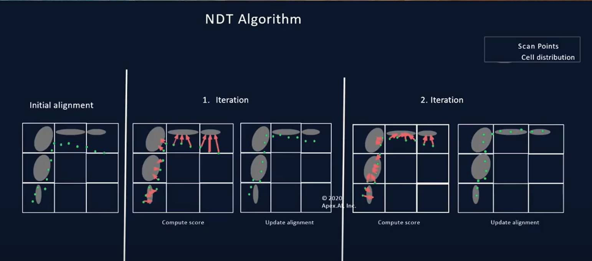
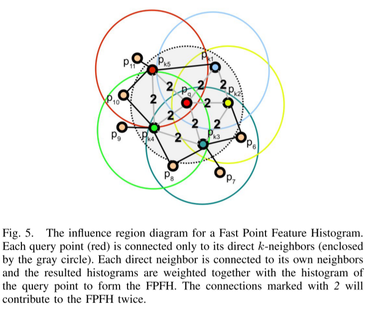

> Record for the papers I have read and want to read

# PSR(Point Set Registration)

## ICP & Variants

### Standard  ICP

- **Method for registration of 3-D shapes** **(Standard ICP)** :heavy_check_mark:

  > Besl, P. J., & McKay, N. D. (1992, April). Method for registration of 3-D shapes. In *Sensor fusion IV: control paradigms and data structures* (Vol. 1611, pp. 586-606). International Society for Optics and Photonics.
  >
  > **Citations:**22173
  >
  > [[url]](https://www.cvl.iis.u-tokyo.ac.jp/class2004/wedenesday/report/besl.pdf) [[pdf]](./papers/A Method for Registration of 3-D Shapes.pdf)
  >
  > [[tutorial]](http://www.sci.utah.edu/~shireen/pdfs/tutorials/Elhabian_ICP09.pdf) [[ICP Related Material]](http://ais.informatik.uni-freiburg.de/teaching/ss12/robotics/slides/17-icp.pdf)
  >
  > [[notes]](./notes/A Method for Registration of 3-D Shapes.md)

  ​	The original paper of ICP.	

  > It alternates between the closest point query in the target set and minimization of the distance between corresponding points and is guaranteed to converge to a locally optimal alignment

- **Iterative Point Matching for Registration of Free-Form Curves and Surfaces** :heavy_check_mark: 

  > Zhang, Z. (1994). Iterative point matching for registration of free-form curves and surfaces. *International journal of computer vision*, *13*(2), 119-152.
  >
  > **Citations:**3098
  >
  > [[url]](http://citeseerx.ist.psu.edu/viewdoc/download?doi=10.1.1.175.770&rep=rep1&type=pdf) [[pdf]](./papers/Iterative Point Matching for Registration of Free-Form Curves and Surfaces.pdf)
  >
  > [[notes]](./notes/Iterative Point Matching for Registration of Free-Form Curves and Surfaces.md)

  - The same work as ICP, but proposed independently.

### How to solve the objective function

- **Multi-scale EM-ICP: A Fast and Robust Approach for Surface Registration** :question:

  > Granger, S., & Pennec, X. (2002, May). Multi-scale EM-ICP: A fast and robust approach for surface registration. In *European Conference on Computer Vision* (pp. 418-432). Springer, Berlin, Heidelberg.
  >
  > **Citations:**521
  >
  > [[url]](http://citeseerx.ist.psu.edu/viewdoc/download?doi=10.1.1.18.5106&rep=rep1&type=pdf)[[pdf]](./papers/Multi-scale EM-ICP  A Fast and Robust.pdf)
  >
  > [[notes]](./notes/EM-ICP.md)

  - Can be viewed as 'Soft Assignment'
  - View the registration problem as the MLE(Maximum Likelihood Estimation) problem, and use E-M Algorithm to optimize the parameter.

### Robust Metric

- **Efficient variants of the ICP algorithm** :heavy_check_mark:

  > Rusinkiewicz, S., & Levoy, M. (2001, May). Efficient Variants of the ICP algorithm. In *Proceedings third international conference on 3-D digital imaging and modelling (pp. 145-152). IEEE.
  >
  > **Citations:**4711
  >
  > [[url]](https://ieeexplore.ieee.org/stamp/stamp.jsp?tp=&arnumber=924423) [[pdf]](./papers/Efficient Variants of the ICP Algorithm.pdf)
  >
  > [[notes]](./notes/Efficient variants of the ICP algorithm.md)

  Compare some variants of ICP-based algorithms, the effect of variants on steps of ICP. The paper proposes a sampling method by sampling points according to the normals to increase robustness.

- **The Trimmed Iterative Closest Point Algorithm** **(Tr-ICP)** :heavy_check_mark:

  > Chetverikov, D., Svirko, D., Stepanov, D., & Krsek, P. (2002, August). The trimmed iterative closest point algorithm. In *Object recognition supported by user interaction for service robots* (Vol. 3, pp. 545-548). IEEE.
  >
  > **Citations:**598
  >
  > [[url]](https://ieeexplore.ieee.org/stamp/stamp.jsp?tp=&arnumber=1047997&tag=1) [[pdf]](./papers/The Trimmed Iterative Closest Point Algorithm.pdf)

  Tr-ICP: '*Tr*' means the '*Trimmed*', use the '*[Least Trimmed Square](https://en.wikipedia.org/wiki/Least_trimmed_squares)*' method in the process to improve robustness.
  Pros: can converge when the overlapping rate is under 50%;
  cons: still need a good initial pose;

- **Robust Euclidean alignment of 3D point sets the trimmed iterative closest point algorithm** :heavy_check_mark:

  > Chetverikov, D., Stepanov, D., & Krsek, P. (2005). Robust Euclidean alignment of 3D point sets: the trimmed iterative closest point algorithm. *Image and vision computing*, *23*(3), 299-309.
  >
  > **Citations:**461
  >
  > [[url]](https://reader.elsevier.com/reader/sd/pii/S0262885604001179?token=B6A29AD77A8BDB565DE4A2ACBB8EFE4B12056ED98E9FFC14E5AD96E10C8F7E04DB2E587E5F8487939EEAC731DC1B24E1&originRegion=eu-west-1&originCreation=20220107203632) [[pdf]](./papers/Robust Euclidean alignment of 3D point sets the trimmediterative closest point algorithm.pdf)

  - Similar to Tr-ICP, they are the same authors, but I did not get the difference between them.

- **The dual-bootstrap iterative closest point algorithm with application to retinal image registration**

  > Stewart, C. V., Tsai, C. L., & Roysam, B. (2003). The dual-bootstrap iterative closest point algorithm with application to retinal image registration. *IEEE transactions on medical imaging*, *22*(11), 1379-1394.
  >
  > **Citations:**520
  >
  > [[url]](https://ieeexplore.ieee.org/stamp/stamp.jsp?tp=&arnumber=1242341) [[pdf]](./papers/The dual-bootstrap iterative closest point algorithm with application to retinal image registration.pdf)

### A similar framework

- **Registration of Point Cloud Data from a Geometric Optimization Perspective**

  > Mitra, N. J., Gelfand, N., Pottmann, H., & Guibas, L. (2004, July). Registration of point cloud data from a geometric optimization perspective. In *Proceedings of the 2004 Eurographics/ACM SIGGRAPH Symposium on Geometry processing* (pp. 22-31).
  >
  > **citations**:346
  >
  > [[url]](https://graphics.stanford.edu/courses/cs348a-17-winter/Handouts/mgpg-rpcdgop-04.pdf) [[pdf]](./papers/Registration of Point Cloud Data from a Geometric Optimization Perspective.pdf)

- **Registration without ICP**

  > Pottmann, H., Leopoldseder, S., & Hofer, M. (2004). Registration without ICP. *Computer Vision and Image Understanding*, *95*(1), 54-71.
  >
  > **citations:** 193
  >
  > [[url]](https://reader.elsevier.com/reader/sd/pii/S1077314204000475?token=8DB8C5E4B144F2E8B057D208B85ACA76BB37E85C6014F18D2EF6C6B9F068840DC740ED9D345A8EC880FDA7ADABF1DF16&originRegion=eu-west-1&originCreation=20220108112859) [[pdf]](./papers/Registration without ICP.pdf)

- **Geometry and convergence analysis of algorithms for registration of 3D shapes**

  > Pottmann, H., Huang, Q. X., Yang, Y. L., & Hu, S. M. (2006). Geometry and convergence analysis of algorithms for registration of 3D shapes. *International Journal of Computer Vision*, *67*(3), 277-296.
  >
  > **citations:** 225
  >
  > [[url]](https://link.springer.com/content/pdf/10.1007/s11263-006-5167-2.pdf) [[pdf]](./papers/Geometry and Convergence Analysis of Algorithms for Registration of 3D Shapes.pdf)

### Robust for the objective function

- **Object modelling by registration of multiple range images** **(Point-to-Plane ICP)** :heavy_check_mark:

  > Chen, Y., & Medioni, G. (1992). Object modelling by registration of multiple range images. *Image and vision computing*, *10*(3), 145-155.
  >
  > **Citations:**4931
  >
  > [[pdf]](./papers/Object modeling by registration of multiple range images.pdf)[[url]](http://graphics.stanford.edu/courses/cs348a-17-winter/Handouts/chen-medioni-align-rob91.pdf)
  >
  > [[notes]](./notes/Object modelling by registration of multiple range images.md)

  **Point-to-Plane ICP.**

  

- **Generalized-ICP** **(Plane-to-Plane ICP / GICP)** :heavy_check_mark:

  > Segal, A., Haehnel, D., & Thrun, S. (2009, June). Generalized-icp. In *Robotics: science and systems* (Vol. 2, No. 4, p. 435).
  >
  > **Citations:**1365 :flags:
  >
  > [[url]](https://www.robots.ox.ac.uk/~avsegal/resources/papers/Generalized_ICP.pdf) [[pdf]](./papers/Generalized_ICP.pdf)
  >
  > [[notes]](./notes/Generalized-ICP.md)

  GICP: Generalize The ICP approach to probabilistic distribution, extend it to plane-to-plane format.

  将ICP的方法从点对点，点对面进行一般化，引入了两个点云的协方差矩阵描述各自的特征，降低了不匹配的特征的影响。

- **A symmetric objective function for ICP** **(Symmetric-ICP)**  :heavy_check_mark: 

  :question: 1. 对于该实验有问题，为什么选择每一次迭代的过程？ 2. 这个是否是解决feature的稀疏问题？3. 本论文还有一些引用文献没看

  > Rusinkiewicz, S. (2019). A symmetric objective function for ICP. *ACM Transactions on Graphics (TOG)*, *38*(4), 1-7.
  >
  > **citations**:41
  >
  > [[url]](https://dl.acm.org/doi/pdf/10.1145/3306346.3323037) [[pdf]](./papers/A Symmetric Objective Function for ICP.pdf)

  

  Symmetric-ICP: 在point-to-plane的基础上进行改进，point-to-plane的类型收敛域减小，因为如上图所示，如果p点在q点所在的平面，那么二者的 *loss function* 一定为0，那么p点就只能在q点的平面进行滑动。但是使用symmetric(上图所示)，可以允许p点与q点形成圆进行滑动。

- **A robust method for registration and segmentation of multiple range images**

  > Masuda, T., & Yokoya, N. (1995). A robust method for registration and segmentation of multiple range images. *Computer vision and image understanding*, *61*(3), 295-307.
  >
  > **Citations:**401
  >
  > [[url]](https://www.sciencedirect.com/sdfe/reader/pii/S1077314285710247/pdf) [[pdf]](./papers/A Robust Method for Registration and Segmentation of Multiple Range Images.pdf)

- **Robust motion and correspondence of noisy 3-d point sets with missing data**

  > Trucco, E., Fusiello, A., & Roberto, V. (1999). Robust motion and correspondence of noisy 3-D point sets with missing data. *Pattern recognition letters*, *20*(9), 889-898.
  >
  > **Citations:**140
  >
  > [[url]](https://reader.elsevier.com/reader/sd/pii/S0167865599000550?token=80227EA90623477B34968113CCC67A768D7F900C9CECFDC7F9A7763C172BB9BC1A5C894B86D5D6169A3A26ED39EA8D59&originRegion=eu-west-1&originCreation=20220108114837) [[pdf]](./papers/Robust motion and correspondence of noisy 3-d point sets with missing data.pdf)

- **Robust registration of 2D and 3D point sets** **(LM-ICP)**:heavy_check_mark: :question:

  > Fitzgibbon, A. W. (2003). Robust registration of 2D and 3D point sets. *Image and vision computing*, *21*(13-14), 1145-1153.
  >
  > **Citations:**1089
  >
  > [[url]](https://reader.elsevier.com/reader/sd/pii/S0262885603001835?token=76780F4CE6E03D857BA3240F3179D4A3ADDC641974808A73B35251E1D27D83CA1AC4345D6345686D2744544E4C647749&originRegion=eu-west-1&originCreation=20220105133411)[[pdf]](./papers/Robust registration of 2D and 3D point sets.pdf)
  >
  > [[notes]](./notes/Robust registration of 2D and 3D point sets.md)

  The article uses the LM (Levenberg–Marquardt algorithm) algorithm to optimize a non-linear process instead of a closed-form solution, which can get a wider converge basin. 

- **Sparse Iterative Closest Point** **(Sparse ICP)** :heavy_check_mark:

  > Bouaziz, S., Tagliasacchi, A., & Pauly, M. (2013, August). Sparse iterative closest point. In *Computer graphics forum* (Vol. 32, No. 5, pp. 113-123). Oxford, UK: Blackwell Publishing Ltd.
  >
  > **Citations:**393
  >
  > [[url]](https://onlinelibrary.wiley.com/doi/epdf/10.1111/cgf.12178)[[pdf]](./papers/Sparse Iterative Closest Point.pdf)
  >
  > [[notes]](./notes/Sparse Iterative Closest Point.md)

  Sparse ICP: 仍然使用欧式距离寻找ICP中的correspondence，但是在优化阶段，使用了$d_2^p$ 代替 $d_2$， 提高了稀疏性，对Outlier和noise有一定的鲁棒性。

- **Fast global registration** :heavy_check_mark:

  > Zhou, Q. Y., Park, J., & Koltun, V. (2016, October). Fast global registration. In *European conference on computer vision* (pp. 766-782). Springer, Cham.
  >
  > **Citations:**421
  >
  > [[url]](http://vladlen.info/papers/fast-global-registration.pdf) [[pdf]](./papers/Fast Global Registration.pdf)
  
  - Not the ICP variant
  - Need the correspondence, (FPFH or other)
  - Use an estimator called *scaled Geman-McClure estimator* to reject the outliers and noise
  - Induce the *Black-Rangarajan duality* to optimize the objective function
  - Faster and more accurate than ICP, no need to find the correspondence and closet in the inner loop.

### Global Registration

- **The 3D-3D registration problem revisited**

  > Li, H., & Hartley, R. (2007, October). The 3D-3D registration problem revisited. In *2007 IEEE 11th international conference on computer vision* (pp. 1-8). IEEE.
  >
  > **Citations:**193
  >
  > [[url]](https://ieeexplore.ieee.org/stamp/stamp.jsp?tp=&arnumber=4409077) [[pdf]](./papers/The 3D-3D registration problem revisited.pdf)

- **Branch-and-bound methods for euclidean registration problems**

  > Olsson, C., Kahl, F., & Oskarsson, M. (2008). Branch-and-bound methods for euclidean registration problems. *IEEE Transactions on Pattern Analysis and Machine Intelligence*, *31*(5), 783-794.
  >
  > **Citations:**138
  >
  > [[url]](https://ieeexplore.ieee.org/stamp/stamp.jsp?tp=&arnumber=4531744) [[pdf]](./papers/Branch-and-Bound Methods for Euclidean Registration Problems.pdf)

- **Go-ICP_A_Globally_Optimal_Solution_to_3D_ICP_Point-Set_Registration** **(Go-ICP)** :heavy_check_mark:

  > Yang, J., Li, H., Campbell, D., & Jia, Y. (2015). Go-ICP: A globally optimal solution to 3D ICP point-set registration. *IEEE transactions on pattern analysis and machine intelligence*, *38*(11), 2241-2254.
  >
  > **Citations:**522
  >
  > [[pdf]](./papers/Go-ICP_A_Globally_Optimal_Solution_to_3D_ICP_Point-Set_Registration.pdf) [[url]](https://ieeexplore.ieee.org/stamp/stamp.jsp?tp=&arnumber=7368945) 

  - Get the global optimal for ICP algorithm.

### Deep learning

- **Deep closest point: Learning representations for point cloud registration**

  > Wang, Y., & Solomon, J. M. (2019). Deep closest point: Learning representations for point cloud registration. In *Proceedings of the IEEE/CVF International Conference on Computer Vision* (pp. 3523-3532).
  >
  > **Citations:**285
  >
  > [[url]](https://openaccess.thecvf.com/content_ICCV_2019/papers/Wang_Deep_Closest_Point_Learning_Representations_for_Point_Cloud_Registration_ICCV_2019_paper.pdf) [[pdf]](./papers/Deep Closest Point Learning Representations for Point Cloud Registration.pdf)

### Acceleration

- **AA-ICP Iterative Closest Point with Anderson Acceleration** :heavy_check_mark:

  > Pavlov, A. L., Ovchinnikov, G. W., Derbyshev, D. Y., Tsetserukou, D., & Oseledets, I. V. (2018, May). AA-ICP: Iterative closest point with Anderson acceleration. In *2018 IEEE International Conference on Robotics and Automation (ICRA)* (pp. 3407-3412). IEEE.
  >
  > **Citations:**29
  >
  > [[url]](https://ieeexplore.ieee.org/stamp/stamp.jsp?tp=&arnumber=8461063)[[pdf]](./papers/AA-ICP Iterative Closest Point with Anderson Acceleration.pdf)

  AA-ICP: (Anderson Acceleration ICP), use Anderson acceleration to accelerate the process of the algorithm(About 30% compared to standard ICP).

- **Fast and Robust Iterative Closest Point** :heavy_check_mark:

  > Zhang, J., Yao, Y., & Deng, B. (2021). Fast and Robust Iterative Closest Point. *IEEE Transactions on Pattern Analysis and Machine Intelligence*.
  >
  > [[url]](https://ieeexplore.ieee.org/stamp/stamp.jsp?tp=&arnumber=9336308) [[pdf]](./papers/Fast_and_Robust_Iterative_Closest_Point.pdf)

  1. Fast: Use Anderson acceleration to make the iteration process quickly;

  2. Robust: Use Welsch’s function to formulate an objective function.

     Extend them to the p2p and p2plane algos, but not globally and need a good initialization.

- **Speeding Up Iterative Closest Point Using Stochastic Gradient Descent** **(SGD-ICP)** :heavy_check_mark:

  > Maken, F. A., Ramos, F., & Ott, L. (2019, May). Speeding up iterative closest point using stochastic gradient descent. In *2019 International Conference on Robotics and Automation (ICRA)* (pp. 6395-6401). IEEE.
  >
  > **Citations:**6
  >
  > [[url]](https://ieeexplore.ieee.org/stamp/stamp.jsp?tp=&arnumber=8794011) [[pdf]](./papers/Speeding Up Iterative Closest Point Using Stochastic Gradient Descent.pdf)

  - SGD-ICP: Use stochastic gradient descent (SGD) to iterate the parameter.
  - Faster than standard ICP and GICP, not resulting in loss in accuracy.

- **Estimating Motion Uncertainty with Bayesian ICP** :heavy_check_mark:

  > Maken, F. A., Ramos, F., & Ott, L. (2020, May). Estimating Motion Uncertainty with Bayesian ICP. In *2020 IEEE International Conference on Robotics and Automation (ICRA)* (pp. 8602-8608). IEEE.
  >
  > **Citations:**2
  >
  > [[url]](https://ieeexplore.ieee.org/stamp/stamp.jsp?tp=&arnumber=9197085) [[pdf]](./papers/Estimating Motion Uncertainty with Bayesian ICP.pdf)

  - Based on the SGD-ICP, use SGLD to estimate the transformation.

## Probability-Based

- **A New Algorithm for Non-Rigid Point Matching**

  > Chui, H., & Rangarajan, A. (2000, June). A new algorithm for non-rigid point matching. In *Proceedings IEEE Conference on Computer Vision and Pattern Recognition. CVPR 2000 (Cat. No. PR00662)* (Vol. 2, pp. 44-51). IEEE.
  >
  > **Citations:**646
  >
  > [[url]](https://ieeexplore.ieee.org/stamp/stamp.jsp?tp=&arnumber=854733) [[pdf]](./papers/)

- **A feature registration framework using mixture models**

  > Chui, H., & Rangarajan, A. (2000, June). A feature registration framework using mixture models. In *Proceedings IEEE Workshop on Mathematical Methods in Biomedical Image Analysis. MMBIA-2000 (Cat. No. PR00737)* (pp. 190-197). IEEE.
  >
  > **Citations:** 205
  >
  > [[url]](https://ieeexplore.ieee.org/stamp/stamp.jsp?tp=&arnumber=852377) [[pdf]](./papers/A feature registration framework using mixture models.pdf)

- **A Correlation-Based Approach to Robust Point Set Registration**

  > Tsin, Y., & Kanade, T. (2004, May). A correlation-based approach to robust point set registration. In *European conference on computer vision* (pp. 558-569). Springer, Berlin, Heidelberg.
  >
  > **Citations:**435
  >
  > [[url]](http://www.cs.cmu.edu/afs/.cs.cmu.edu/Web/People/ytsin/research/kcreg.pdf) [[pdf]](./papers/A Correlation-Based Approach to Robust Point Set Registration.pdf)

- **A robust algorithm for point set registration using mixture of Gaussians** **:green_book:**

  > Jian, B., & Vemuri, B. C. (2005, October). A robust algorithm for point set registration using mixture of Gaussians. In *Tenth IEEE International Conference on Computer Vision (ICCV'05) Volume 1* (Vol. 2, pp. 1246-1251). IEEE.
  >
  > **Citations:**408
  >
  > [[url]](https://ieeexplore.ieee.org/stamp/stamp.jsp?tp=&arnumber=1544863) [[pdf]](./papers/A Robust Algorithm for Point Set Registration Using Mixture of Gaussians.pdf)

- **Non-rigid point set registration: Coherent Point Drift** :green_book:

  > Myronenko, A., Song, X., & Carreira-Perpinán, M. A. (2007). Non-rigid point set registration: Coherent point drift. *Advances in neural information processing systems*, *19*, 1009.
  >
  > **Citations:**383
  >
  > [[url]](https://citeseerx.ist.psu.edu/viewdoc/download?doi=10.1.1.85.493&rep=rep1&type=pdf) [[pdf]](./papers/Non-rigid point set registration Coherent Point Drift.pdf)

- **Rigid and Articulated Point Registration with Expectation Conditional Maximization**

  > Horaud, R., Forbes, F., Yguel, M., Dewaele, G., & Zhang, J. (2010). Rigid and articulated point registration with expectation conditional maximization. *IEEE Transactions on Pattern Analysis and Machine Intelligence*, *33*(3), 587-602.
  >
  > **Citations:**219
  >
  > [[url]](https://ieeexplore.ieee.org/stamp/stamp.jsp?tp=&arnumber=5444893) [[pdf]](./papers/Rigid and Articulated Point Registration with Expectation Conditional Maximization.pdf)

- **Diffeomorphic Matching of Distributions: A New Approach for Unlabelled Point-Sets and Sub-Manifolds Matching**

  > Glaunes, J., Trouvé, A., & Younes, L. (2004, June). Diffeomorphic matching of distributions: A new approach for unlabelled point-sets and sub-manifolds matching. In *Proceedings of the 2004 IEEE Computer Society Conference on Computer Vision and Pattern Recognition, 2004. CVPR 2004.* (Vol. 2, pp. II-II). IEEE.
  >
  > **Citations:**234
  >
  > [[url]](https://ieeexplore.ieee.org/stamp/stamp.jsp?tp=&arnumber=1315234) [[pdf]](./papers/Diffeomorphic Matching of Distributions A New Approach for Unlabelled Point-Sets and Sub-Manifolds Matching.pdf)

- **Uncertainty Modeling and Model Selection for Geometric Inference**

  > Kanatani, K. I. (2004). Uncertainty modeling and model selection for geometric inference. *IEEE Transactions on Pattern Analysis and Machine Intelligence*, *26*(10), 1307-1319.
  >
  > **Citations:**86
  >
  > [[url]](https://ieeexplore.ieee.org/stamp/stamp.jsp?tp=&arnumber=1323799) [[pdf]](./papers/Uncertainty Modeling and Model Selection for Geometric Inference.pdf)

### GMM

- **Point Set Registration: Coherent Point Drift** **(CPD)** :heavy_check_mark:

  > Myronenko, A., & Song, X. (2010). Point set registration: Coherent point drift. *IEEE transactions on pattern analysis and machine intelligence*, *32*(12), 2262-2275.
  >
  > **Citations:**2323
  >
  > [[URL]](https://ieeexplore.ieee.org/stamp/stamp.jsp?tp=&arnumber=5432191) [[PDF]](./papers/Point_Set_Registration_Coherent_Point_Drift.pdf)
  >
  > [[notes]](./notes/Point Set Registration - Coherent Point Drift.md)

  - Point-to-all GMM, one point set used as centroids of GMM and the other as 'data' to match it;
  - Use E-M to get the optimal parameters;
  - In M step, change the expression to get a closed-form solution to get a quicker solution.
  - More robust than LM-ICP

- **Robust Point Set Registration Using Gaussian Mixture Models** **(GMM)** :heavy_check_mark: :flags: :question:

  > Jian, B., & Vemuri, B. C. (2010). Robust point set registration using gaussian mixture models. *IEEE transactions on pattern analysis and machine intelligence*, *33*(8), 1633-1645.
  >
  > **Citations:**869
  >
  > [[url]](https://ieeexplore.ieee.org/stamp/stamp.jsp?tp=&arnumber=5674050) [[pdf]](./papers/Robust Point Set Registration Using Gaussian Mixture Models.pdf)

  > 文章的行文逻辑读起来非常顺畅，值得多读几遍。

  - Use GMM to model the point set; Get a local optimal by iterating closed-form solution of L2 distance between two GMMs(rigid); For non-rigid: numerical optimization
  - Distribution-to-distribution GMM
  - Every point serves as a centroid of GMM
  - More robust than CPD

### **NDT & Variants**

- **The Normal Distributions Transform: A New Approach to Laser Scan Matching** **(2D-NDT)** :heavy_check_mark:

  > Biber, P., & Straßer, W. (2003, October). The normal distributions transform: A new approach to laser scan matching. In *Proceedings 2003 IEEE/RSJ International Conference on Intelligent Robots and Systems (IROS 2003)(Cat. No. 03CH37453)* (Vol. 3, pp. 2743-2748). IEEE.
  >
  > **Citations:**1096
  >
  > [[url]](https://ieeexplore.ieee.org/stamp/stamp.jsp?tp=&arnumber=1249285)[[pdf]](./papers/The_normal_distributions_transform_a_new_approach_to_laser_scan_matching.pdf) 
  > [[materials]](https://autowarefoundation.gitlab.io/autoware.auto/AutowareAuto/ndt-literature-review.html)
  
  2D-NDT(Normalized Distribution Transform):
  
  - keywords: grid; ndt; newton optimization;
  
  
  
  - A kind of low-level description, no feature and structural information.

  - **Scan Registration for Autonomous Mining Vehicles Using 3D-NDT** **(P2D-NDT)** :heavy_check_mark:

    > Magnusson, M., Lilienthal, A., & Duckett, T. (2007). Scan registration for autonomous mining vehicles using 3D‐NDT. *Journal of Field Robotics*, *24*(10), 803-827.
    >
    > **Citations:**558
    >
    > [[url]](https://onlinelibrary.wiley.com/doi/epdf/10.1002/rob.20204)[[pdf]](./papers/Scan registration for autonomous mining vehicles using 3D‐NDT.pdf) 
    
    - 3D-NDT(P2D-NDT)
    - Faster; Less memory; compared to ICP
    
  - **The three-dimensional normal-distributions transform an efficient representation for registration, surface analysis, and loop detection**

    > Magnusson, M. (2009). *The three-dimensional normal-distributions transform: an efficient representation for registration, surface analysis, and loop detection* (Doctoral dissertation, Örebro universitet).
    >
    > **Citations:**324
    >
    > [[url]](https://www.diva-portal.org/smash/get/diva2:276162/FULLTEXT02.pdf) [[pdf]](./papers/The three-dimensional normal-distributions transform an efficient representation for registration, surface analysis, and loop detection.pdf)
    
  - **Fast and accurate scan registration through minimization of the distance between compact 3D NDT representations** **(D2D-NDT)** :heavy_check_mark:

    > Stoyanov, T., Magnusson, M., Andreasson, H., & Lilienthal, A. J. (2012). Fast and accurate scan registration through minimization of the distance between compact 3D NDT representations. *The International Journal of Robotics Research*, *31*(12), 1377-1393.
    >
    > **Citations:** 180
    >
    > [[url]](http://citeseerx.ist.psu.edu/viewdoc/download?doi=10.1.1.817.5962&rep=rep1&type=pdf) [[pdf]](./papers/Fast and accurate scan registration through minimization of the distance between compact 3D NDT representations.pdf)
    
    - D2D 3D NDT
    - Faster than P2D NDT

## Feature-Based

- **Fast Registration Based on Noisy Planes With Unknown Correspondences for 3-D Mapping**

  > Pathak, K., Birk, A., Vaškevičius, N., & Poppinga, J. (2010). Fast registration based on noisy planes with unknown correspondences for 3-D mapping. *IEEE Transactions on Robotics*, *26*(3), 424-441.
  >
  > **Citations:**257
  >
  > [[url]](https://ieeexplore.ieee.org/stamp/stamp.jsp?tp=&arnumber=5431057) [[pdf]](./papers/Fast Registration Based on Noisy Planes With Unknown Correspondences for 3-D Mapping.pdf)

## Learning-Based

- **PRNet: Self-Supervised Learning for Partial-to-Partial Registration**

  > [[URL]](https://arxiv.org/pdf/1910.12240.pdf) [[pdf]](./papers/PRNet Self-Supervised Learning for Partial-to-Partial Registration.pdf)

- **The Perfect Match: 3D Point Cloud Matching with Smoothed Densities**

  > <CVPR2019>
  >
  > [[URL]](https://openaccess.thecvf.com/content_CVPR_2019/papers/Gojcic_The_Perfect_Match_3D_Point_Cloud_Matching_With_Smoothed_Densities_CVPR_2019_paper.pdf)

- **Registration Loss Learning for Deep Probabilistic Point Set Registration**

  > <International Conference on 3D Vision>
  >
  > [[pdf]](./papers/Registration Loss Learning for Deep Probabilistic Point Set Registration.pdf)
  >
  > [[NOTES]](./notes/Registration Loss Learning for Deep Probabilistic Point Set Registration.md)

## Graph-Based

- **Thirty Years of Graph Matching in Pattern Recognition**

  > Conte, D., Foggia, P., Sansone, C., & Vento, M. (2004). Thirty years of graph matching in pattern recognition. *International journal of pattern recognition and artificial intelligence*, *18*(03), 265-298.
  >
  > **Citations:**1758
  >
  > [[url]](http://citeseerx.ist.psu.edu/viewdoc/download?doi=10.1.1.455.7770&rep=rep1&type=pdf) [[pdf]](./papers/Thirty Years of Graph Matching in Pattern Recognition.pdf)

- **A unified framework for alignment and correspondence**

  > Luo, B., & Hancock, E. R. (2003). A unified framework for alignment and correspondence. *Computer Vision and Image Understanding*, *92*(1), 26-55.
  >
  > **Citations:**73
  >
  > [[url]](https://reader.elsevier.com/reader/sd/pii/S1077314203000973?token=0DBF0A87CDEC4BE21370C4E39E5A1906171CB67EBDAA80A064DB207F16AEF0881DB5CB50C2E751104DF082DBF0E688B6&originRegion=eu-west-1&originCreation=20220113135844) [[pdf]](./papers/A unified framework for alignment and correspondence.pdf)

- **Spectral Correspondence for Point Pattern Matching**

  > Carcassoni, M., & Hancock, E. R. (2003). Spectral correspondence for point pattern matching. *Pattern Recognition*, *36*(1), 193-204.
  >
  > **Citations:**271
  >
  > [[url]](https://reader.elsevier.com/reader/sd/pii/S0031320302000547?token=9EC1420AF495A990060CF769F8859EB19D22B507DF305D3779BF0F968814EC067F756D046CD5429AF52B6FDC4807EBE9&originRegion=eu-west-1&originCreation=20220113140059) [[pdf]](./papers/Spectral Correspondence for Point Pattern Matching.pdf)

- **Graphical Models and Point Pattern Matching**

  > Caetano, T. S., Caelli, T., Schuurmans, D., & Barone, D. A. C. (2006). Graphical models and point pattern matching. *IEEE Transactions on pattern analysis and machine intelligence*, *28*(10), 1646-1663.
  >
  > **Citations:**171
  >
  > [[url]](https://ieeexplore.ieee.org/stamp/stamp.jsp?tp=&arnumber=1677520) [[pdf]](./papers/Graphical Models and Point Pattern Matching.pdf)

- **Shape Matching and Object Recognition Using Shape Contexts**

  > Belongie, S., Malik, J., & Puzicha, J. (2002). Shape matching and object recognition using shape contexts. *IEEE transactions on pattern analysis and machine intelligence*, *24*(4), 509-522.
  >
  > **Citations:**8311
  >
  > [[url]](https://ieeexplore.ieee.org/stamp/stamp.jsp?tp=&arnumber=993558) [[pdf]](./papers/Shape Matching and Object Recognition Using Shape Contexts.pdf)

- **Robust Point Matching for Nonrigid Shapes by Preserving Local Neighborhood Structures**

  > Zheng, Y., & Doermann, D. (2006). Robust point matching for nonrigid shapes by preserving local neighborhood structures. *IEEE transactions on pattern analysis and machine intelligence*, *28*(4), 643-649.
  >
  > **Citations:**366
  >
  > [[url]](https://ieeexplore.ieee.org/stamp/stamp.jsp?tp=&arnumber=1597120) [[pdf]](./papers/Robust Point Matching for Nonrigid Shapes by Preserving Local Neighborhood Structures.pdf)

## Genetic or Annealing

- **Precision Range Image Registration Using a Robust Surface Interpenetration Measure and Enhanced Genetic Algorithms**

  > Silva, L., Bellon, O. R. P., & Boyer, K. L. (2005). Precision range image registration using a robust surface interpenetration measure and enhanced genetic algorithms. *IEEE transactions on pattern analysis and machine intelligence*, *27*(5), 762-776.
  >
  > **Citations:**281
  >
  > [[url]](https://ieeexplore.ieee.org/stamp/stamp.jsp?tp=&arnumber=1407879)[[pdf]](./papers/Precision_range_image_registration_using_a_robust_surface_interpenetration_measure_and_enhanced_genetic_algorithms.pdf)

  - Use robust genetic algorithm to search in the pose space and get a good registration result.
  - More robust and accurate than ICP
  - Slower than ICP

## Different kinds of Improvements

- **Efficient Global Point Cloud Registration by Matching Rotation Invariant Features Through Translation Search**

  > [[URL]](https://www.ecva.net/papers/eccv_2018/papers_ECCV/papers/Yinlong_Liu_Efficient_Global_Point_ECCV_2018_paper.pdf) [[pdf]](./papers/Efficient Global Point Cloud Registration by Matching Rotation Invariant Features Through Translation Search)
  >
  > [[notes]](./notes/Efficient Global Point Cloud Registration by Matching Rotation Invariant Features Through Translation Search.md)
  
- **SDRSAC: Semidefinite-Based Randomized Approach for Robust Point Cloud Registration without Correspondences**

  > <CVPR2019>
  >
  > [[URL]](https://openaccess.thecvf.com/content_CVPR_2019/papers/Le_SDRSAC_Semidefinite-Based_Randomized_Approach_for_Robust_Point_Cloud_Registration_Without_CVPR_2019_paper.pdf) [[PDF]](./papers/SDRSAC_Semidefinite-Based_Randomized_Approach_for_Robust_Point_Cloud_Registration_Without_CVPR_2019_paper.pdf)

- **Global Optimality for Point Set Registration Using Semidefinite Programming**

  > <CVPR2020>
  > [[url]](https://openaccess.thecvf.com/content_CVPR_2020/papers/Iglesias_Global_Optimality_for_Point_Set_Registration_Using_Semidefinite_Programming_CVPR_2020_paper.pdf) [[pdf]](./papers/Global_Optimality_for_Point_Set_Registration_Using_Semidefinite_Programming_CVPR_2020_paper.pdf)

- **Deep Global Registration**

  > <CVPR2020>
  > [[url]](https://arxiv.org/pdf/2004.11540.pdf) 

## Extension

### Multiple Point set

- **Joint Alignment of Multiple Point Sets with Batch and Incremental Expectation-Maximization**

  > Evangelidis, G. D., & Horaud, R. (2017). Joint alignment of multiple point sets with batch and incremental expectation-maximization. *IEEE transactions on pattern analysis and machine intelligence*, *40*(6), 1397-1410.
  >
  > **Citations:** 87
  >
  > [[url]](https://ieeexplore.ieee.org/stamp/stamp.jsp?tp=&arnumber=7954698) [[pdf]](./papers/Joint Alignment of Multiple Point Sets with Batch and Incremental Expectation-Maximization.pdf)

### Non-rigid Point set

- **A new point matching algorithm for non-rigid registration**

  > Chui, H., & Rangarajan, A. (2003). A new point matching algorithm for non-rigid registration. *Computer Vision and Image Understanding*, *89*(2-3), 114-141.
  >
  > [[url]](https://reader.elsevier.com/reader/sd/pii/S1077314203000092?token=1F6EDF85BEE9DB34579FF7916F9D35C900B8B71010B9E7F166D03A7050D1CD39F574900CBB0DAB444B3168C6A74F6A71&originRegion=eu-west-1&originCreation=20220116113608) [[pdf]](./papers/A new point matching algorithm for non-rigid registration.pdf)

## Survey

- **A comprehensive survey on point cloud registration**

  > Huang, X., Mei, G., Zhang, J., & Abbas, R. (2021). A comprehensive survey on point cloud registration. *arXiv preprint arXiv:2103.02690*.
  >
  > **Citations:**10
  >
  > [[url]](https://arxiv.org/pdf/2103.02690.pdf) [[pdf]](./papers/A comprehensive survey on point cloud registration.pdf)
  >
  > [[detailed notes]](./notes/A comprehensive survey on point cloud registration.md)

- **Registration of large-scale terrestrial laser scanner point clouds A review and benchmark**

  > <ISPRS Journal of Photogrammetry and Remote Sensing>
  > [[url]](https://reader.elsevier.com/reader/sd/pii/S0924271620300836?token=601731D7F5A970C99DA0F576524F984B32A54C306453727528A63B21BE9B8B9B81E18ED8BE62C0ECA2F16B6CDC4CE878&originRegion=eu-west-1&originCreation=20211224092123)
  > [[pdf]](./papers/Registration of large-scale terrestrial laser scanner point clouds A reviewand benchmark.pdf)
  > [[detailed notes]](./notes/Registration of large-scale terrestrial laser scanner point clouds A reviewand benchmark.pdf.md)
  
- **A Review of Point Cloud Registration Algorithms for Mobile Robotics**

  > Pomerleau, F., Colas, F., & Siegwart, R. (2015). A review of point cloud registration algorithms for mobile robotics. *Foundations and Trends in Robotics*, *4*(1), 1-104.
  >
  > **Citations**:423
  >
  > [[url]](https://hal.archives-ouvertes.fr/hal-01178661/document) [[pdf]](./papers/A Review of Point Cloud Registration Algorithms for Mobile Robotics.pdf)

- **Image Matching from Handcrafted to Deep Features: A Survey**

  > Ma, J., Jiang, X., Fan, A., Jiang, J., & Yan, J. (2021). Image matching from handcrafted to deep features: A survey. *International Journal of Computer Vision*, *129*(1), 23-79.
  >
  > **Citations:**155
  >
  > [[url]](https://link.springer.com/content/pdf/10.1007/s11263-020-01359-2.pdf) [[pdf]](./papers/Image Matching from Handcrafted to Deep Features A Survey.pdf)
  
  - Mainly focus on feature-matching.
  
- **Deformable Medical Image Registration: A Survey**

  > Sotiras, A., Davatzikos, C., & Paragios, N. (2013). Deformable medical image registration: A survey. *IEEE transactions on medical imaging*, *32*(7), 1153-1190.
  >
  > **Citations:**1413
  >
  > [[url]](https://ieeexplore.ieee.org/stamp/stamp.jsp?tp=&arnumber=6522524) [[pdf]](./papers/Deformable Medical Image Registration A Survey.pdf)

# Mapping & Fusion

## Semantic

- **SegMap Segment-based mapping and localization using data-driven descriptors**

  > <IJRR>
  > [[pdf]](./papers/SegMap Segment-based mapping and localization using data-driven descriptors.pdf)[[url]](https://journals.sagepub.com/doi/pdf/10.1177/0278364919863090)
  >
  > [[notes]](./notes/SegMap Segment-based mapping and localization using data-driven descriptors.md)

- **Recurrent-OctoMap: Learning State-Based Map Refinement for Long-Term Semantic Mapping With 3-D-Lidar Data**

  > <RA-L2018>

- **Sattler_Understanding_the_Limitations_of_CNN-Based_Absolute_Camera_Pose_Regression_CVPR_2019_paper**

  > <CVPR>

  为端到端的localization的效果不如基于3D精确地图的位姿估计提供了理论依据.

  A key result is that current approaches do not consistently outperform a handcrafted image retrieval baseline

- **Self-Supervised_Learning_of_Lidar_Segmentation_for_Autonomous_Indoor_Navigation**

  > <ICRA>

- **Semantic Fusion_Dense_3D_semantic_mapping_with_convolutional_neural_networks**

  > <ICRA 2017>
  >
  > [[pdf]](./papers/SemanticFusion_Dense_3D_semantic_mapping_with_convolutional_neural_networks.pdf)
  >
  > [[notes]](./notes/SemanticFusion_Dense_3D_semantic_mapping_with_convolutional_neural_networks.md)

  Combine the CNNs with the SLAM system ElasticFusion. The camera is RGB-D, use the RGB image as the input;

- **SuMa++: Efficient LiDAR-based Semantic SLAM**

  > <IROS 2019>

- **Integrating Deep Semantic Segmentation into 3D point cloud registration**

  > <RA-L 2018>
  >
  > [[pdf]](./papers/Integrating Deep Semantic Segmentation into 3D point cloud registration.pdf)
  >
  > [[notes]](./notes/Integrating Deep Semantic Segmentation into 3D point cloud registration.md)

  - 使用PointNet作为语义分割的前端，对三维点云进行像素级别的语义分割；

  - 将分割后的点云按照class进行集合分类，使用NDT算法，对两个点云中同类的点云进行配准；objective function优化各个class的损失的和
  - **future work**: end-to-end, get the transformation directly;

- 

## Cross-source Combination

# Math Basis

- **Global optimization through rotation space search**

  > [[URL]](https://link.springer.com/content/pdf/10.1007/s11263-008-0186-9.pdf)
  
- **Maximum Likelihood from Incomplete Data via the EM Algorithm**

  > Dempster, A. P., Laird, N. M., & Rubin, D. B. (1977). Maximum likelihood from incomplete data via the EM algorithm. *Journal of the Royal Statistical Society: Series B (Methodological)*, *39*(1), 1-22.
  >
  > **Citations:**65630
  >
  > [[url]](https://rss.onlinelibrary.wiley.com/doi/epdf/10.1111/j.2517-6161.1977.tb01600.x) [[pdf]](./papers/Maximum Likelihood from Incomplete Data via the EM Algorithm.pdf)

- **Computational Optimal Transport** :green_book:

  > Peyré, G., & Cuturi, M. (2019). Computational optimal transport: With applications to data science. *Foundations and Trends® in Machine Learning*, *11*(5-6), 355-607.
  >
  > [[url]](https://arxiv.org/pdf/1803.00567.pdf) [[pdf]](./papers/Computational Optimal Transport.pdf)

# Timeline record

## 2022-01-17

- **Point Cloud Registration Based on One-Point RANSAC and Scale-Annealing Biweight Estimation** 

  > Li, Jiayuan, Qingwu Hu, and Mingyao Ai. "Point cloud registration based on one-point ransac and scale-annealing biweight estimation." *IEEE Transactions on Geoscience and Remote Sensing* (2021).
  >
  > **Citations:**8
  >
  > [[url]](https://ieeexplore.ieee.org/stamp/stamp.jsp?tp=&arnumber=9318535) [[pdf]](./papers/Point Cloud Registration Based on One-Point RANSAC and Scale-Annealing Biweight Estimation.pdf)

- **TEASER: Fast and Certifiable Point Cloud Registration** :heavy_check_mark: :question:

  > Yang, Heng, Jingnan Shi, and Luca Carlone. "Teaser: Fast and certifiable point cloud registration." *IEEE Transactions on Robotics* 37.2 (2020): 314-333.
  >
  > **Citations:**135
  >
  >  [[url]](https://sci-hub.ru/https://ieeexplore.ieee.org/abstract/document/9286491/) [[pdf]](./papers/TEASER-Fast and Certifiable Point Cloud.pdf)
  >
  > [[notes]](./notes/TEASER-Fast and Certifiable Point Cloud.md)

- **Point Set Registration for 3D Range Scans Using Fuzzy Cluster-based Metric and Efficient Global Optimization** :heavy_check_mark:

  > Liao, Qianfang, Da Sun, and Henrik Andreasson. "Point set registration for 3d range scans using fuzzy cluster-based metric and efficient global optimization." *IEEE transactions on pattern analysis and machine intelligence* (2020).
  >
  > **Citations:**7
  >
  > [[url]](https://ieeexplore.ieee.org/stamp/stamp.jsp?tp=&arnumber=9026868) [[pdf]](./papers/Point_Set_Registration_for_3D_Range_Scans_Using_Fuzzy_Cluster-Based_Metric_and_Efficient_Global_Optimization.pdf) 
  >
  > [[notes]](./notes/Point Set Registration for 3D Range Scans Using Fuzzy Cluster-based Metric and Efficient Global Optimization.md)
  
  - In our method, fuzzy clusters are utilized to represent a scan, and the registration of two given scans is realized by minimizing a fuzzy weighted sum of the distances between their fuzzy cluster centers.
  - Use a coarse-to-fine framework, BnBs to get a global registration and provide a good initialization for refinement.(coarse: center-to-center; fine: point-to-center)
  
- **FuzzyPSReg: Strategies of Fuzzy Cluster-Based Point Set Registration** :heavy_check_mark: :red_circle:

  > Liao, Qianfang, Da Sun, and Henrik Andreasson. "FuzzyPSReg: Strategies of Fuzzy Cluster-Based Point Set Registration." *IEEE Transactions on Robotics* (2021).
  >
  > [[url]](https://ieeexplore.ieee.org/stamp/stamp.jsp?arnumber=9623345) [[pdf]](./papers/FuzzyPSReg_Strategies_of_Fuzzy_Cluster-Based_Point_Set_Registration.pdf)
  >
  > [[notes]](./notes/FuzzyPSReg_Strategies_of_Fuzzy_Cluster-Based_Point_Set_Registration.md)
  
  > - [ ] O2S的部分还没有看完
  >
  > - First, we propose a new metric based on Gustafson–Kessel (GK) fuzzy clustering to measure the alignment
  >   of two point clouds.
  > - We then develop the registration quality assessment of the GK-based metric, which is more sensitive
  >   to small misalignments than that of the FCM-based metric.
  > - The FCM-based metric can be regarded as point-to-point ICP; The GK-based metric can be regarded as point-to-plane ICP.
  > - If given the dozens of cluster centers, GK-based metric can provide more accurate result than FCM-based metric.
  > - FCM can use the points as cluster centers directly.
  > - Compared to FCM-based metric, 
  >   - cons
  >     - GK-based metric takes longer time because of calculating the norm-inducing matrices;
  >     - Narrower converge basin than FCM-based metric(So it may need a good initialization);
  >   - pros
  >     - Much faster;
  >     - With the same cluster centers, GK-based is more accurate;
  > - Compare to TEASER++:
  >   - more accurate and faster ( SUN3D dataset )
  
- **Accurate Point Cloud Registration with Robust Optimal Transport**

  > Shen, Zhengyang, et al. "Accurate Point Cloud Registration with Robust Optimal Transport." *Advances in Neural Information Processing Systems* 34 (2021).
  >
  > **Citations:**0
  >
  > [[url]](https://proceedings.neurips.cc/paper/2021/hash/2b0f658cbffd284984fb11d90254081f-Abstract.html) [[paper]](./papers/Accurate Point Cloud Registration with Robust Optimal Transport.pdf)

  需要补充一些额外的数学知识，没看懂。。

  另外，看起来 optimal transport 要想用在点云配准里面，是需要知道correspondence的，可以说是一种优化手段吧。

- **Optimal Mass Transport for Registration and Warping**

  > Haker, Steven, et al. "Optimal mass transport for registration and warping." *International Journal of computer vision* 60.3 (2004): 225-240.
  >
  > **Citations:**412
  >
  > [[url]](https://www.math.ucdavis.edu/~saito/data/emd/zhu-ijcv2004.pdf)

- **Aligning Point Cloud Views using Persistent Feature Histograms** **(PFH)** :heavy_check_mark:

  > Rusu, Radu Bogdan, et al. "Aligning point cloud views using persistent feature histograms." *2008 IEEE/RSJ international conference on intelligent robots and systems*. IEEE, 2008.
  >
  > **Citations:**768
  >
  > [[url]](https://ieeexplore.ieee.org/stamp/stamp.jsp?tp=&arnumber=4650967) [[pdf]](./papers/Aligning Point Cloud Views using Persistent Feature Histograms.pdf)

  - Use persistent point feature histograms to describe a feature point in a point set.

    - Four features are extracted to describe a feature point.(3 angels based on norm, 1based on distance);
    - The ration is computed and showed in histograms, which can be used as a vector;

  - By analyzing the persistence of the features at different scales, we extract an optimal set which best characterizes a given point cloud.

    - By comparing the point with global description.

    - > In order to select the best feature points for a given cloud, we analyze the neighborhood of each point p multiple times, by enclosing p on a sphere of radius ri and p as its center. We vary r over an interval depending on the point cloud size and density, and compute the local point feature histograms for every point.

    - > By comparing the feature histogram of each point against the *µ-histogram* using a distance metric (see below), and building a distribution of distances (see Figure 8 – note that it can be approximated with a Gaussian distribution) , we can perform a statistical analysis of each feature’s persistence over multiple radii.

  - Pros and cons

    - pros

      - By using a higher dimensionality (16D) for characterizing the local geometry at a point p, the estimated features are robust in the presence of outliers, and invariant to the position, orientation, or sampling density of the cloud.
      - Expressive enough.

    - cons

      - > For real-time or near real-time applications however, the computation of Point Feature Histograms in dense point neighborhoods can represent one of the major bottlenecks in the registration framework.

  - :question: How to get correspondence? ( **Refer to[9]** )

- **Fast Point Feature Histograms (FPFH) for 3D registration** **(FPFH)** :heavy_check_mark:

  > Rusu, R. B., Blodow, N., & Beetz, M. (2009, May). Fast point feature histograms (FPFH) for 3D registration. In *2009 IEEE international conference on robotics and automation* (pp. 3212-3217). IEEE.
  >
  > **Citations:**2755
  >
  > [[url]](https://ieeexplore.ieee.org/stamp/stamp.jsp?tp=&arnumber=5152473) [[pdf]](./papers/Fast Point Feature Histograms (FPFH) for 3D Registration.pdf)

  - Simplified *PFH* algo, which reduces the computational complexity of the algorithm from  $O(n\cdot k^2)$ to $O(n·k)$;

    

  - Pros and cons

    - Pros: Compared to FPH, it reduce the computational cost.
    - Cons: Handcrafted features are generally designed to work with relatively clean range data like laser scans, and may not work very well with the scans collected by commodity depth sensors

- **Demisting the Hough Transform for 3D Shape Recognition and Registration** :heavy_check_mark: :yellow_heart: 

  > Woodford, Oliver J., et al. "Demisting the Hough transform for 3D shape recognition and registration." *International Journal of Computer Vision* 106.3 (2014): 332-341.
  >
  > **Citations:**82
  >
  > [[url]](https://link.springer.com/content/pdf/10.1007/s11263-013-0623-2.pdf) [[pdf]](./papers/Demisting the Hough transform for 3D shape recognition and registration.pdf)

  - :yellow_heart: Just roughly reading
  - Add two extensions to standard *Hough Transform*: 1) The *intrinsic Hough transform* which reduces the memory consuming; 2) *minimum-entropy Hough transform* which increases the detection accuracy.

- **Using spin images for efficient object recognition in cluttered 3D scenes**

  > Johnson, Andrew E., and Martial Hebert. "Using spin images for efficient object recognition in cluttered 3D scenes." *IEEE Transactions on pattern analysis and machine intelligence* 21.5 (1999): 433-449.
  >
  > **Citations:**3080
  >
  > [[url]](https://ieeexplore.ieee.org/stamp/stamp.jsp?tp=&arnumber=765655) [[pdf]](./papers/Using Spin Images for Efficient Object Recognition in Cluttered 3D Scenes.pdf)

- **Semantic 3D Object Maps for Everyday Manipulation in Human Living Environments** :book: 

  > Rusu, Radu Bogdan. "Semantic 3d object maps for everyday manipulation in human living environments." *KI-Künstliche Intelligenz* 24.4 (2010): 345-348.
  >
  > **Citations:**1104
  >
  > [[url]](http://mediatum.ub.tum.de/doc/800632/941254.pdf) [[pdf]](./papers/Semantic 3D Object Maps for Everyday Manipulation in Human Living Environments.pdf)

  - Rusu's PhD thesis, just for reference.

- **PREDATOR: Registration of 3D Point Clouds with Low Overlap** :heavy_check_mark: :red_circle:

  > Huang, Shengyu, et al. "PREDATOR: Registration of 3D Point Clouds with Low Overlap." *Proceedings of the IEEE/CVF Conference on Computer Vision and Pattern Recognition*. 2021.
  >
  > **Citations:**29
  >
  > [[url]](https://openaccess.thecvf.com/content/CVPR2021/papers/Huang_Predator_Registration_of_3D_Point_Clouds_With_Low_Overlap_CVPR_2021_paper.pdf) [[pdf]](./papers/PREDATOR Registration of 3D Point Clouds with Low Overlap.pdf)

  - Our model is specifically designed to handle (also) point-cloud pairs with low overlap.
  - The core of the model is an overlap attention module that enables early information exchange between the point clouds’ latent encodings, in order to infer which of their points are likely to lie in their overlap region.
  - :question:所以这个模型的输出是啥？

- **ICP registration using invariant features** **（ICPIF)** :heavy_check_mark: :red_circle:

  > Sharp, Gregory C., Sang W. Lee, and David K. Wehe. "ICP registration using invariant features." *IEEE Transactions on Pattern Analysis and Machine Intelligence* 24.1 (2002): 90-102.
  >
  > **Citations:**716
  >
  > [[url]](https://ieeexplore.ieee.org/stamp/stamp.jsp?tp=&arnumber=982886&tag=1) [[pdf]](./papers/ICP Registration Using Invariant Features.pdf)

  - Reading Notes:
    - Invariants:
      - Curvature
        - simplicity and efficiency;
        - sensitivity to both sensor noise and sampling rate;
      - Moment
      - Spherical Harmonics

  - [ ] 这些特征是否有几何意义？
  - [ ] 第四章和第五章还没看

- **4-points congruent sets for robust pairwise surface registration**

  > Aiger, Dror, Niloy J. Mitra, and Daniel Cohen-Or. "4-points congruent sets for robust pairwise surface registration." *ACM SIGGRAPH 2008 papers*. 2008. 1-10.
  >
  > **Citations:**687
  >
  > [[url]](https://dl.acm.org/doi/pdf/10.1145/1399504.1360684) [[pdf]](./papers/4-Points Congruent Sets for Robust Pairwise Surface Registration.pdf)

- **Sampling Network Guided Cross-Entropy Method for Unsupervised Point Cloud Registration** :heavy_check_mark:

  > Jiang, Haobo, et al. "Sampling network guided cross-entropy method for unsupervised point cloud registration." *Proceedings of the IEEE/CVF International Conference on Computer Vision*. 2021.
  >
  > **Citations:**1
  >
  > [[url]](https://openaccess.thecvf.com/content/ICCV2021/papers/Jiang_Sampling_Network_Guided_Cross-Entropy_Method_for_Unsupervised_Point_Cloud_Registration_ICCV_2021_paper.pdf) [[pdf]](./papers/Sampling Network Guided Cross-Entropy Method for Unsupervised Point Cloud Registration.pdf)

  - Reformulate the registration problem as a reinforcement learning problem.

- **PointNet: Deep Learning on Point Sets for 3D Classification and Segmentation** 

  > Qi, C. R., Su, H., Mo, K., & Guibas, L. J. (2017). Pointnet: Deep learning on point sets for 3d classification and segmentation. In *Proceedings of the IEEE conference on computer vision and pattern recognition* (pp. 652-660).
  >
  > **Citations:**6347
  >
  > [[url]](https://openaccess.thecvf.com/content_cvpr_2017/papers/Qi_PointNet_Deep_Learning_CVPR_2017_paper.pdf)[[pdf]](./papers/PointNet_Deep_Learning_CVPR_2017_paper.pdf)
  >
  > [[notes]](./notes/PointNet Deep Learning on Point Sets for 3D Classification and Segmentation.md)

- **PointNet++: Deep Hierarchical Feature Learning on Point Sets in a Metric Space**

  > Qi, C. R., Yi, L., Su, H., & Guibas, L. J. (2017). Pointnet++: Deep hierarchical feature learning on point sets in a metric space. *arXiv preprint arXiv:1706.02413*.
  >
  > **Citations:**4083

- **Teach-Repeat-Replan A Complete and Robust System for Aggressive Flight in Complex Environments**

  > Gao, Fei, et al. "Teach-repeat-replan: A complete and robust system for aggressive flight in complex environments." *IEEE Transactions on Robotics* 36.5 (2020): 1526-1545.
  >
  > **Citations:**41
  >
  > [[url]]() [[pdf]](./papers/Teach-Repeat-Replan A Complete and Robust System for Aggressive Flight in Complex Environments.pdf)

- **Normal distributions transform occupancy maps: Application to large-scale online 3D mapping**

  > Saarinen, Jari, et al. "Normal distributions transform occupancy maps: Application to large-scale online 3D mapping." *2013 ieee international conference on robotics and automation*. IEEE, 2013.
  >
  > **Citations:** 89
  >
  > [[url]](https://ieeexplore.ieee.org/stamp/stamp.jsp?tp=&arnumber=6630878) [[pdf]](./papers/Normal distributions transform occupancy maps Application to large-scale online 3D mapping.pdf)

- **GLFP:  Global  Localization  from  a  Floor  Plan**

  > Wang, Xipeng, Ryan J. Marcotte, and Edwin Olson. "GLFP: Global localization from a floor plan." *2019 IEEE/RSJ International Conference on Intelligent Robots and Systems (IROS)*. IEEE, 2019.
  >
  > **Citations:** 3
  >
  > [[url]](https://ieeexplore.ieee.org/stamp/stamp.jsp?tp=&arnumber=8968061) [[pdf]](./papers/GLFP Global Localization from a Floor Plan.pdf)
  
- **A Robust Loss for Point Cloud Registration** :heavy_check_mark:

  > Deng, Zhi, et al. "A robust loss for point cloud registration." *Proceedings of the IEEE/CVF International Conference on Computer Vision*. 2021.
  >
  > [[url]](https://openaccess.thecvf.com/content/ICCV2021/papers/Deng_A_Robust_Loss_for_Point_Cloud_Registration_ICCV_2021_paper.pdf) [[pdf]](./papers/A Robust Loss for Point Cloud Registration.pdf)

  - First, the proposed metric is based on intersections of uniformly random straight lines set in space, which can obtain richer information and more likely to achieve the global minimum.

  - Second, our proposed metric can turn various supervised learning frameworks into unsupervised and has the
    ability to train on massive real unlabeled suitable data sets.

    :star:优缺点要看和谁进行比较；

  - More accurate and faster than ICP, FGR.

## 2022-01-24

- **Deep Hough Voting for Robust Global Registration**

  > Lee, Junha, et al. "Deep Hough Voting for Robust Global Registration." *Proceedings of the IEEE/CVF International Conference on Computer Vision*. 2021.
  >
  > **Citations:**2
  >
  > [[url]](https://openaccess.thecvf.com/content/ICCV2021/papers/Lee_Deep_Hough_Voting_for_Robust_Global_Registration_ICCV_2021_paper.pdf) [[pdf]](./papers/Deep Hough Voting for Robust Global Registration.pdf)

- **Provably Approximated Point Cloud Registration**

  > Jubran, Ibrahim, et al. "Provably Approximated Point Cloud Registration." *Proceedings of the IEEE/CVF International Conference on Computer Vision*. 2021.
  >
  > [[url]](https://openaccess.thecvf.com/content/ICCV2021/papers/Jubran_Provably_Approximated_Point_Cloud_Registration_ICCV_2021_paper.pdf) [[pdf]](./papers/Provably Approximated Point Cloud Registration.pdf)

- **The Auto-Complete Graph: Merging and MutualCorrection of Sensor and Prior Maps for SLAM**

  > Mielle, Malcolm, Martin Magnusson, and Achim J. Lilienthal. "The auto-complete graph: Merging and mutual correction of sensor and prior maps for SLAM." Robotics 8.2 (2019): 40.
  >
  > [[url]](https://cloud.oru.se/apps/files/?dir=/Shuo%20Sun/initial%20reading%20list/3.2%20heterogeneous%20maps&fileid=29343307#pdfviewer) [[pdf]](./papers/The Auto-Complete Graph Merging and MutualCorrection of Sensor and Prior Maps for SLAM.pdf)

- **A Bayesian Formulation of Coherent Point Drift** 

  > Hirose, O. (2020). A Bayesian formulation of coherent point drift. *IEEE transactions on pattern analysis and machine intelligence*.
  >
  > **Citations:**26
  >
  > [[url]](https://ieeexplore.ieee.org/stamp/stamp.jsp?tp=&arnumber=8985307) [[pdf]](./papers/A Bayesian Formulation of Coherent Point Drift.pdf)
  >
  > ps:这个代码竟然是用C写的,证明也单独拎出来了

- **Generalized Coherent Point Drift With Multi-Variate Gaussian Distribution and Watson Distribution**

  > Min, Zhe, et al. "Generalized coherent point drift with multi-variate gaussian distribution and watson distribution." *IEEE Robotics and Automation Letters* 6.4 (2021): 6749-6756.
  >
  > **Citations:**1
  >
  > [[pdf]](./paper/Generalized Coherent Point Drift With Multi-Variate Gaussian Distribution and Watson Distribution.pdf)

- **Robust and Accurate Point Set Registration with Generalized Bayesian Coherent Point Drift**

  > Zhang, Ang, et al. "Robust and Accurate Point Set Registration with Generalized Bayesian Coherent Point Drift." *2021 IEEE/RSJ International Conference on Intelligent Robots and Systems (IROS)*. IEEE.
  >
  > **Citations:**0
  >
  > [[pdf]](./papers/Robust and Accurate Point Set Registration with Generalized Bayesian.pdf)

### 2022/01/26

- **FilterReg: Robust and Efficient Probabilistic Point-Set Registration using Gaussian Filter and Twist Parameterization** :heavy_check_mark: :no_entry:

  > Gao, Wei, and Russ Tedrake. "Filterreg: Robust and efficient probabilistic point-set registration using gaussian filter and twist parameterization." *Proceedings of the IEEE/CVF Conference on Computer Vision and Pattern Recognition*. 2019.
  >
  > **Citations:**58
  >
  > [[url]](https://openaccess.thecvf.com/content_CVPR_2019/papers/Gao_FilterReg_Robust_and_Efficient_Probabilistic_Point-Set_Registration_Using_Gaussian_Filter_CVPR_2019_paper.pdf) [[pdf]](./papers/FilterReg-Robust and Efficient Probabilistic Point-Set Registration using Gaussian Filter and Twist Parameterization.pdf)

  - Point-to-Plane GMM.
  - Formulate the E step as a filtering problem and solve it using advances in efficient Gaussian filters.

- **LSG-CPD: Coherent Point Drift with Local Surface Geometry for Point Cloud Registration** :heavy_check_mark:

  > Liu, Weixiao, Hongtao Wu, and Gregory Chirikjian. "LSG-CPD: Coherent Point Drift with Local Surface Geometry for Point Cloud Registration." *arXiv preprint arXiv:2103.15039* (2021).
  >
  > [[url]](https://openaccess.thecvf.com/content/ICCV2021/papers/Liu_LSG-CPD_Coherent_Point_Drift_With_Local_Surface_Geometry_for_Point_ICCV_2021_paper.pdf) [[pdf]](./papers/LSG-CPD Coherent Point Drift with Local Surface Geometry.pdf)

  - Adjust the point-to-point / point-to-plane based on surface normal and surface variation by adjusting covariance:

    

  - Some tricks to increase robustness:
    - Adjust the uniform distribution, and the weight of GMM;
  - Some tricks to get faster:
    - We propose an efficient optimization method to solve for the optimal transformation on a matrix
      Lie group in the EM process.
    - The proposed method is about 20 times faster than modern implementations of CPD.

- **3D Local Features for Direct Pairwise Registration**

  > 
