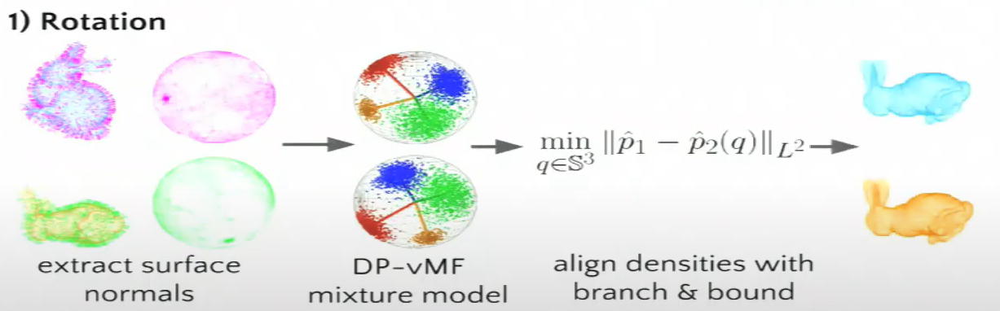
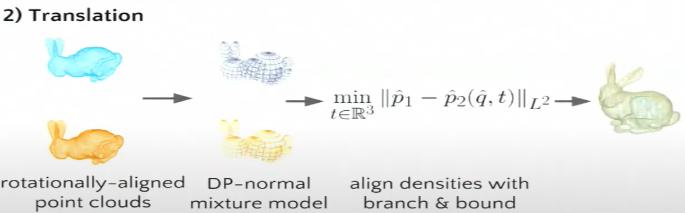
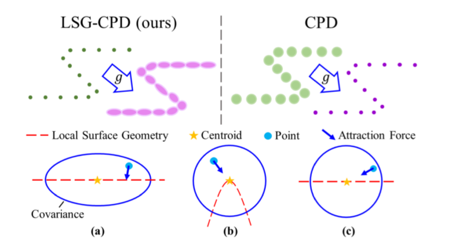

# Soft-Assignment

## Objective-function

- **New algorithms for 2D and 3D point matching: pose estimation and correspondence** :heavy_check_mark:

  > Gold, Steven, et al. "New algorithms for 2D and 3D point matching: pose estimation and correspondence." *Pattern recognition* 31.8 (1998): 1019-1031.
  >
  > **Citations:** 647
  >
  > [[pdf]](./papers/New_algorithms_for_2D_and_3D_point_matching_pose_estimation_and_correspondence.pdf)

  - Summary

    - The *new* of the proposed method is because it is different ICP methods which defines linear association. The method introduces the *soft-assignment* to the point set registration.
    - To relax the discrete optimization by introducing the *softmax* function to describe the the assignment matrix. Then using the *deterministic annealing* to estimating the parameter matrix. (Nested iteration). Annealing is a kind of optimization which can give different functions at different annealing rate.
    - Overview of the algorithm:
      - This algorithm expands the binary correspondence to a fuzzy correspondence. The objective function can be viewed as below. The variable $m_{jk}$​ means the mathing relationship between the jth point in the fixed set and the kth point in the mov set. For standard ICP, the variable has the valude of $\{0,1\}$​.  The constraints are relaxed and the variables have the value of $[0,1]$. Then one point in the fixed set can correspond to all points in the other set. Then the transformation parameter and the mathcing parameter are estimated iteratively when the other is fixed.
      - Besides, the determinstic annealling is adopted to imorve robustness.

  - **Formulation**:

    The registration is presented as a engery function(cost function):
    $$
    E = \sum_{j=1}^{J}\sum_{k=1}^{K} m_{jk} (|| X_j -t -AY_k||_{2}^{2} - f(m_{jk}))
    $$

- **A New Algorithm for Non-Rigid Point Matching**

  > Chui, H., & Rangarajan, A. (2000, June). A new algorithm for non-rigid point matching. In *Proceedings IEEE Conference on Computer Vision and Pattern Recognition. CVPR 2000 (Cat. No. PR00662)* (Vol. 2, pp. 44-51). IEEE.
  >
  > **Citations:** 646
  >
  > [[url]](https://ieeexplore.ieee.org/stamp/stamp.jsp?tp=&arnumber=854733)  [[pdf]](./papers/)
  
- **A Robust Point Matching Algorithm for Autoradiograph Alignment** :heavy_check_mark: (**RPM**)

  > Rangarajan, Anand, et al. "A robust point-matching algorithm for autoradiograph alignment." *Medical image analysis* 1.4 (1997): 379-398.
  >
  > **Citations:** 232
  >
  > [[url\]](https://reader.elsevier.com/reader/sd/pii/S1361841597850086?token=939D9B6CF93E55670F0907F7557812B247EDCE053FF3112F4DB6EC1213E1EAEBFB46FB87D8B7B47BE7D583E195092E11&originRegion=eu-west-1&originCreation=20220201205118)  [[pdf\]](./papers/A robust point-matching algorithm for autoradiograph alignment.pdf)
  
  - Summary

    - The proposed method is similar to *New algorithms for 2D and 3D point matching: pose estimation and correspondence*.
  
      The difference is the input points are based on *Canny edge detection*. (Can be viewed as a variant of **RMP**).
  
- **A New Point Matching Algorithm for Non-Rigid Registration** :heavy_check_mark: (**TPS-RPM**)

  > Chui, Haili, and Anand Rangarajan. "A new point matching algorithm for non-rigid registration." *Computer Vision and Image Understanding* 89.2-3 (2003): 114-141.
  >
  > **Citations:** 1889
  >
  > [[pdf]](./papers/1-s2.0-S1077314203000092-main.pdf)
  
  - Summary
    - TPS-RPM: A non-rigid version of RPM method, which combines the constraint function into the objective function of RPM.
  
- **Multi-scale EM-ICP: A Fast and Robust Approach for Surface Registration** :heavy_check_mark:

  > Granger, S., & Pennec, X. (2002, May). Multi-scale EM-ICP: A fast and robust approach for surface registration. In *European Conference on Computer Vision* (pp. 418-432). Springer, Berlin, Heidelberg.
  >
  > **Citations:** 521
  >
  > [[url]](http://citeseerx.ist.psu.edu/viewdoc/download?doi=10.1.1.18.5106&rep=rep1&type=pdf) [[pdf]](./papers/Multi-scale EM-ICP  A Fast and Robust.pdf)
  >
  > [[notes]](./notes/EM-ICP.md)

  - Can be viewed as 'Soft Assignment'
  - View the registration problem as the MLE(Maximum Likelihood Estimation) problem, and use E-M Algorithm to optimize the parameter.
  - Summary:
    - For a soft-assignment method, two variables are estimated: 1) matches; 2) transformation;
  - Comments:
    - How to find matches? —— still closest?
    - As long as the percentage of outliers in the local neighborhood is small, their influence can be averaged out by contributions from other inlier points. Consequently, KC is capable of registering despite of these local distractions.
    - KC based registration can be considered as a robust, multiply-linked ICP.

- **A Correlation-Based Approach to Robust Point Set Registration** :heavy_check_mark: 

  > Tsin, Y., & Kanade, T. (2004, May). A correlation-based approach to robust point set registration. In *European conference on computer vision* (pp. 558-569). Springer, Berlin, Heidelberg.
  >
  > **Citations:** 435
  >
  > [[url]](http://www.cs.cmu.edu/afs/.cs.cmu.edu/Web/People/ytsin/research/kcreg.pdf)  [[pdf]](./papers/A Correlation-Based Approach to Robust Point Set Registration.pdf)
  
  - Summary
    - In conclusion, two characteristics: 1) Multi-linked; 2) robust error metric.
  
- **A feature registration framework using mixture models** :heavy_check_mark:

  > Chui, H., & Rangarajan, A. (2000, June). A feature registration framework using mixture models. In *Proceedings IEEE Workshop on Mathematical Methods in Biomedical Image Analysis. MMBIA-2000 (Cat. No. PR00737)* (pp. 190-197). IEEE.
  >
  > **Citations:**  205
  >
  > [[url]](https://ieeexplore.ieee.org/stamp/stamp.jsp?tp=&arnumber=852377)  [[pdf]](./papers/A feature registration framework using mixture models.pdf)
  
  - :question: 和CPD，和GMM的区别在哪里？？
  
- **Point Set Registration: Coherent Point Drift** **(CPD)** :heavy_check_mark:

  > Myronenko, A., & Song, X. (2010). Point set registration: Coherent point drift. *IEEE transactions on pattern analysis and machine intelligence*, *32*(12), 2262-2275.
  >
  > **Citations:** 2323
  >
  > [[url]](https://ieeexplore.ieee.org/stamp/stamp.jsp?tp=&arnumber=5432191)  [[pdf]](./papers/Point_Set_Registration_Coherent_Point_Drift.pdf)
  >
  > [[notes]](./notes/Point Set Registration - Coherent Point Drift.md)

  - **Some Notes**：
    - 无论对于rigid还是non-rigid，计算的复杂度，计算时间以及鲁棒性都是必须要进行比较的东西。
  - For **rigid** registration, given two point set X and Y. Y is represented as the centroids of 
  - The CPD algorithm is more robust and accurate than LM-ICP, but will perform slower than it.
  - The algorithm will perform very slow then the input's size is big(35947*3), FGT can get faster, but will be less robust.
  - For non-rigid registration, compared to TPS-RPM, CPD algorithm is more accurate, but still slow when the input size is large. The time consumption mainly lies in matrix computation. 
  - **Representation**: The moving point set is represented by a GMMs, the components of which have the same isotropic covariance.

- **A robust algorithm for point set registration using mixture of Gaussians** **:green_book:** :heavy_check_mark:

  > Jian, B., & Vemuri, B. C. (2005, October). A robust algorithm for point set registration using mixture of Gaussians. In *Tenth IEEE International Conference on Computer Vision (ICCV'05) Volume 1* (Vol. 2, pp. 1246-1251). IEEE.
  >
  > **Citations:** 408
  >
  > [[url]](https://ieeexplore.ieee.org/stamp/stamp.jsp?tp=&arnumber=1544863)  [[pdf]](./papers/A Robust Algorithm for Point Set Registration Using Mixture of Gaussians.pdf)

- **Robust Point Set Registration Using Gaussian Mixture Models** **(GMM)** :heavy_check_mark: :flags: :question:

  > Jian, B., & Vemuri, B. C. (2010). Robust point set registration using gaussian mixture models. *IEEE transactions on pattern analysis and machine intelligence*, *33*(8), 1633-1645.
  >
  > **Citations:** 869
  >
  > [[url]](https://ieeexplore.ieee.org/stamp/stamp.jsp?tp=&arnumber=5674050)  [[pdf]](./papers/Robust_Point_Set_Registration_Using_Gaussian_Mixture_Models.pdf)
  >
  > [[notes]]()

  > 文章的行文逻辑读起来非常顺畅，值得多读几遍。

  - Use GMM to model the point set; Get a local optimal by iterating closed-form solution of L2 distance between two GMMs(rigid); For non-rigid: numerical optimization
  - Distribution-to-distribution GMM
  - Every point serves as a centroid of GMM
  - More robust than CPD
  - :question: How to calculate the L2 distance?

- **A generative model for the joint registration of multiple point sets** :heavy_check_mark: (**JR-MPS**)

  > Evangelidis, Georgios D., et al. "A generative model for the joint registration of multiple point sets." *European Conference on Computer Vision*. Springer, Cham, 2014.
  >
  > **Citations:**  83
  >
  > [[pdf]](./papers/Evangelidis2014_Chapter_AGenerativeModelForTheJointReg.pdf)

  - This paper view the problem in a different view. The CPD or GMM view the point set registration as a *point fitting probaility model* problem, to estimate the parameter. But in this paper, the author view the problem as a *cluster* problem. Many point sets together find the cluster model.

  - The covariance is a by-product which can be used to smooth the result( Rejecting the outliers. )

  - cons:

    - The experiments show that the four points with 1200 points need to take 20+s to get the result. (Compared to the GMM, ICP seems always more efficient). Mainly beacuse GMM-based methods involve much computation(Matrix and Exponentiation)

    - > is orders of **magnitude slower than** common ICP variants or our approach

- **Point Set Registration for 3D Range Scans Using Fuzzy Cluster-based Metric and Efficient Global Optimization** :heavy_check_mark:

  > Liao, Qianfang, Da Sun, and Henrik Andreasson. "Point set registration for 3d range scans using fuzzy cluster-based metric and efficient global optimization." *IEEE transactions on pattern analysis and machine intelligence* (2020).
  >
  > **Citations:** 7
  >
  > [[url]](https://ieeexplore.ieee.org/stamp/stamp.jsp?tp=&arnumber=9026868)  [[pdf]](./papers/Point_Set_Registration_for_3D_Range_Scans_Using_Fuzzy_Cluster-Based_Metric_and_Efficient_Global_Optimization.pdf) 
  >
  > [[notes]](./notes/Point Set Registration for 3D Range Scans Using Fuzzy Cluster-based Metric and Efficient Global Optimization.md)

  - In our method, fuzzy clusters are utilized to represent a scan, and the registration of two given scans is realized by minimizing a fuzzy weighted sum of the distances between their fuzzy cluster centers.
  - Use a coarse-to-fine framework, BnBs to get a global registration and provide a good initialization for refinement.(coarse: center-to-center; fine: point-to-center)
  - TODO：
    - [ ] 神经网络识别overlap的区域，然后进行registration.
    - [ ] 混合聚类；
    - [ ] 分层聚类
  
- **FuzzyPSReg: Strategies of Fuzzy Cluster-Based Point Set Registration** :heavy_check_mark: :red_circle:

  > Liao, Qianfang, Da Sun, and Henrik Andreasson. "FuzzyPSReg: Strategies of Fuzzy Cluster-Based Point Set Registration." *IEEE Transactions on Robotics* (2021).
  >
  > [[url]](https://ieeexplore.ieee.org/stamp/stamp.jsp?arnumber=9623345)  [[pdf]](./papers/FuzzyPSReg_Strategies_of_Fuzzy_Cluster-Based_Point_Set_Registration.pdf)
  >
  > [[notes]](./notes/FuzzyPSReg_Strategies_of_Fuzzy_Cluster-Based_Point_Set_Registration.md)
  
  > - First, we propose a new metric based on Gustafson–Kessel (GK) fuzzy clustering to measure the alignment
  >   of two point clouds.
  > - We then develop the registration quality assessment of the GK-based metric, which is more sensitive
  >   to small misalignments than that of the FCM-based metric.
  > - The FCM-based metric can be regarded as point-to-point ICP; The GK-based metric can be regarded as point-to-plane ICP.
  > - If given the dozens of cluster centers, GK-based metric can provide more accurate result than FCM-based metric.
  > - FCM can use the points as cluster centers directly.
  > - Compared to FCM-based metric, 
  >   - cons
  >     - GK-based metric takes longer time because of calculating the norm-inducing matrices;
  >     - Narrower converge basin than FCM-based metric(So it may need a good initialization);
  >   - pros
  >     - Much faster;
  >     - With the same cluster centers, GK-based is more accurate;
  > - Compare to TEASER++:
  >   - more accurate and faster ( SUN3D dataset )
  
  - To
    - What kind of other distance that can be used to do fuzzy clustering, what's this advantage?
    - Can local feature be added into the distance calculating while doing clustering?
    - Similar to Generalized-ICP, can this kind of plane-to-plane correspondence be added when cpmputing transformation?
    - Can quality assessment be added into GMM-based methods?
    - How to extend fuzzy to non-rigid registration?
    - 感觉搞一个soft的其他聚类方法可能也是一个好的尝试；
  - Compared to FCM, the GK-based(In fanct the *M-Distance*) fuzzy clustering's advantage is :

## Facilitation

### Matching

- **Robust Semantic Map Matching Algorithm Based on Probabilistic Registration Model**

  > Zhang, Qingxiang, Meiling Wang, and Yufeng Yue. "Robust semantic map matching algorithm based on probabilistic registration model." *2021 IEEE International Conference on Robotics and Automation (ICRA)*. IEEE, 2021.
  >
  > **Citations:** 2

- **LCR-SMM: Large Convergence Region Semantic Map Matching Through Expectation Maximization**

  > Zhang, Qingxiang, et al. "LCR-SMM: Large Convergence Region Semantic Map Matching Through Expectation Maximization." *IEEE/ASME Transactions on Mechatronics* (2021).
  >
  > **Citations:** 0
  
- **Density Adaptive Point Set Registration** :heavy_check_mark: :imp:(important)

  > Lawin, Felix Järemo, et al. "Density adaptive point set registration." *Proceedings of the IEEE Conference on Computer Vision and Pattern Recognition*. 2018.
  >
  > **Citations:**  39
  >
  > [[pdf]](./papers/Lawin_Density_Adaptive_Point_CVPR_2018_paper.pdf) [[supp]](./papers/2354-supp.pdf)
  
  - Summary:
    - 
    - The method is based on *JRMPC* (It firstly construct GMM clusters and register point sets by estimating cluster parameters. Also similar to fuzzy-cluster, the difference is to use GMM cluster or fuzzy cluster). 
    - In real sensors, the points are sparse in remote areas, and points are dense in close areas, which will result in more clusters in dense areas. These uneven samples will result in inaccurate registration.
    - The paper uses a latent distribution to replace the original sample distribution by minimizing *K-L Divergence* to get a relatively uniform distribution. In practice, an extra term $f(x)$ is added in the GMM as a kind of weight.
  - Pros:
    - Compared to baseline methods(JR-MPC), the proposed method performs better in real datasets.
  - Related work and comments
    - To solve the uneven samples, there are also many other ways:
      - Re-sample: Divide the point set into many many **girds**, and compute the *mean* point for each grid. (Looks like the NDT method). The **shortcomings** of the method: It neglects the original geometric structure of the point set, And it is hard to tune the parameter such as grid size.
  - :train2: Can be used in other algorithms.
  
- **A Probabilistic Framework for Color-Based Point Set Registration** :heavy_check_mark:

  > Lawin, Felix Järemo, et al. "Density adaptive point set registration." *Proceedings of the IEEE Conference on Computer Vision and Pattern Recognition*. **2018**.
  >
  > **Citations:**  39
  >
  > [[pdf]](./papers/Danelljan_A_Probabilistic_Framework_CVPR_2016_paper.pdf)
  
  - Summary
    - Incorporating the colour information for each spatial GMM component in the E-M framework. The colour information serves as an independent conditional probability.
    - The color serves as a feature, the point distribution is a joint distribution in with both spatial space and feature space. $f(x,y)$ conditioned by latent variabled $z$.
  
- **DeepGMR: Learning Latent Gaussian Mixture Models for Registration** :heavy_check_mark:

  > Yuan, Wentao, et al. "Deepgmr: Learning latent gaussian mixture models for registration." *European conference on computer vision*. Springer, Cham, 2020.
  >
  > **Citations:**  51
  >
  > [[pdf]](./papers/DeepGMR2008.09088.pdf)
  
  
  
  - Summary:
  
    
  
    - The author proposes a network $f_{\psi}$ to work as an *E* step in the *E-M* framework to classify a point and the Gaussian cluster it belongs to. The two following computing blocks $M_{\theta}$ and $M_{T}$ work as the *M* step in the *E-M* framework.
    - The *E-M* framework is different from previous methods which find the correspondence between points-to-clusters or clusters-to-clusters. But find a deterministic correspondence between clusters? (:question: How?)
  
  - Comments:
  
    - The major difficulty of global registration lies in data association.
  
    - In addition, real-world point clouds don’t contain exact point-level correspondences due to sensor noise.
  
    - FPFH features used in [48] rely on consistent normal estimation, which is difficult to obtain in practice due to varying sparsity or non-rectilinear geometry.
  
    - Moreover, these sparse correspondences are still point-level and suffer the same problem when exact point-level correspondences don’t exist.
  
    - However, the iterative EM procedure makes it much more computationally expensive.
  
    - *<u>This is because Eq. 6 used in the E Step performs point-to-cluster correspondence based on locality, i.e. a point likely belongs to a component if it is close to the component’s center, which leads to spurious data association between Pˆ and Θ∗ when T is large.</u>*
  
      > 从直觉的角度分析为什么local optimal, 是一个很好的角度.
  
  - Thoughts
  
    - What's novelty? 1. Solve the hard problem which is accepted publicly. 2. Improve the understanding of some problems(Include a brief overview of the past methods, add your own understanding —— 要对一类问题进行抽象化/泛化，找出共性/瓶颈，然后解决). 3. Introduce some new ideas to the problems.
  
  - Future work :question:
  
- **Registration Loss Learning for Deep Probabilistic Point Set Registration** :heavy_check_mark: 

  > Lawin, Felix Järemo, and Per-Erik Forssén. "Registration loss learning for deep probabilistic point set registration." *2020 International Conference on 3D Vision (3DV)*. IEEE, 2020.
  >
  > [[pdf]](./papers/Registration Loss Learning for Deep Probabilistic Point Set Registration.pdf)
  >
  > [[NOTES]](./notes/Registration Loss Learning for Deep Probabilistic Point Set Registration.md)
  
  - Summary:
    - 
    - Similar to GMMs with color, but the colour is replaced by feature. In general, there are two distributions to form a joint distribution: $p(x,y)$ —— $x$ is the sptial information, $y$ is the feature distribution. The nueral network set a point-wise feature and a weight.
    - For the network: Input: coordinate of points; Output: Featurs & weights. The feature distribution: von Mises-Fisher distribution.
  
- **Non-Rigid Point Set Registration by Preserving Global and Local Structures** :heavy_check_mark:

  > Ma, Jiayi, Ji Zhao, and Alan L. Yuille. "Non-rigid point set registration by preserving global and local structures." *IEEE Transactions on image Processing* 25.1 (2015): 53-64.
  >
  > **Citations:** 279
  >
  > [[pdf]](./papers/Non-Rigid Point Set Registration by Preserving Global and Local Structures.pdf)
  
  - Considering the local features(provided by *FPFH*) as the prior knowledge to give a prio estimation of parameter if $\pi_{mn}$ in the process of *E-M* process of algorithm of CPD;
  
    - In the original paper, $\pi_{mn}$ is given in the uniform form: $\pi_{mn}=\frac{1}{N}$ , but this paper demonstrates that the $\pi_{mn}$ can be calculated by $\pi_{mn}=\frac{\tau}{|D|}$, where $|D|$ is the corresponding features' number of the point.
  
      > Here, the author changes the prior estimation, there is also related work about changing the covariance about the local structure, where can be found in [[LSG-CPD]](./papers/LSG-CPD Coherent Point Drift with Local Surface Geometry.pdf)
  
    - In the *M* step, the parameter can be obtained by calculate the partial derviation directly. The difficulty lies in the non-rigid term, in the original paper, the author adds a regularization term to form a smotthness. <u>The transformation is calculated by solving a linear system</u>.
  
  - Pros and cons
  
    - For 3D rigid experiments, the author give the cases of *rotation*, *noise*, *occulsion*, compared to CPD, the proposed algorithm provides a wider biasn.
  
      > The exp needs to include: noise/ occulsion/ rotation.
      >
      > Refer to other paper, find out how they do the experiments.
  
    - Cons: It needs feature, but may not be found easily.

### Accleration

- **Accelerated Generative Models for 3D Point Cloud Data** :heavy_check_mark: :imp:

  > Eckart, Benjamin, et al. "Accelerated generative models for 3d point cloud data." *Proceedings of the IEEE conference on computer vision and pattern recognition*. 2016.
  >
  > **Citations:** 46
  >
  > [[pdf]](./papers/Eckart_Accelerated_Generative_Models_CVPR_2016_paper.pdf)

  - Summary:
    - 
    - This paper is about how to represent a 3-D point set. The author proposes to use the *Hierarchy of Gaussian Mixtures*.
    - The main consideration of *Hierarchy* is a trade-off between *Fidelity* and *memory usage*. 
    - The authors are from *Nvidia*, the hierarchical representation is beneficial to computing parallelly by GPU, which results in *accelerated* in the title.
  - Comments
    - Representing continuous geometry through voxels creates discretization artifacts and offers no clear way of handling
      noise or data uncertainty.
    - Furthermore, the discrete nature of voxels and sub-sampled point clouds greatly complicate spatial processing procedures that require continuous derivatives or high-quality normal estimates.
    - Voxelization and occupancy grids [6, 19] have been established as a popular method to discretize raw PCD over a dense grid, but memory problems emerge when needing fine resolution or large grids. Many voxels may be unoccupied, leading to inefficient memory usage.
    - (KD-trees and Oct-trees): These structures incur additional overhead compared to dense grids, however, requiring superlinear construction time with respect to the size of the PCD.
    - (NDT): Though the construction of such a data structure is very efficient, the requirement to voxelize at the beginning
      can cause a loss of fidelity.
  - :question: TODO
    - Occupancy Grid Generation -- To read(The application.)

- **HGMR: Hierarchical Gaussian Mixtures for Adaptive 3D Registration** :heavy_check_mark: :imp:

  > Eckart, Benjamin, Kihwan Kim, and Jan Kautz. "Hgmr: Hierarchical gaussian mixtures for adaptive 3d registration." *Proceedings of the European Conference on Computer Vision (ECCV)*. 2018.
  >
  > **Citations:**  48
  >
  > [[pdf]](./papers/Benjamin_Eckart_Fast_and_Accurate_ECCV_2018_paper.pdf)

  - Summary:
    - 
    - The consideration of the paper shows above: the deterministic division of point sets can not represent the raw point set well.
    - The algorithm is based on the hierarchical GMM model to accelerate the posterior estimation. The algorithm uses the covariance of the cluster to describe the geometry property of the cluster which can be used to decide the level of the cluster. The covariance of the Gaussian model has three eigenvalue $\lambda_{1} \lambda_{2} \lambda_{3}$, if $\lambda_{3} << \lambda_{1},\lambda_{2}$, this Gaussian model can be viewed very similar to a planar, and no need to divide in deeper.
  - Comments
    - ICP and its dozens of variants [34] often fail to produce correct results in many common but challenging scenarios, where the presence of noise, uneven point density, occlusions, or when large pose displacements can cause a large proportion of points to be without valid matches.
    - but these algorithms(statistical methods) tend to be much slower than ICP and often offer only marginal improvement in all but a few specific circumstances. As a result, ICP-based methods are still heavily used
      in practice for many real-world applications.
    - Intuitively, we can view EM as a statistical generalization of ICP: The E Step estimates data associations, replacing ICP’s matching step, while the M Step maximizes the expected likelihood conditioned on these data associations, replacing ICP’s distance minimization step over matched pairs.
    - Under a single scale, the point cloud modeling and matching process might succumb to noise or sampling inadequacies if the given modeling fidelity is not appropriate to the local data distribution.
  - Cons:
    - But it does not account for outliers in its probabilistic modeling, making it not robust to outliers and missing points.
  - Tips:
    - The covariance of the Gaussian model can be used to describe the geometric features of the point cluster.
  - TODO: (:question:)
    - How to solve the optimization need more read.
  - :train2: Can be used in other algorithms.
  - :high_brightness: 1. Speed up by estimating the weight of two GMMs to speed up the process.
    2) Wether can be added the assessment similar to Fuzzy-based.
    3) Globally Registration.
    4) set-to-set? 在Hierarchical条件下？
    5) Estimate the geomertic features by the property of cluster?
    6) Use the property of the GMM(eigen value) to make a robust cluster?

## Optimization

- **GOGMA: Globally-Optimal Gaussian Mixture Alignment** :heavy_check_mark: 

  > Campbell, Dylan, and Lars Petersson. "Gogma: Globally-optimal gaussian mixture alignment." *Proceedings of the IEEE conference on computer vision and pattern recognition*. 2016.
  >
  > **Citations:** 73
  >
  > [[pdf]](./papers/Campbell_GOGMA_Globally-Optimal_Gaussian_CVPR_2016_paper.pdf)

  - Summary:
    - Find the global optimal transformation based-on GMMs(L2-distance).  Global optimization is realized by *BnB*. 
    - Isotropic covariance is set and closed-form solution can be derived, the representation of the rotation and translation is the same as *GO-ICP*, where rotation is represented by a $\pi-ball$.
    - The termination condition is the difference of cost function $|f - f^{*}| < \epsilon$ .

- **Rigid and Articulated Point Registration with Expectation Conditional Maximization** :heavy_check_mark:

  > Horaud, R., Forbes, F., Yguel, M., Dewaele, G., & Zhang, J. (2010). Rigid and articulated point registration with expectation conditional maximization. *IEEE Transactions on Pattern Analysis and Machine Intelligence*, *33*(3), 587-602.
  >
  > **Citations:** 219
  >
  > [[url]](https://ieeexplore.ieee.org/stamp/stamp.jsp?tp=&arnumber=5444893)  [[pdf]](./papers/Rigid and Articulated Point Registration with Expectation Conditional Maximization.pdf)

  - Summary:

    - This method is similar to CPD, the difference is that in this algorithm(which is called **ECM**), the **isotropic covariance** is replaced by **anisotropic covariance**. To solve the problem of estimating $R$ under the case of anisotropic covariance, the orthogonal constraint is put on the rotation matrix, and get the estimation of $R$ by *SDP*.
    - The reason the author mentions using the anisotropic covariance is to treat the covariance as a parameter of the model and to be optimized in the *E-M* process. The former methods use isotropic covariance combined with annealing where covariance works as a parameter of the process of annealing.

  - Cons:

    - Other papers mention that using anisotropic covariance improve little in fact.

  - The paper has some assumptions which are interesting:

    - This paper treat the algorithm as a **Cluster and parameter estimation** problem. The root can be referred to:

      [Model-Based Clustering, Discriminant Analysis, and Density Estimation]([Model-Based Clustering, Discriminant Analysis, and Density Estimation (tandfonline.com)](https://www.tandfonline.com/doi/pdf/10.1198/016214502760047131?needAccess=true))

    - Using the isotropic covariance has two advantages:

      - With isotropic covariance, the Mahalanobis Distance is replaced by Euclidean Distance, the rotation can be computed in a closed-form way.

      - The isotropic covariance can be combined with annealing. 

        > **The drawback**: Anisotropic noise in the data is not properly handled, it does not use the full Gaussian model, and it does not fully benefit from the convergence properties ofEMbecause it anneals the variance
        > rather than considering it as a parameter to be estimated

  - Some more considerations:

    - Replacing the EM process by **CEM**, which means *Classification EM*, forcing posterior probability to 0/1.
    - Finding the connection to ICP.
    - Some ways to accelerate E-step: *block-like organizations* or *KD-trees*.

- **A Bayesian Formulation of Coherent Point Drift** :heavy_check_mark: :no_entry:

  > Hirose, Osamu. "A Bayesian formulation of coherent point drift." *IEEE transactions on pattern analysis and machine intelligence* (2020).
  >
  > **Citations:** 28
  >
  > [[url]](https://ieeexplore.ieee.org/stamp/stamp.jsp?tp=&arnumber=8985307)  [[pdf]](./papers/A Bayesian Formulation of Coherent Point Drift.pdf)

- **Efficient Global Point Cloud Alignment Using Bayesian Nonparametric Mixtures** :heavy_check_mark: :imp:

  > Straub, Julian, et al. "Efficient global point cloud alignment using Bayesian nonparametric mixtures." *Proceedings of the IEEE Conference on Computer Vision and Pattern Recognition*. 2017.
  >
  > **Citations:** 31
  >
  > [[pdf]](./papers/Straub_Efficient_Global_Point_CVPR_2017_paper.pdf)

  - Summary

    

    

    - The method aims to find the global optimal transformation by decomposition to translation $t^*$, rotation $R^*$. Specifically, computing $R^*$ firstly by search the translation-invariants features space(point-wise normals). After getting $R^*$, using it to compute $t^*$ to search translation space by BnB.

      ```mermaid
      graph LR
      	T((R,t)) --Rot-invariant --> A[R*] --> B[t*]
      ```

    - $R^*$ :

      - pointwise **normals**: vonMises-Fisher mixture models (vMF-MM) **Used to model angle distribution**. 
      - **Rotation space representation** 
      - Distribution-to-distribution; **Numbers of Model: nonparametric method automatically.**

    - $t^*$ : DP(Dirichlet process)Gaussian mixure model(GMM).

  - Why

    - DP(Dirichlet process)
      - Automatically compute the numbers of mixtures.
      - This allows adaptive compression of the data, enabling the processing of large **noisy** point clouds, (is a kind of way to compressing data)
    - Decomposition: Efficiency (Two low-dimension searching space *VS* one high-dimension searching space)
      - Based on a invariant features.
    - Rotation Searching Space: Less overlap, more accurate subdivision, faster.

  - Comments:

    - BB requires three major components: (1) a tessellation method for covering the optimization domain with subsets; (2) a branch/refinement procedure for subdividing any subset into smaller subsets; and (3) upper and lower bounds of the maximum objective on each subset to be used for pruning.
    - About the representation of rotation space: 
      - axis-angle (AA) space:  First, it covers 46% of rotation space twice. Second, it does not lead to uniform tessellation in rotation space.

  - Coms

    - The complicated mixture models introduce heavy computation.

  - Usuage

    - The proposed distribution of estimating the distribution of normals can be used in SLAM.

## Not Classified

- **An Adaptive Data Representation for Robust Point-Set Registration and Merging** :heavy_check_mark:

  > Campbell, Dylan, and Lars Petersson. "An adaptive data representation for robust point-set registration and merging." *Proceedings of the IEEE international conference on computer vision*. 2015.
  >
  > **Citations:** 60
  >
  > [[pdf]](./papers/Campbell_An_Adaptive_Data_ICCV_2015_paper.pdf)

  - **SVR**
  - Summary
    - The method uses a *SVM* to generate two GMMs for the two point sets.(Compared to GMMReg, the GMMs components do not equal to the number of the points). The two GMMs have the same covariance, (Every component has the same covariance).
    - Similar to GMMReg, registration is conducted by minimizing the L2 distance between two GMMs. The transformation parameter is updated by gradient-based method(*interior-reflective Newton* method). The covariance $\sigma$ works as the annealingp arameter.
  - Pros
    - The GMM constructed by the SVM is more robust especially for occlusion.

- **FilterReg: Robust and Efficient Probabilistic Point-Set Registration using Gaussian Filter and Twist Parameterization** :heavy_check_mark: :no_entry:

  > Gao, Wei, and Russ Tedrake. "Filterreg: Robust and efficient probabilistic point-set registration using gaussian filter and twist parameterization." *Proceedings of the IEEE/CVF Conference on Computer Vision and Pattern Recognition*. 2019.
  >
  > **Citations:** 58
  >
  > [[url]](https://openaccess.thecvf.com/content_CVPR_2019/papers/Gao_FilterReg_Robust_and_Efficient_Probabilistic_Point-Set_Registration_Using_Gaussian_Filter_CVPR_2019_paper.pdf)  [[pdf]](./papers/FilterReg-Robust and Efficient Probabilistic Point-Set Registration using Gaussian Filter and Twist Parameterization.pdf)

  - Point-to-Plane GMM.
  - Formulate the E step as a filtering problem and solve it using advances in efficient Gaussian filters.

- **LSG-CPD: Coherent Point Drift with Local Surface Geometry for Point Cloud Registration** :heavy_check_mark:

  > Liu, Weixiao, Hongtao Wu, and Gregory Chirikjian. "LSG-CPD: Coherent Point Drift with Local Surface Geometry for Point Cloud Registration." *arXiv preprint arXiv:2103.15039* (2021).
  >
  > [[url]](https://openaccess.thecvf.com/content/ICCV2021/papers/Liu_LSG-CPD_Coherent_Point_Drift_With_Local_Surface_Geometry_for_Point_ICCV_2021_paper.pdf)  [[pdf]](./papers/LSG-CPD Coherent Point Drift with Local Surface Geometry.pdf)

  - Adjust the point-to-point / point-to-plane based on surface normal and surface variation by adjusting covariance:

    

  - Some tricks to increase robustness:

    - Adjust the uniform distribution, and the weight of GMM;

  - Some tricks to get faster:

    - We propose an efficient optimization method to solve for the optimal transformation on a matrix
      Lie group in the EM process.
    - The proposed method is about 20 times faster than modern implementations of CPD.

- **Group-Wise Point-Set Registration based on R´enyi’s Second Order Entropy**

  > Giraldo, Luis G. Sanchez, et al. "Group-wise point-set registration based on Renyi's second order entropy." *2017 IEEE Conference on Computer Vision and Pattern Recognition (CVPR)*. IEEE, 2017.
  >
  > **Citations:** 8
  >
  > [[pdf]](./papers/Group-Wise_Point-Set_Registration_Based_on_Rnyis_Second_Order_Entropy.pdf)

## Not Read

- **STORM: Structure-based Overlap Matching for Partial Point Cloud Registration**

  > Wang, Yujie, et al. "STORM: Structure-based Overlap Matching for Partial Point Cloud Registration." *IEEE Transactions on Pattern Analysis and Machine Intelligence* (2022).
  >
  > **Citations:** 0
  
- **Fast LIDAR Localization using Multiresolution Gaussian Mixture Maps**

  > Wolcott, Ryan W., and Ryan M. Eustice. "Fast LIDAR localization using multiresolution Gaussian mixture maps." *2015 IEEE international conference on robotics and automation (ICRA)*. IEEE, 2015.
  >
  > **Citations:** 166

- **Sampling Network Guided Cross-Entropy Method for Unsupervised Point Cloud Registration**

  > Jiang, Haobo, et al. "Sampling network guided cross-entropy method for unsupervised point cloud registration." *Proceedings of the IEEE/CVF International Conference on Computer Vision*. 2021.
  >
  > **Citations:** 3
  >
  > [[pdf]](./papers/Jiang_Sampling_Network_Guided_Cross-Entropy_Method_for_Unsupervised_Point_Cloud_Registration_ICCV_2021_paper.pdf)