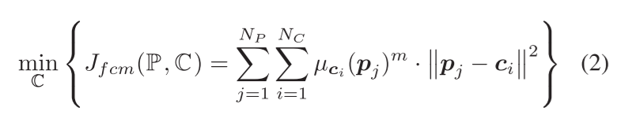
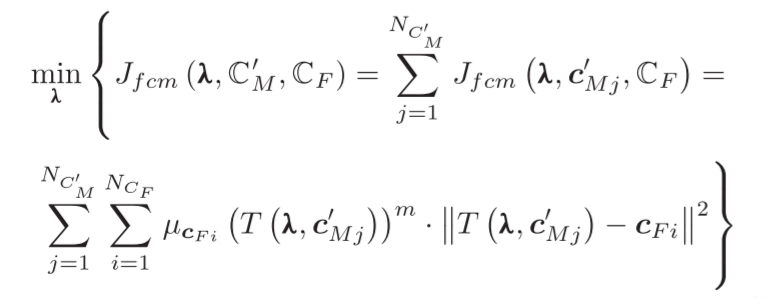

# FuzzyPSReg_Strategies_of_Fuzzy_Cluster-Based_Point_Set_Registration

## Related work

The PSR Approaches can be divided into four classes:

- ICP and its variants;
- Correspondence-based approaches;
- Probability-based approaches;
- Deep-learning based approaches;

## Notes

- FCM-Based Registration Metric

  - Pre-knowledge : k-means 聚类分析，将一个点集通过k个聚类中心进行描述，每一个点都属于一个聚类中心(clusters);

  - c-means clusters：模糊聚类方法，每一个点可能从属于不同的clusters；

    - mathematics:

      - 

        C-Means的聚类目标函数，其中$\mu_{c_i}(p_j)$ 表示点$p_j$ 对于cluster $c_i$ 的从属的程度(membership)，并且：
        $$
        \sum_{i}^{N_c}\mu_{c_i}(p_j) = 1 \\
        0 <=\mu_{c_i}(p_j) <=1
        $$

      - 假设连个点云$P_F$ 和 $P_M$，$\lambda = (r,t)$ 表示变化，$T(\lambda, p_{M_j})$ 表示点云$P_M$ 变化后的点。首先对于两个点云对其重叠部分(overlapping) 基于c-means进行模糊聚类，得到模糊聚类后的clusters，假设分别为 $P_F'$ 和 $P_M'$，得到聚类中心后，并不对原有点云中的每个点再进行优化了，而是直接对模糊聚类的中心进行优化，这就大大降低了输入数据的尺寸。

        具体的优化策略是，假定原点云$P_M$ 为参考点云（也就是目标点云），$P_F$ 为采样得到的数据；将该问题转化为$P_F'$ 聚类中心通过变化转化为$P_M'$ 的聚类中心，其中的变化仍然是$\lambda = (r,t)$ 。这个时候，将问题转化为，已知c-means的聚类中心，如果调整输入点得到最终优化的问题。

      - 接上述，问题被调整为：

        

        也就是将F'和M的聚类中心进行相似性的优化。

      - 具体的全局优化策略类似于GO-ICP中的 $nested-BnBs$  首先进行全局搜索，然后