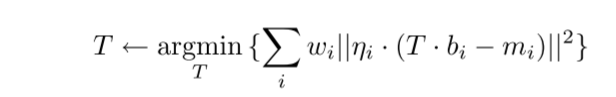
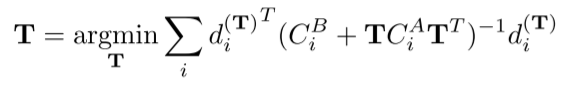

# Generalized-ICP

## 小结：

本文主要是对standard ICP 和 point-plane ICP的一个小扩展，标准的ICP算法可以描述为：

—— 其中$w_i$表示的点的权重。

不同的算法主要是针对(11)行进行调整：

其中point-to-plane进行的修改是：

—— 其中$\eta_i$ 表示二者垂直于面的距离；

GICP 将上述的方法进行泛化，得到：

- 将两个point cloud使用概率分布进行描述，$\hat{A}=\{\hat{a_i}\}$, $\hat{B}=\{\hat{b_i}\}$。表达为$a_i-N(\hat{a_i}, C_i^A)$, $b_i-N(\hat{b_i}, C_i^B)$;

- —— 其中$d_i$ 表示的仍是两个点之间的距离；其中$C_i^B$ $C_i^A$ 表示的是两个三维点的协方差矩阵，其实描述的是表面点云的特征(locally planar structure)。

GICP的主要优点在于：**提升accuracy**

提升 accuracy的原因在于：可以减少 wrong correspondence 的影响。

