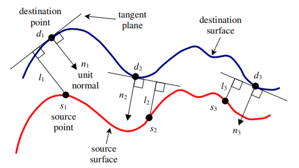

# Object modelling by registration of multiple range images

> Point-to-Plane ICP

- Main idea:

  

使用点到面的距离代替点到点的距离。

- Improvements

  - Solved using standard nonlinear least squares methods (e.g., Levenberg-Marquardt method)
    - L-M方法结合和最速下降法和牛顿-高斯方法的优点。
  - Each iteration generally slower than the point-to-point version, however, often significantly better convergence rates 
  - Using point-to-plane distance instead of point-to-point lets flat regions slide along each other.

  > [[1](http://ais.informatik.uni-freiburg.de/teaching/ss12/robotics/slides/17-icp.pdf)]