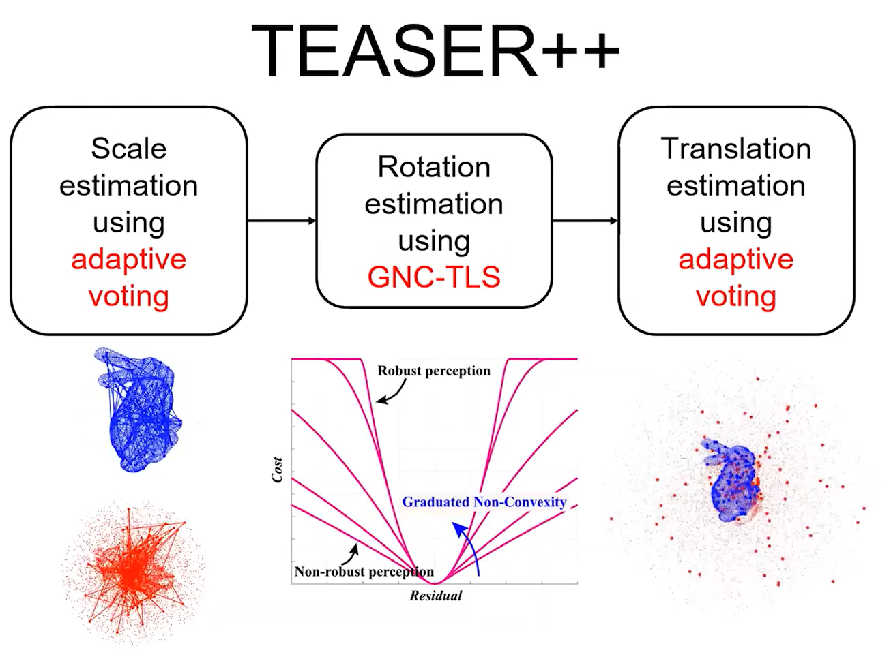
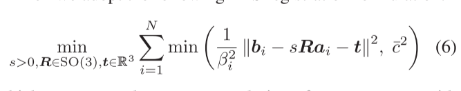

# TEASER-Fast and Certifiable Point Cloud

## Pre-Knowledge

- **Semidefinite programming** (半定规划)

  > [[wiki]](https://en.wikipedia.org/wiki/Semidefinite_programming)

- **quaternion**(四元数)

- **SVD**(奇异值分解)

## Related work

- **Correspondence Based**

  - detect and match key points using feature descriptors.

  - sensitive to the noise and outliers.

  - **Without outliers**

    - Closed-form solutions for single transformation, rotation and scale registration without noise.

    - Briales and Gonzalez-Jimenez [43] proposed a tight semidefinite relaxation to solve the same registration problem as in [42].(将配准问题设置为一个半定规划的松弛问题)

    - Closed-form solutions to the Wahba problem are known using both quaternion [14], [44] and rotation matrix [15], [45] representations. (对于单纯的旋转配准问题，在没有noise的情况下，是知道其解析解的)。

      在现有方法下，有针对isotropic Gaussian noise的解，以及anisotropic Gaussian noise的局部最优解。此外，Ahmed etal. [50] developed an SDP relaxation for the case with bounded noise and no outliers

  - Robust Registration

    - RANSAC: efficiency without noise but sensitivity to noise.

    - Other approaches resort to M-estimation, which replaces the least squares objective function with robust costs that are less sensitive to outliers [53]–[55]

    - Zhou et al. [56] proposed fast global registration (FGR) that uses the GemanMcClure cost function and leverages GNC to solve the resulting nonconvex optimization. 

    - Parra and Chin [19] proposed a Guaranteed Outlier REmoval (GORE) technique, that uses geometric operations to significantly reduce the amount of outlier correspondences before passing them to the optimization backend.

    - Parra et al. [58] found pairwise-consistent correspondences in 3-D registration using a practical maximum clique (PMC) algorithm.

      > Both GORE and PMC use the BnBs to search.

    - Yang and Carlone [39] proposed the first certifiable algorithm for robust registration, which however requires solving a large scale SDP hence being limited to small problems.

- **Simultaneous Pose and Correspondence Methods** (SPC)

  > 上面的方法表示的是已知correspodence，或者说是去求一个correspodence；而在此列中表示的是，可能并不会给一个准确的correspodence的匹配，可能是给一个correspodence的估计。

  - SPC methods alternate between finding the correspondences and computing the best transformation given the correspondences.

    - 一个典型的例子就是ICP，在估计correspodence和寻找transformation之间反复迭代；

  - **Local Methods**

    - ICP is prone to converge to local minima and only performs well given a good initial guess.
    - Multiple variants of ICP [73]–[76] have been proposed to use robust cost functions to improve convergence.
    - Probabilistic interpretations have also been proposed to improve ICP as **minimization of the Kullback–Leibler divergence between two mixture models** [77], [78].
    - Clark et al. [79] align point clouds as continuous functions using Riemannian optimization.
    - Le et al. [80] used semidefinite relaxation to generate hypotheses for randomized methods.

  - **Global Methods**

    - Global SPC approaches compute a globally optimal solution without initial guesses, **and are usually based**
      **on BnB.**
    - However, the runtime of **BnB increases exponentially with the size of the point cloud** and is made worse by the explosion of the number of local minimal resulting from high outlier ratios.

    > 反复提及的SDP(半定规划，是什么含义？) :question:

  - **Deep Learning Methods**

    - The success of **deep learning on 3-D point clouds (e.g., PointNet [86] and DGCNN [87])** opens new opportunities for learning point cloud registration from data. 

    - Deep learning methods first learn to embed points clouds in a high-dimensional feature space, then learn to match key points to **generate correspondences**, after which optimization over the space of rigid transformations is performed for the best alignment.

      > 深度学习的方法主要是去学习correspodence. 

    - PointNetLK [88] uses PointNet to learn feature representations and then iteratively align the features represen-
      tations, instead of the 3-D coordinates.

      > 不像ICP那种对于objective function进行优化，而是对模型学到的特征匹配进行优化；

    - current deep learning approaches still **struggle to produce acceptable inlier rates in real problems.**

      > :question: 还是难以生成足够好的features？

- One can always reformulate an SPC problem as a correspondence-based problem by hypothesizing all-to-all correspondences, i.e., **associating each point in the first point cloud to all the points in the second.**

## NOTATIONS AND PRELIMINARIES

## NOTES

- 本论文将问题分解为scalar, rotation, translation， 那么 scalar的含义是什么？

- adaptive voting 的方法是什么含义？

- 对于scalar和rotation使用的是TLS估计，而对于rotation，则使用的semidefine programming(SDP, 半定规划)的方法来求旋转的最优解。

- We remark that the rotation subproblem addressed in this article is in itself a foundational problem in vision (where it is known as rotation search [32]) and aerospace (where it is known as the Wahba problem [33]).

  本文对于旋转问题的解决，使用的是SDP Relaxation(半定规划松弛) 是其他问题的基础。

- :question:noise 和 outlier的区别是什么？

- TEASER++对比TEASER的改进：

  - Our fourth contribution (see Section X) is to implement a fast version of TEASER, named TEASER++, that uses **graduated nonconvexity (GNC)** [35] to estimate the rotation without solving a large SDP.

- In our previous works, we introduced TEASER [39] and the **quaternion-based relaxation** of the **rotation subproblem** [40] (named QUASAR).

- :question: paper中表示的 certifiable 是什么含义？用来评价算法是否算法的结果？

## VIDEO

> [[video]](https://www.youtube.com/watch?v=uwNdLdRozeA&t=202s) —— The author explains the motivation of the paper.

- 在scale前端，首先会对输入的数据进行一次 *filter out* 的过程，对输入的数据进行一次清洗，去除掉 *outliers*；

- Pipeline中TEASER主要做了一些什么？

  - 为什么可以Decoupling?

    - 主要是根据旋转不变性；基于此其实是找到了correspodence；

  - TLS(Truncated Least Square)的含义？

    

    上式即为 TLS的含义，定义的问题首先需要需要知道correspodence，然后在此基础上进行优化；

  - 其余部分就是解耦部分的优化了；

  - outliers是如何处理的？

  - **certificate是如何保证的？**

    - **暂时没看懂，似乎与解SDP问题有关** :question:
    - SDP 半定问题。

  - correspodence是如何获取的？

    - 预先给出/deep-learning的方法给出；
    - all-to-all correspodence的方式给出；（强行假定存在一个correpsondence)

## Questions

- 如何判定一个问题是 *convex* 还是 *non-convex* 的？

## Reference

- **Closed-form solution of absolute orientation using unit quaternions** [[URL]](http://people.csail.mit.edu/bkph/papers/Absolute_Orthonormal.pdf)
- **Least-Squares Fitting of Two 3-D Point Sets**[[URL]](https://ieeexplore.ieee.org/stamp/stamp.jsp?tp=&arnumber=4767965)

> correspondence:  Given two point set $p$ and $p'$, the correspondence means :
> $$
> p_i' = Rp_i + T + N_i
> $$
> 点集分别为$p'$ 和 $p$， 上式表示的就是correspodence；其中$N_i$ 表示的是噪声；对于已知correspodence的两个点集，其配准的就诊R和T是可以求解析解的。（在没有$N_i$ 的情况下）
>
> 总结而言，对于两个点集进行配准，如果知道**准确的correspodence**（上式的表示）是可以知道配准的解析解的，（即所谓的 **ground truth**)

其实还可以进一步的抽象化的是：对于点云配准问题，就是求R（旋转矩阵）和T（平移）来使得两个点集的overlapping部分尽可能地重合。而如何求R&T是配准问题的关键。不同方法的核心在于 $objective function$ 的不同。

但是在实际的工程应用中，Lidar采集到的数据有很大的噪声。这个时候就很难知道 *ground truth* ，想要进行配准需要使用的算法：

- **A method for registration of 3-D shapes** (ICP)

  > key idea  If the correct correspondences are known, the correct relative rotation/translation can be calculated in closed form.
  >
  > [[Wolfram Burgard, et al. Introduction to Mobile Robotics: Iterative Closest Point Algorithm]](https://link.zhihu.com/?target=http%3A//ais.informatik.uni-freiburg.de/teaching/ss11/robotics/slides/17-icp.pdf) :flags:

  ICP算法的 *motivation* 其实也来自于上面的 *Least-Squares Fitting of Two 3-D Point Sets*， 对于correspondence已知的情况下，是可以求出解析解的，但是对于correspodence未知的情况下呢（这种情况下是无法求出解析解的）

  —— 一个朴素的想法就是找到这个correspodence，那么假定的correspodence是什么样的呢？

  1. correspondence 是怎么获取的—— 对于mobile robot来说，扫描同一个场景的时候，摄像机知道自己的lidar的位姿的变化，根据这个变化其实是将扫描得到的scan的坐标进行了变化，使得两个场景有一个点的correspodence.

     而closet的含义其实就是赋予这个correspodence，也就是说选取两个点云之间的最近点作为correspodence；

     iterative的含义是，上述选取的correspodence显然是不正确的，因此需要进行反复的迭代，直到收敛；

  2. 上述的过程中其实可以看到ICP算法的局限性：

     - effiency比较低，需要的计算量很大；
     - Roubtness比较低，对noise抵抗性较弱；
     - Accuracy需要比较好的initialization;

- **A Globally Optimal Solution to 3D ICP Point-Set Registration**（GO-ICP)

  在ICP的 **目标函数** 的基础上，使用了 *nested BnBs*(嵌套BnB) 的方法，将求取旋转矩阵R和T解耦，获得一个全局最优的解。

  优点是得到的解全局最优，缺点是计算量很大(随输入数据尺寸，计算量呈指数增加），需要对outlier进行一定的处理。

- **Random Sample Consensus: A Paradigm for Model Fitting with Applications to Image Analysis and Automated Cartography ** (RANSAC)

  > [[URL]](http://www.cs.ait.ac.th/~mdailey/cvreadings/Fischler-RANSAC.pdf)
  > [[Wiki]](https://zh.wikipedia.org/wiki/%E9%9A%A8%E6%A9%9F%E6%8A%BD%E6%A8%A3%E4%B8%80%E8%87%B4)

  简而言之，RANSAC算法是这样的算法：其作用是为了从带有噪声(outliers)的数据中，估算出一个比较好的模型。基本的想法是，会搜索符合输入数据的一系列模型，如果某一个模型含有的点最多，则将其认为是描述数据的模型。

  该方法如果用在点云配准上面，主要的应用是这个样子：首先估计一系列的correspodence，这些correspodence有inliers，也有outliers，但是会寻求找到一个 exact correspodence来描述两个点云的配准关系，只要找了了这两个点云的correspodence（精确）那么就仍然可以采用SVD的方法来求解两个点云配准的解析解。

- https://zhuanlan.zhihu.com/p/431903717

  可能有用，有空看看

- **Motivation**

  > 将配准问题进行解耦，分为 *scale*, *rotation*, *translation*. 
  >
  > From:[[Efficient Global Point Cloud Registration by Matching Rotation Invariant Features Through Translation Search]](https://www.ecva.net/papers/eccv_2018/papers_ECCV/papers/Yinlong_Liu_Efficient_Global_Point_ECCV_2018_paper.pdf)

# 临时的想法

- We reformulate the registration problem using a truncated least squares (TLS) cost.

  不同的算法其最核心的不同之处我认为是 formulate 的形式不同，也就会得到不同的 *Loss function*；